# BIOLOGIA-1_101-110 — Questões extraídas

## Questão 346 (2017.1)

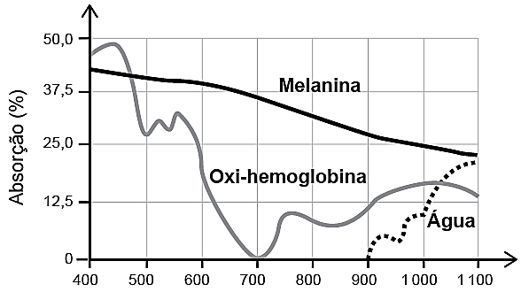

A depilação a laser (popularmente conhecida como depilação a laser) consiste na aplicação de uma
fonte de luz para aquecer e causar uma lesão localizada e controlada nos folículos capilares. Para evitar
que outros tecidos sejam danificados, selecionam-se comprimentos de onda que são absorvidos pela
melanina presente nos pelos, mas que não afetam a oxi-hemoglobina do sangue e a água dos tecidos da
região em que o tratamento será aplicado. A figura mostra como é a absorção de diferentes comprimentos de onda pela melanina, oxi-hemoglobina e água.

(MACEDO, F. S.; MONTEIRO, E. O. Epilação com laser e luz intensa pulsada. Revista Brasileira de Medicina, Disponível em: www.moreiraj.com.br, Acesso em: 4 Set 2015 - adaptado)

Qual é o comprimento de onda, em nm, ideal para a depilação a laser?

- **A)** 400
- **B)** 700
- **C)** 1100
- **D)** 900
- **E)** 500

## Questão 347 (2017.1)

A Mata Atlântica caracteriza-se por uma grande
diversidade de epífitas, como as bromélias.
Essas plantas estão adaptadas a esse ecossistema e conseguem captar luz, água e nutrientes
mesmo vivendo sobre as árvores.

(Disponível em: www.ib.usp.br.
Acesso em: 23 fev. 2013 - adaptado)

Essas espécies captam água do(a):

- **A)** organismo das plantas vizinhas.
- **B)** solo através de suas longas raízes.
- **C)** chuva acumulada entre suas folhas.
- **D)** seiva bruta das plantas hospedeiras.
- **E)** comunidade que vive em seu interior.

## Questão 348 (2017.1)

O fenômeno da piracema (subida do rio) é um
importante mecanismo que influencia a reprodução de algumas espécies de peixes, pois
induz o processo que estimula a queima de
gordura e ativa mecanismos hormonais complexos, preparando-os para a reprodução.

Intervenções antrópicas nos ambientes aquáticos, como a construção de barragens, interferem na reprodução de desses animais.

Essa intervenção antrópica prejudica a piracema porque reduz o (a):

- **A)** percurso da migração.
- **B)** longevidade dos indivíduos.
- **C)** disponibilidade de alimentos.
- **D)** período de migração da espécie.
- **E)** número de espécies de peixes no local.

## Questão 349 (2017.1)

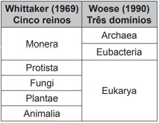

Os botos-cinza (Sotalia guianensis) mamíferos
da família dos golfinhos são excelentes indicadores da poluição das áreas em que vivem, pois
passam toda a sua vida – cerca de 30 anos  –
na mesma região.
CADERNO BIOLOGIA
ENEM 2009 a 2019

98
Além disso, a espécie acumula mais contaminantes em seu organismo, como o mercúrio, do
que outros animais da sua cadeia alimentar.

(MARCOLINO, B. Sentinelas do mar.
Disponível em: http://cienciahoje.uol.com.br.
Acesso em: 1 ago. 2012 - adaptado)

Os botos-cinza acumulam maior concentração
dessas substâncias porque:

- **A)** são animais herbívoros.
- **B)** são animais detritívoros.
- **C)** são animais de grande porte.
- **D)** digerem o alimento lentamente.
- **E)** estão no topo da cadeia alimentar.

## Questão 350 (2017.1)

Os medicamentos são rotineiramente utilizados
pelo ser humano com o intuito de diminuir ou,
por muitas vezes, curar possíveis transtornos de
saúde. Os antibióticos são grupos de fármacos
inseridos no tratamento de doenças causadas
por bactérias.

Na terapêutica das doenças mencionadas, alguns desses fármacos atuam:

- **A)** ativando o sistema imunológico do hospedeiro.
- **B)** interferindo na cascata bioquímica da inflamação.
- **C)** removendo as toxinas sintetizadas pelas bactérias.
- **D)** combatendo as células hospedeiras das bactérias.
- **E)** danificando estruturas específicas da célula bacterina.

## Questão 351 (2017.1)

Pesquisadores conseguiram estimular a absorção de energia luminosa em plantas graças ao
uso de nanotubos de carbono.

Para isso, nanotubos de carbono “se inseriram”
no interior dos cloroplastos por uma montagem
espontânea, através das membranas dos cloroplastos.

Pigmentos da planta absorvem as radiações
luminosas, os elétrons são “excitados” se deslocam no interior das membranas dos cloroplastos, e a planta utiliza em seguida essa energia
elétrica para a fabricação de açúcares.

Os nanotubos de carbono podem absorver
comprimentos de onda habitualmente não utilizados pelos cloroplastos, e os pesquisadores
tiveram a ideia de utilizá-los como “antenas”,
estimulando a conversão de energia solar cloroplastos, com o aumento do transporte de elétrons.

(Nапоtubos de carbono incrementam a fotossíntese
de plantas. Disponível em: http://qes.iqm.unicamp.br.
Acesso em: 14 nov. 2014 - adaptado)

O aumento da eficiência fotossintética ocorreu
pelo fato de os nanotubos de carbono promoverem diretamente a:

- **A)** utilização de água.
- **B)** absorção de fótons.
- **C)** formação de gás Oxigênio.
- **D)** proliferação dos Cloroplastos.
- **E)** captação de dióxido de Carbono.

## Questão 352 (2017.1)

A classificação biológica proposta por Whittaker
permite distinguir cinco grandes linhas evolutivas utilizando, como critérios de classificação, a
organização celular e o modo de nutrição.

Woese e seus colaboradores, com base na
comparação das sequências que codificam o
RNA ribossômico dos seres vivos, estabeleceram relações de ancestralidade entre os grupos
e concluíram que os procariontes do reino Monera não eram um grupo coeso do ponto de
vista evolutivo.

A diferença básica nas classificações citadas é
que a mais recente se baseia fundamentalmente em:

- **A)** tipos de células.
- **B)** aspectos ecológicos.
- **C)** relações filogenéticas.
- **D)** propriedades fisiológicas.
- **E)** características morfológicas.

## Questão 353 (2017.1)

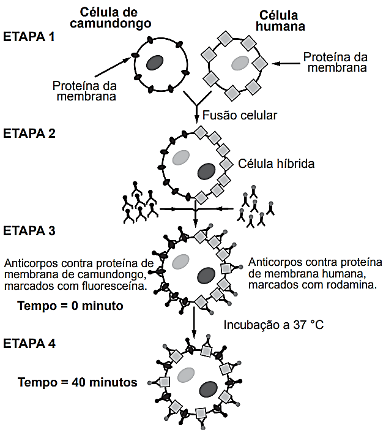

Visando explicar uma das propriedades da
membrana plasmática, fusionou-se uma célula
de camundongo com uma célula humana, formando uma célula híbrida.
CADERNO BIOLOGIA
ENEM 2009 a 2019

99
Em seguida, com o intuito de marcar as proteínas de membrana, dois anticorpos foram inseridos no experimento, um específico para as proteínas de membrana do camundongo e outro para as proteínas de
membrana humana. Os anticorpos foram visualizados ao microscópio por meio de fluorescência de cores diferentes.

(ALBERTS, B. etal Biologia molecular da célula, Porto Alegre: Artes Médicas, 1997 - adaptado)

A mudança observada da etapa 3 para a etapa 4 do experimento ocorre porque as proteínas:

- **A)** movimentam-se livremente no plano da bicamada lipídica.
- **B)** permanecem confinadas em determinadas regiões da bicamada.
- **C)** auxiliam o deslocamento dos fosfolipídios da membrana plasmática.
- **D)** são mobilizadas em razão da inserção de anticorpos.
- **E)** são bloqueadas pelos anticorpos.

## Questão 354 (2017.1)

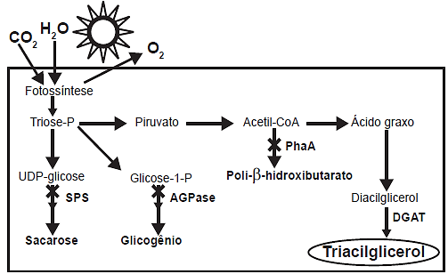

A grande virada na moderna história da agricultura ocorreu depois da Segunda Guerra Mundial. Após a
guerra, os governos haviam se deparado com um enorme excedente de nitrato de amônio, ingrediente
usado na fabricação de explosivos. A partir daí, as fábricas de munição foram adaptadas para começar a
produzir fertilizantes tendo como componente principal os nitratos.

(SOUZA, F. A. Agricultura natural/orgânica como instrumento de fixação biológica e manutenção do nitrogênio no
solo: um modelo sustentável de MDL. Disponível em: www.planetaorgnaico.com.br.
Acesso em: 17 jul. 2015 - adaptado)
CADERNO BIOLOGIA
ENEM 2009 a 2019

100
No ciclo natural do nitrogênio, o equivalente ao principal componente desses fertilizantes industriais é
produzido na etapa de:

- **A)** nitração.
- **B)** nitrosação.
- **C)** amonificação.
- **D)** desnitrificação.
- **E)** fixação biológica do N2.

## Questão 355 (2017.1)

Pesquisadores criaram um tipo de plaqueta artificial, feita com um polímero gelatinoso coberto de anticorpos, que promete agilizar o processo de coagulação quando injetada no corpo. Se houver sangramento, esses anticorpos fazem com que a plaqueta mude sua forma e se transforme em uma espécie de
rede que gruda nas lesões dos vasos sanguíneos e da pele.

(MOUTINHO, S. Coagulação acelerada. Disponível em: http://cienciahoje.uol.com.br.
Acesso em: 19.fev.2013 - adaptado)

Qual a doença cujos pacientes teriam melhora de seu estado de saúde com o uso desse material?

- **A)** Filariose.
- **B)** Hemofilia.
- **C)** Aterosclerose.
- **D)** Doença de Chagas.
- **E)** Síndrome da imunodeficiência adquirida.

## Questão 356 (2017.2)

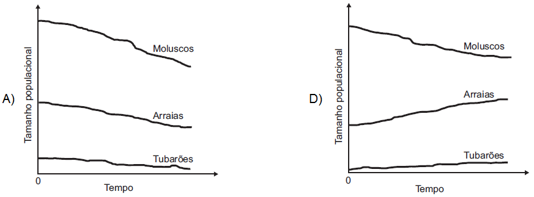

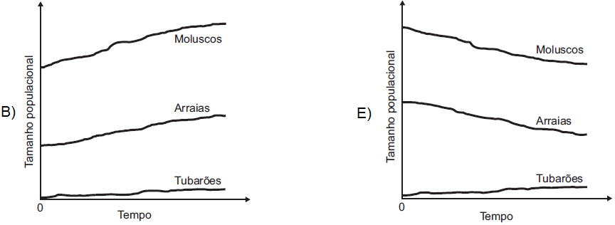

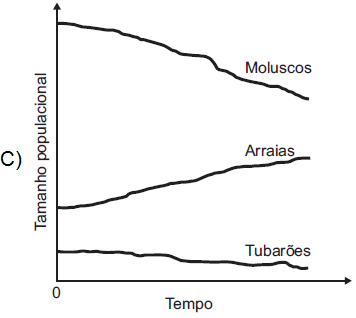

O quadro é um esquema da via de produção de biocombustível com base no cultivo de uma cianobactéria geneticamente modificada com a inserção do gene DGAT. Além da introdução desse gene, os pesquisadores interromperam as vias de síntese de outros compostos orgânicos visando aumentara eficiência na produção do biocombustível (triacilglicerol).

(National Renewable Energy Laboratory. NREL creates new pathways for producing biofuels and acids from cyanobacteria. Disponível em: www.nrel.gov. Acesso em: 16 maio 2013 - adaptado)

Considerando as vias mostradas, uma fonte de matéria-prima desse combustível é o(a):

- **A)** ácido graxo, produzido a partir da sacarose.
- **B)** gás carbônico, adquirido via fotossíntese.
- **C)** sacarose, um dissacarídeo rico em energia.
- **D)** gene DGAT, introduzido por engenharia genética.
- **E)** glicogênio, reserva energética das cianobactérias. CADERNO BIOLOGIA ENEM 2009 a 2019 101

## Questão 357 (2017.2)

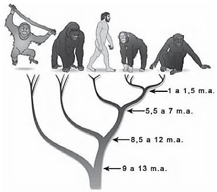

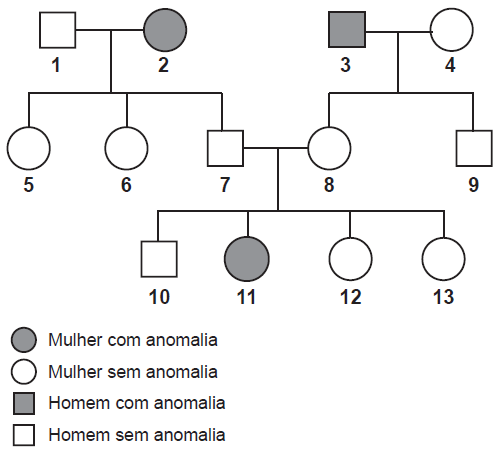

Dados compilados por Jeremy Jackson, do Instituto Scripps de Oceanografia (EUA), mostram que o
declínio de 90% dos indivíduos de 11 espécies de tubarões do Atlântico Norte, causado pelo excesso de
pesca, fez com que a população de uma arraia, normalmente devorada por eles, explodisse para 40
milhões de indivíduos. Doce vingança: essa horda de arraias é capaz de devorar 840 mil toneladas de
moluscos por ano, o que provavelmente explica o colapso da antes lucrativa pesca de mariscos na Baía
de Chesapeake (EUA).

(LOPES, R. J. Nós, o asteroide. Revista Unesp Ciência, abr. 2010.
Disponível em: https://issuu.com. Acesso em: 9 maio 2017 - adaptado)

Qual das figuras representa a variação do tamanho populacional de tubarões, arraias e moluscos no
Atlântico Norte, a partir do momento em que a pesca de tubarões foi iniciada (tempo zero)?
CADERNO BIOLOGIA
ENEM 2009 a 2019

102

## Questão 358 (2017.2)

A árvore filogenética representa uma hipótese evolutiva para a família Hominidae, na qual a sigla "m.a."
significa "milhões de anos atrás". As ilustrações representam, da esquerda para a direita, o orangotando,
o gorila, o ser humano, o chimpanzé e o bonobo.

(Disponível em: www.nature.com. Acesso em: 6 dez. 2012 - adaptado)

Considerando a filogenia representada, a maior similaridade genética será encontrada entre os seres
humanos e:

- **A)** Gorila e bonobo.
- **B)** Gorila e chimpanzé.
- **C)** Gorila e orangotango.
- **D)** Chimpanzé e bonobo.
- **E)** Bonobo e orangotango.

## Questão 359 (2017.2)

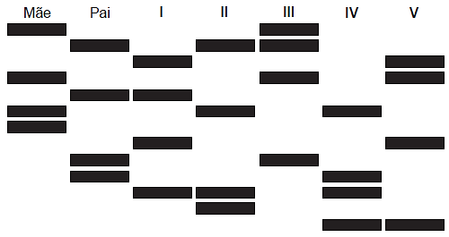

O heredograma mostra a incidência de uma anomalia genética em um grupo familiar.
CADERNO BIOLOGIA
ENEM 2009 a 2019

103
O indivíduo representado pelo número 10, preocupado em transmitir o alelo para a anomalia genética a
seus filhos, calcula que a probabilidade de ele ser portador desse alelo é de:

- **A)** 0%.
- **B)** 25%.
- **C)** 50%.
- **D)** 67%.
- **E)** 75%.

## Questão 360 (2017.2)

O resultado de um teste de DNA para identificar o filho de um casal, entre cinco jovens, está representado na figura. As barras escuras correspondem aos genes compartilhados.

Qual dos jovens é filho do casal?

- **A)** I
- **B)** II
- **C)** III
- **D)** IV
- **E)** V

## Questão 361 (2017.2)

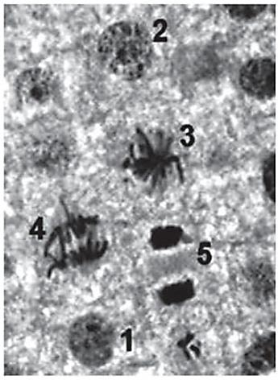

Atualmente, o medicamento de escolha para o tratamento da esquistossomose causada por todas as
espécies do verme Schistosoma é o praquizentel (PQZ). Apesar de ser eficaz e seguro, seu uso em larga escala e tratamentos repetitivos em áreas endêmicas têm provocado a seleção de linhagens resistentes.

(LAGE, R. C. G. Disponível em: www.repositorio.ufop.br. Acesso em: 17 dez. - adaptado)

Qual é o mecanismo de seleção dos vermes resistentes citados?

- **A)** Os vermes tornam-se resistentes ao entrarem em contato com o medicamento quando invadem muitos hospedeiros.
- **B)** Os vermes resistentes absorvem o medicamento, passando-o para seus descendentes, que também se tornam resistentes.
- **C)** Os vermes resistentes transmitem resistência ao medicamento quando entram em contato com outros vermes dentro do hospedeiro.
- **D)** Os vermes resistentes tendem a sobreviver e produzir mais descendentes do que os vermes sobre os quais o medicamento faz efeito.
- **E)** Os vermes resistentes ao medicamento tendem a eliminar os vermes que não são resistentes, fazendo com que apenas os mais fortes sobrevivam. CADERNO BIOLOGIA ENEM 2009 a 2019 104

## Questão 362 (2017.2)

Os sapos passam por uma metamorfose completa. Os girinos apresentam cauda e brânquias
externas, mas não têm pernas. Com o crescimento e desenvolvimento do girino, as brânquias desaparecem, as pernas surgem e a cauda encolhe. Posteriormente, a cauda desaparece por apoptose ou marte celular programada,
regulada por genes, resultando num sapo adulto
jovem.

A organela citoplasmática envolvida diretamente
no desaparecimento da cauda é o

- **A)** ribossomo.
- **B)** lisossomo.
- **C)** peroxissomo.
- **D)** complexo golgiense.
- **E)** retículo endoplasmático.

## Questão 363 (2017.2)

Para estudar os cromossomos, é preciso observá-los no momento em que se encontram no
ponto máximo de sua condensação. A imagem
corresponde ao tecido da raiz de cebola, visto
ao microscópio, e cada número marca uma das
diferentes etapas do ciclo celular.

(Disponível em: www.histologia.icb.ufg.br.
Acesso em: 6 mar. 2015 - adaptado)

Qual número corresponde à melhor etapa para
que esse estudo seja possível?

- **A)** 1
- **B)** 2
- **C)** 3
- **D)** 4
- **E)** 5

## Questão 364 (2017.2)

Asa branca

Quando olhei a terra ardendo
Qual fogueira de São João
Eu perguntei a Deus do céu, ai
Por que tamanha judiação

Que braseiro, que fornalha
Nem um pé de plantação
Por falta d'água perdi meu gado
Morreu de sede meu alazão

Até mesmo a asa branca
Bateu asas do sertão
Então eu disse adeus Rosinha
Guarda contigo meu coração

[...]
(GONZAGA, L.; TEIXEIRA, H. Disponível em:
www.luizluagonzaga.mus.br.
Acesso em: 29 set. 2011 - fragmento)

O bioma brasileiro caracterizado principalmente
por:

- **A)** índices pluviométricos baixos.
- **B)** alta taxa de evapotranspiração.
- **C)** temperatura de clima temperado.
- **D)** vegetação predominantemente epífita.
- **E)** migração das aves no período reprodutivo.

## Questão 365 (2017.2)

Para a produção de adubo caseiro (compostagem), busca-se a decomposição aeróbica, que
produz menos mau cheiro, seguindo estes passos:

I. Reserve um recipiente para depositar o lixo
orgânico e monte a composteira em um local
sombreado.

II. Deposite em apenas um dos lados da composteira o material orgânico e cubra-o com folhas.

III. Regue o material para umedecer a camada
superficial.

IV. Proteja o material de chuvas intensas e do
sol direto.

V. De dois em dois transfira o material para o
outro lado para arejar.

Em cerca de dois meses o adubo estará pronto.

(Processo de compostagem. Disponível em:
www.ib.usp.br. Acesso em: 2 ago. 2012 - adaptado)

Dos procedimentos listados, o que contribui
para o aumento da decomposição aeróbica é o:
CADERNO BIOLOGIA
ENEM 2009 a 2019

105

- **A)** I.
- **B)** II.
- **C)** III.
- **D)** IV.
- **E)** V.

## Questão 366 (2017.2)

A célula fotovoltaica é uma aplicação prática do
efeito fotoelétrico. Quando a luz incide sobre
certas substâncias, libera elétrons que, circulando livremente de átomo para átomo, formam
uma corrente elétrica. Uma célula fotovoltaica é
composta por uma placa de ferro recoberta por
uma camada de selênio e uma película transparente de ouro.

A luz atravessa a película, incide sobre o selênio e retira elétrons, que são atraídos pelo ouro,
um ótimo condutor de eletricidade. A película de
ouro é conectada à placa de ferro, que recebe
os elétrons e os devolve para o selênio, fechando o circuito e formando uma corrente elétrica
de pequena intensidade.

(DIAS, C. B. Célula fotovoltaica.
Disponível em: http://super.abril.com.br.
Acesso em: 16 ago. 2012 - adaptado)

O processo biológico que se assemelha ao descrito é a:

- **A)** fotossíntese.
- **B)** fermentação.
- **C)** quimiossíntese.
- **D)** hidrólise de ATP.
- **E)** respiração celular.

## Questão 367 (2017.2)

Os distúrbios por deficiência de iodo (DDI) são
fenômenos naturais e permanentes amplamente
distribuídos em várias regiões do mundo.

Populações que vivem em áreas deficientes em
iodo têm o risco de apresentar os distúrbios
causados por essa deficiência, cujos impactos
sobre os níveis de desenvolvimento humano,
social e econômico são muito graves.

No Brasil, vigora uma lei que obriga os produtores de sal de cozinha a incluírem em seu produto certa quantidade de iodeto de potássio.

Essa inclusão visa prevenir problemas em qual
glândula humana?

- **A)** Hipófise.
- **B)** Tireoide.
- **C)** Pâncreas.
- **D)** Suprarrenal.
- **E)** Paratireoide.

## Questão 368 (2017.2)

Uma mulher deu à luz o seu primeiro filho e,
após o parto, os médicos testaram o sangue da
criança para a determinação de seu grupo sanguíneo. O sangue da criança era do tipo O+.
Imediatamente, a equipe médica aplicou na mãe
uma solução contendo anticorpos anti-Rh, uma
vez que ela tinha o tipo sanguíneo O-.

Qual é a função dessa solução de anticorpos?

- **A)** Modificar o fator Rh do próximo filho.
- **B)** Destruir as células sanguíneas do bebê.
- **C)** Formar uma memória imunológica na mãe.
- **D)** Neutralizar os anticorpos produzidos pela mãe.
- **E)** Promover a alteração do tipo sanguíneo materno.

## Questão 369 (2017.2)

Um geneticista observou que determinada plantação era sensível a um tipo de praga que atacava as flores da lavoura. Ao mesmo tempo, ele
percebeu que uma erva daninha que crescia
associada às plantas não era destruída. A partir
de técnicas de manipulação genética, em laboratório, o gene da resistência à praga foi inserido nas plantas cultivadas, resolvendo o problema.

Do ponto de vista da biotecnologia, como essa
planta resultante da intervenção é classificada?

- **A)** Clone.
- **B)** Híbrida.
- **C)** Mutante.
- **D)** Dominante.
- **E)** Transgênica.

## Questão 370 (2017.3)

Surgidos há 370 milhões de anos, os anfíbios
apresentam inovações evolutivas que permitiram a eles tornarem-se os primeiros vertebrados a colonizar o ambiente terrestre, passando
apenas parte da vida no meio aquático. Apesar
disso, alguns aspectos fisiológicos limitam a sua
distribuição; por exemplo, no Brasil existe uma
diversidade menor de espécies na Região Sul.

A característica adaptativa que limita a distribuição geográfica desses organismos é a:

- **A)** presença de embriões protegidos por ovos.
- **B)** ocorrência de metamorfose na fase de girino.
- **C)** incapacidade de controle interno da temperatura.
- **D)** excreção de resíduos nitrogenados na forma de ureia.
- **E)** realização de trocas gasosas por pulmões e tegumento. CADERNO BIOLOGIA ENEM 2009 a 2019 106

## Questão 371 (2017.3)

Um pesquisador observou um pássaro alimentando-se dos frutos de uma espécie de arbusto
e perguntou-se qual seria o efeito na germinação das sementes do fruto após passarem pelo
trato digestório do pássaro. Para responder à
pergunta, o pesquisador pensou em desenvolver um experimento de germinação com sementes de diferentes origens.

Para realizar esse experimento, as sementes
devem ser coletadas:

- **A)** aleatoriamente do chão da mata.
- **B)** de redes de coleta embaixo dos arbustos.
- **C)** diretamente dos frutos de arbustos diferentes.
- **D)** das fezes dos pássaros de lugares diferentes.
- **E)** das fezes dos pássaros e dos frutos coletados dos arbustos.

## Questão 372 (2017.3)

No Período Cretáceo, surgiram as angiospermas, caracterizadas pela presença de flores e
frutos. Essas características contribuíram para
que essas plantas ocupassem rapidamente
diversos ambientes em nosso planeta.

Os frutos têm importante papel nessa ocupação
porque ajudam a:

- **A)** fertilizar o solo.
- **B)** dispersar as sementes.
- **C)** fixar as raízes da nova planta.
- **D)** nutrir as sementes por longos períodos.
- **E)** manter as sementes próximas às árvores.

## Questão 373 (2017.3)

Um estudo indica que insetos podem comprometer cerca de 34% da produção de grãos nos
pés de milho. No Brasil, o controle desses invertebrados no campo tem sido realizado essencialmente com inseticidas químicos e, para isso,
são feitas dezenas de pulverizações em um
único ciclo da cultura, o que causa contaminação ambiental.

(Disponível em: www.mma.gov.br.
Acesso em: 15 ago. 2012)

Para continuar realizando o controle dessas
pragas e reduzir a aplicação desses produtos,
recomenda-se a utilização de:

- **A)** biofertilizantes.
- **B)** agentes biológicos.
- **C)** herbicidas naturais.
- **D)** fungicidas orgânicos.
- **E)** radiação de origem nuclear.

## Questão 374 (2017.3)

Hospitais de diferentes regiões do país registram casos de contaminação pela superbactéria
Klebsiella pneumoniae carbapenamase (KPC),
que apresenta resistência à maioria dos medicamentos. Acredita-se que o uso inadequado de
antibióticos tenha levado à seleção dessas formas mais resistentes.

De acordo com as teorias darwinistas e neodarwinistas, o surgimento dessa superbactéria
ocorreu por:

- **A)** aumento da especiação.
- **B)** crescimento populacional.
- **C)** variações no material gênico.
- **D)** ampliação da irradiação adaptativa.
- **E)** potencialização da convergência evolutiva.

## Questão 375 (2017.3)

A radioterapia é uma especialidade médica utilizada para o tratamento de diversos tipos de
câncer. Uma das radioterapias utilizadas atualmente é a terapia à base de iodo radioativo.

Nessa, o paciente ingere uma pílula contendo o
iodo radioativo (¹³¹I), que migra para a corrente
sanguínea e circula pelo organismo até ser absorvido pelo órgão-alvo, onde age nas células
tumorais, destruindo-as e impedindo a proliferação do câncer para outras regiões do corpo.

Usa-se o iodo porque o órgão-alvo dessa terapia é o(a):

- **A)** fígado.
- **B)** tireoide.
- **C)** hipófise.
- **D)** gônada.
- **E)** pâncreas.

## Questão 376 (2017.3)

Os manguezais são considerados um ecossistema costeiro de transição, pois são terrestres e
estão localizados no encontro das águas dos
rios com o mar. Estão sujeitos ao regime das
marés e são dominados por espécies vegetais
típicas, que conseguem se desenvolver nesse
ambiente de elevada salinidade. Nos manguezais, é comum observar raízes suporte, que
ajudam na sustentação em função do solo lodoso, bem como raízes que crescem verticalmente
do solo (geotropismo negativo).

(Disponível em: http://vivimarc.sites.uol.com.br. Acesso em: 20 fev. 2012 - adaptado)

Essas últimas raízes citadas desenvolvem estruturas em sua porção aérea relacionadas á:

## Gabarito

- Questão 346:
- Questão 347:
- Questão 348:
- Questão 349: E
- Questão 350: E
- Questão 351: B
- Questão 352: C
- Questão 353: A
- Questão 354:
- Questão 355: B
- Questão 356: B
- Questão 357: C
- Questão 358: D
- Questão 359: D
- Questão 360: C
- Questão 361: D
- Questão 362: B
- Questão 363: C
- Questão 364: A
- Questão 365: E
- Questão 366: A
- Questão 367: B
- Questão 368: B
- Questão 369: E
- Questão 370: C
- Questão 371: E
- Questão 372: B
- Questão 373: B
- Questão 374: C
- Questão 375: B
- Questão 376: C
