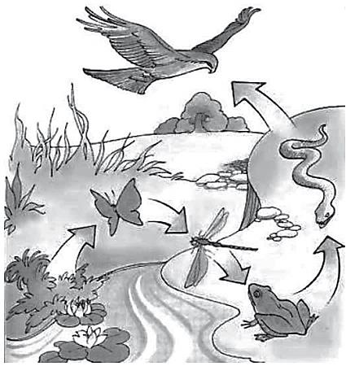
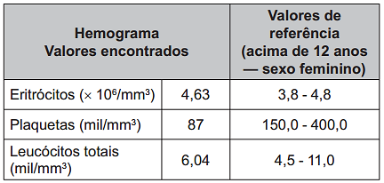
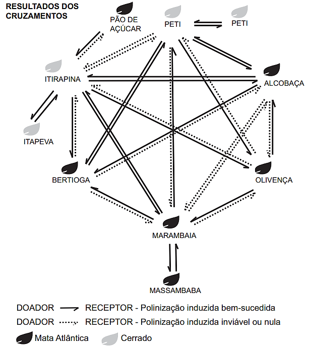
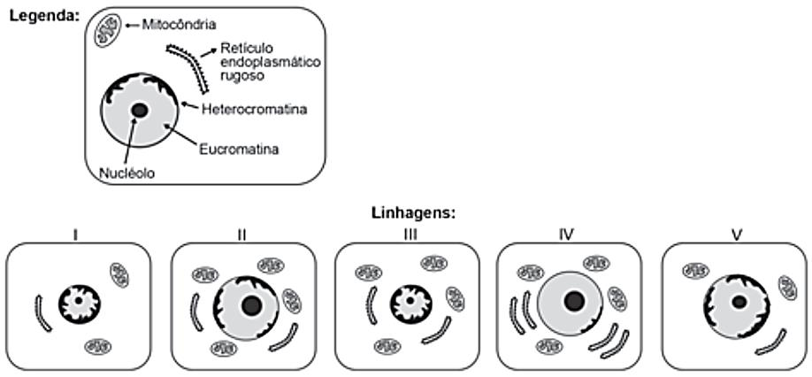
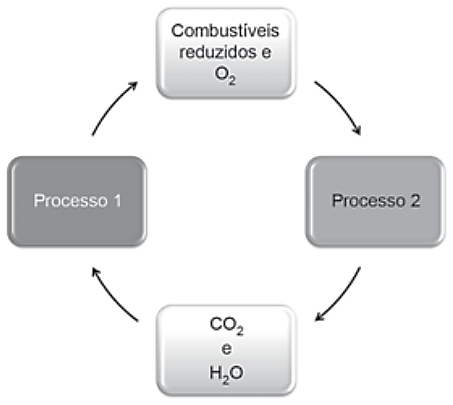
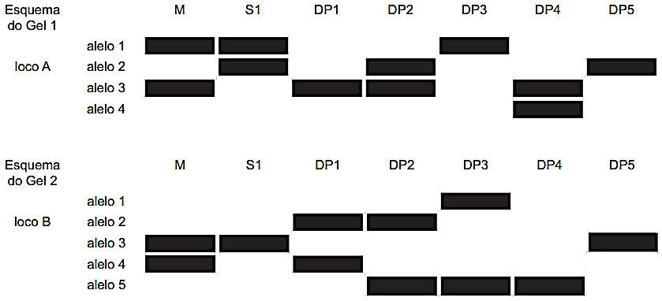
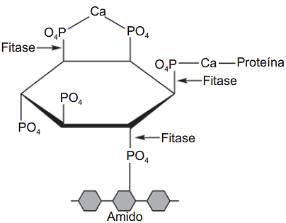

# BIOLOGIA-1_111-120 — Questões extraídas

## Questão 377 (2017.3)

A figura mostra o fluxo de energia em diferentes
níveis tróficos de uma cadeia alimentar.

(Disponível em: http://odeneide.blog.uol.com.br.
Acesso em: 21 fev. 2012)

Entre os consumidores representados nessa
cadeia alimentar, aquele cujo nível trófico apresenta menor quantidade de energia disponível é
o(a):

- **A)** gavião, porque parte da energia transferida vai se dissipando a cada nível trófico.
- **B)** sapo, pois ele se alimenta de grande quantidade de consumidores secundários.
- **C)** libélula, pois ela se alimenta diretamente de consumidores primários.
- **D)** borboleta, pois a energia vai se acumulando em cada nível trófico.
- **E)** cobra, pois ela se alimenta de consumidores terciários.

## Questão 378 (2017.3)

A acondroplasia é uma forma de nanismo que
ocorre em 1 a cada 25000 pessoas no mundo.
Curiosamente, as pessoas não anãs são homozigotas recessivas para o gene determinante
dessa característica. José é um anão, filho de
mãe anã e pai sem nanismo. Ele é casado com
Laura, que não é anã.
Qual é a probabilidade de José e Laura terem
uma filha anã?

- **A)** 0%
- **B)** 25%
- **C)** 50%
- **D)** 75%
- **E)** 100%

## Questão 379 (2017.3)

Uma das funções dos neutrófilos, um tipo de
glóbulo branco, é fagocitar bactérias invasoras
em nosso organismo. Em uma situação experimental, um cientista colocou em um mesmo
meio neutrófilos e bactérias Gram positivas que
apresentavam a parede celular fluorescente.

Em seguida, o cientista observou os neutrófilos
ao microscópio de fluorescência e verificou a
presença de fluorescência em seu interior.

Em qual organela do neutrófilo foi percebida a
fluorescência?

- **A)** Mitocôndria
- **B)** Peroxissomo.
- **C)** Vacúolo digestivo.
- **D)** Complexo golgiense.
- **E)** Retículo endoplasmático liso.

## Questão 380 (2017.3)

No Brasil, a incidência da esquistossomose vem
aumentando bastante nos estados da Região
Nordeste e em Minas Gerais. Para tentar diminuir estes números, a Fundação Oswaldo Cruz
anunciou a primeira vacina do mundo contra
essa doença. A expectativa é que o produto
chegue ao mercado em alguns anos.

(Disponível em: www.fiocruz.br.
Acesso em: 11 nov. 2013)

A tecnologia desenvolvida tem como finalidade:

- **A)** impedir a manifestação da doença.
- **B)** promover a sobrevida do paciente.
- **C)** diminuir os sintomas da doença.
- **D)** atenuar os efeitos colaterais.
- **E)** curar o paciente positivo.

## Questão 381 (2017.3)

O aumento da pecuária em decorrência do
crescimento da demanda de carne pela população humana tem sido alvo de grandes preocupações por pesquisadores e ambientalistas.
Essa preocupação ocorre em virtude de o metabolismo de animais como os ruminantes produzirem e liberarem gás metano para a atmosfera.
CADERNO BIOLOGIA
ENEM 2009 a 2019

108
Essa preocupação está relacionada com a intensificação de qual problema ambiental?

- **A)** Eutrofização.
- **B)** Chuva ácida.
- **C)** Bioacumulação.
- **D)** Inversão térmica.
- **E)** Aquecimento global.

## Questão 382 (2017.3)

O diclorodifeniltricloroetano (DDT) é o mais conhecido dentre os inseticidas do grupo dos organoclorados, tendo sido largamente usado após a Segunda Guerra Mundial para o combate aos mosquitos vetores da malária e do tifo. Trata-se de um inseticida barato e altamente eficiente em curto prazo, mas, em
longo prazo, tem efeitos prejudiciais à saúde humana. O DDT apresenta toxicidade e característica lipossolúvel.
(D'AMATO, C.; TORRES, J. P. M.; MALM. O DDT (diclorodifeniltricloroetano):
toxicidade e contaminação ambiental - Química Nova, n. 6, 2002)

Nos animais, esse composto acumula-se, preferencialmente, no tecido:

- **A)** ósseo.
- **B)** adiposo.
- **C)** nervoso.
- **D)** epitelial.        E) muscular.

## Questão 383 (2017.3)

O quadro indica o resultado resumido de um exame de sangue (hemograma) de uma jovem de 23 anos.

Com base nesses resultados, qual alteração fisiológica a jovem apresenta?

- **A)** Dificuldade de coagulação sanguínea.
- **B)** Diminuição da produção de anticorpos.
- **C)** Aumento dos processos infecciosos e alérgicos.
- **D)** Diminuição no transporte dos gases respiratórios.
- **E)** Aumento da probabilidade de formação de coágulo no sangue.

## Questão 384 (2018.1)

Anabolismo e catabolismo são processos celulares antagônicos, que são controlados principalmente
pela ação hormonal. Por exemplo, no fígado a insulina atua como um hormônio com ação anabólica,
enquanto o glucagon tem ação catabólica e ambos são secretados em resposta ao nível de glicose sanguínea.

Em caso de um indivíduo com hipoglicemia, o hormônio citado que atua no catabolismo induzirá o organismo a:

- **A)** realizar a fermentação lática.
- **B)** metabolizar aerobicamente a glicose.
- **C)** produzir aminoácidos a partir de ácidos graxos.
- **D)** transformar ácidos graxos em glicogênio.
- **E)** estimular a utilização do glicogênio. CADERNO BIOLOGIA ENEM 2009 a 2019 109

## Questão 385 (2018.1)

Para serem absorvidos pelas células do intestino humano, os lipídios ingeridos precisam ser
primeiramente emulsificados. Nessa etapa da
digestão, torna-se necessária a ação dos ácidos
biliares, visto que os lipídios apresentam uma
natureza apoiar e são insolúveis em água.

Esses ácidos atuam no processo de modo a:

- **A)** hidrolisar os lipídios.
- **B)** agir como detergentes.
- **C)** tornar os lipídios anfifílicos.
- **D)** promover a secreção de lipases.
- **E)** estimular o trânsito intestinal dos lipídios.

## Questão 386 (2018.1)

Corredores ecológicos visam mitigar os efeitos
da fragmentação dos ecossistemas promovendo
a ligação entre diferentes áreas, com o objetivo
de proporcionar o deslocamento de animais, a
dispersão de sementes e o aumento da cobertura vegetal. São instituídos com base em informações como estudos sobre o deslocamento de
espécies, sua área de vida (área necessária
para o suprimento de suas necessidades vitais
e reprodutivas) e a distribuição de suas populações.
(Disponível em: www.mma.gov.br.
Acesso em: 30 nov. 2017 - adaptado)

Nessa estratégia, a recuperação da biodiversidade é efetiva porque:

- **A)** propicia o fluxo gênico.
- **B)** intensifica o manejo de espécies.
- **C)** amplia o processo de ocupação humana.
- **D)** aumenta o número de indivíduos nas populações.
- **E)** favorece a formação de ilhas de proteção integral.

## Questão 387 (2018.1)

No ciclo celular atuam moléculas reguladoras.
Dentre elas, a proteína p53 é ativada em resposta a mutações no DNA, evitando a progressão do ciclo até que os danos sejam reparados,
ou induzindo a célula ã autodestruição.

(ALBERTS, B. et ai. Fundamentos da biologia celular.
Porto Alegre: Artmed, 2011 - adaptado)

A ausência dessa proteína poderá favorecer a:

- **A)** redução da síntese de DNA, acelerando o ciclo celular.
- **B)** saída imediata do ciclo celular, antecipando a proteção do DNA.
- **C)** ativação de outras proteínas reguladoras, induzindo a apoptose.
- **D)** manutenção da estabilidade genética, favorecendo a longevidade.
- **E)** proliferação celular exagerada, resultando na formação de um tumor.

## Questão 388 (2018.1)

O deserto é um bioma que se localiza em regiões de pouca umidade. A fauna é, predominantemente, composta por animais roedores, aves,
répteis e artrópodes.

Uma adaptação, associada a esse bioma, presente nos seres vivos dos grupos citados é o(a):

- **A)** existência de numerosas glândulas sudoríparas na epiderme.
- **B)** eliminação de excretas nitrogenadas de forma concentrada.
- **C)** desenvolvimento do embrião no interior de ovo com casca.
- **D)** capacidade de controlar a temperatura corporal.
- **E)** respiração realizada por pulmões foliáceos.

## Questão 389 (2018.1)

O cruzamento de duas espécies da família das
Anonáceas, a cherimoia (Annona cherimola)
com a fruta-pinha (Annona squamosa), resultou
em uma planta híbrida denominada de atemoia.
Recomenda-se que o seu plantio seja por meio
de enxertia.

Um dos benefícios dessa forma de plantio é a:

- **A)** ampliação da variabilidade genética.
- **B)** produção de frutos das duas espécies.
- **C)** manutenção do genótipo da planta híbrida.
- **D)** reprodução de clones das plantas parentais.
- **E)** modificação do genoma decorrente da transgenia.

## Questão 390 (2018.1)

Um estudante relatou que o mapeamento do
DNA da cevada foi quase todo concluído e seu
código genético desvendado. Chamou atenção
para o número de genes que compõem esse
código genético e que a semente da cevada,
apesar de pequena, possui um genoma mais
complexo que o humano, sendo boa parte desse código constituída de sequências repetidas.
Nesse contexto, o conceito de código genético
está abordado de forma equivocada.

Cientificamente esse conceito é definido como:

- **A)** trincas de nucleotídeos que codificam os aminoácidos.
- **B)** localização de todos os genes encontrados em um genoma.
- **C)** codificação de sequências repetidas presentes em um genoma.
- **D)** Conjunto de todos os RNAs mensageiros transcritos em um organismo.
- **E)** todas as sequências de pares de bases presentes em um organismo. CADERNO BIOLOGIA ENEM 2009 a 2019 110

## Questão 391 (2018.1)

O processo de formação de novas espécies é lento e repleto de nuances e estágios intermediários, havendo uma diminuição da viabilidade entre cruzamentos. Assim, plantas originalmente de uma mesma
espécie que não cruzam mais entre si podem ser consideradas como uma espécie se diferenciando. Um
pesquisador realizou cruzamentos entre nove populações — denominadas de acordo com a localização
onde são encontradas — de uma espécie de orquídea (Epidendrum denticulatum). No diagrama estão os
resultados dos cruzamentos entre as populações. Considere que o doador fornece o pólen para o receptor.

(FIORAVANTI, C. Os primeiros passos de novas espécies: plantas e animais se diferenciam
por meio de mecanismos surpreendentes. Pesquisa Fapesp, out. 2013 - adaptado)

Em populações de quais localidades se observa um processo de especiação evidente?

- **A)** Bertioga e Marambaia; Alcobaça e Olivença.
- **B)** Itirapina e Itapeva; Marambaia e Massambaba.
- **C)** Itirapina e Marambaia; Alcobaça e Itirapina.
- **D)** Itirapina e Peti; Alcobaça e Marambaia.
- **E)** Itirapina e Olivença; Marambaia e Peti.

## Questão 392 (2018.1)

A polinização, que viabiliza o transporte do grão de pólen de uma planta até o estigma de outra, pode ser
realizada biótica ou abioticamente. Nos processos abióticos, as plantas dependem de fatores como o
vento e a água. A estratégia evolutiva que resulta em polinização mais eficiente quando esta depende do
vento é o(a):

- **A)** diminuição do cálice.
- **B)** alongamento do ovário.
- **C)** disponibilização do néctar.
- **D)** intensificação da cor das pétalas.
- **E)** aumento do número de estames. CADERNO BIOLOGIA ENEM 2009 a 2019 111

## Questão 393 (2018.1)

O nível metabólico de uma célula pode ser determinado pela taxa de síntese de RNAs e proteínas, processos dependentes de energia. Essa diferença na taxa de síntese de biomoléculas é refletida na abundância e características morfológicas dos componentes celulares. Em uma empresa de produção de
hormônios proteicos a partir do cultivo de células animais, um pesquisador deseja selecionar uma linhagem com o metabolismo de síntese mais elevado, dentre as cinco esquematizadas na figura.

Qual linhagem deve ser escolhida pelo pesquisador?

- **A)** I
- **B)** II
- **C)** III
- **D)** IV
- **E)** V

## Questão 394 (2018.1)

As células e os organismos precisam realizar
trabalho para permanecerem vivos e se reproduzirem. A energia metabólica necessária para
a realização desse trabalho é oriunda da oxidação de combustíveis, gerados no ciclo do carbono, por meio de processos capazes de interconverter diferentes formas da energia.

(NELSON, D. L.; COX, M. M. Lehninger: princípios de
bioquímica. São Paulo: Sarvier, 2002 - adaptado)
Nesse ciclo, a formação de combustíveis está
vinculada à conversão de energia:

- **A)** térmica em cinética.
- **B)** química em térmica.
- **C)** eletroquímica em calor.
- **D)** cinética em eletromagnética.
- **E)** eletromagnética em química.

## Questão 395 (2018.1)

A utilização de extratos de origem natural tem
recebido a atenção de pesquisadores em todo o
mundo, principalmente nos países em desenvolvimento que são altamente acometidos por
doenças infecciosas e parasitárias. Um bom
exemplo dessa utilização são os produtos de
origem botânica que combatem insetos.

O uso desses produtos pode auxiliar no controle
da:

- **A)** esquistossomose.
- **B)** leptospirose.
- **C)** leishmaniose.
- **D)** hanseníase.
- **E)** aids. CADERNO BIOLOGIA ENEM 2009 a 2019 112

## Questão 396 (2018.1)

Considere, em um fragmento ambiental, uma árvore matriz com frutos (M) e outras cinco que produziram
flores e são apenas doadoras de pólen (DP1, DP2, DP3, DP4 e DP5). Foi excluída a capacidade de autopolinização das árvores. Os genótipos da matriz, da semente (S1) e das prováveis fontes de pólen
foram obtidos pela análise de dois locos (loco A e loco B) de marcadores de DNA, conforme a figura.

(COLLEVATTI, R. G.; TELLES, M. P.; SOARES, T. N. Dispersão do pólen entre pequizeiros:
uma atividade para a genética do ensino superior. Genética na Escola, n. 1, 2013 - adaptado)

A progênie S1 recebeu o pólen de qual doadora?

- **A)** DP1
- **B)** DP2
- **C)** DP3
- **D)** DP4
- **E)** DP5

## Questão 397 (2018.2)

Um biólogo foi convidado para realizar um estudo do possível crescimento de populações de roedores
em cinco diferentes regiões impactadas pelo desmatamento para ocupação humana, o que poderia estar
prejudicando a produção e armazenagem local de grãos. Para cada uma das cinco populações analisadas (I a V), identificou as taxas de natalidade (n), mortalidade (m), emigração (e) e imigração (i), em número de indivíduos, conforme ilustrado no quadro.

Em longo prazo, se essas taxas permanecerem constantes, qual dessas regiões deverá apresentar maiores prejuízos na produção/armazenagem de grãos?

- **A)** I
- **B)** II
- **C)** III
- **D)** IV
- **E)** V CADERNO BIOLOGIA ENEM 2009 a 2019 113

## Questão 398 (2018.1)

Insetos podem apresentar três tipos de desenvolvimento. Um deles, a holometabolia (desenvolvimento completo), é constituído pelas fases
de ovo, larva, pupa e adulto sexualmente maduro, que ocupam diversos hábitats. Os insetos
com holometabolia pertencem às ordens mais
numerosas em termos de espécies conhecidas.

Esse tipo de desenvolvimento está relacionado
a um maior número de espécies em razão da:

- **A)** proteção na fase de pupa, favorecendo a sobrevivência de adultos férteis.
- **B)** produção de muitos ovos, larvas e pupas, aumentando o número de adultos.
- **C)** exploração de diferentes nichos, evitando a competição entre as fases da vida.
- **D)** ingestão de alimentos em todas as fases de vida, garantindo o surgimento do adulto.
- **E)** utilização do mesmo alimento em todas as fases, otimizando a nutrição do organismo.

## Questão 399 (2018.2)

O fitato, presente em diversos cereais, apresenta a propriedade de associar-se a alguns minerais, proteínas e carboidratos, formando complexos insolúveis e incapazes de serem digeridos por animais monogástricos. Por esse motivo, muitas rações ricas em cereais contêm, na
sua formulação final, a enzima fitase como aditivo. O esquema de ação dessa enzima sobre o
fitato está representado na figura.

(ROMANO, F.; RUSSO, A. Biocatalysis Research
Progress. Hauppauge (NY): Nova Science, 2008)

A adição de fitase nessas rações acarretará um
aumento da:

- **A)** eliminação de produtos nitrogenados.
- **B)** disponibilidade de nutrientes.
- **C)** desnaturação das proteínas.
- **D)** assimilação de fitato.
- **E)** absorção de amido.

## Questão 400 (2018.2)

As larvas do inseto do bicho-da-farinha (Tenebrio molitor) conseguem se alimentar de isopor
descartado (poliestireno expandido), transformando-o em dióxido de carbono e outros componentes. Dessa forma, essas larvas contribui
em para a redução dos impactos negativos causados pelo acúmulo de isopor no ambiente.

(Disponível em: www.bbc.com.
Acesso em: 29 out. 2015 - adaptado)

A redução dos impactos causados pelo acúmulo
de isopor é resultante de qual processo desempenhado pelas larvas do bicho-da-farinha?

- **A)** Bioindicação.
- **B)** Biomarcação.
- **C)** biodegradação.
- **D)** Bioacumulação.
- **E)** Biomonitoramento.

## Questão 401 (2018.2)

De acordo com o Ministério da Saúde, a cegueira noturna ou nictalopia é uma doença caracterizada pela dificuldade de se enxergar em ambientes com baixa luminosidade. Sua ocorrência
pode estar relacionada a uma alteração ocular
congênita ou a problemas nutricionais. Com
esses sintomas, uma senhora dirigiu-se ao serviço de saúde e seu médico sugeriu a ingestão
de vegetais ricos em carotenoides, como a cenoura.

(Disponível em: http://bvsms.saude.gov.br.
Acesso em: 1 mar. 2012 - adaptado)

Essa indicação médica deve-se ao fato de que
os carotenoides são os precursores de:

- **A)** hormônios, estimulantes da regeneração celular da retina.
- **B)** enzimas, utilizadas na geração de ATP pela respiração celular.
- **C)** vitamina A, necessária para a formação de estruturas fotorreceptoras.
- **D)** tocoferal, uma vitamina com função na propagação dos impulsos nervosos.
- **E)** vitamina C, substância antioxidante que diminui a degeneração de cones e bastonetes.

## Questão 402 (2018.2)

Uma idosa residente em uma cidade do interior
do país foi levada a um hospital por sua neta.
Ao examiná-la, o médico verificou que a senhora apresentava um quadro crônico de edema
linfático nos membros inferiores e nos seios,
concluindo ser um caso de elefantíase ou filariose linfática. Preocupada com a possibilidade
de adquirir a mesma doença, a neta perguntou
ao médico como era possível se prevenir.
CADERNO BIOLOGIA
ENEM 2009 a 2019

114
Qual foi a orientação dada à jovem pelo médico?

- **A)** Usar repelentes e telas em janelas, já que a doença é transmitida por mosquito.
- **B)** Evitar nadar em rios, lagos e lagoas da região, já que a doença é transmitida pela água contaminada.
- **C)** Evitar contato com animais de zoológicos, uma vez que se trata de uma zoonose veiculada por grandes mamíferos.
- **D)** Realizar exames médicos periódicos para detectar precocemente a doença, já que se trata de uma enfermidade hereditária.
- **E)** Manter uma dieta balanceada e prática regular de atividades físicas, uma vez que a doença está associada ao sedentarismo.

## Questão 403 (2018.2)

Em pacientes portadores de astrocitoma pilocítico, um tipo de tumor cerebral, o gene BRAF se
quebra e parte dele se funde a outro gene, o
KIAA1549. Para detectar essa alteração cromossômica, foi desenvolvida uma sonda que é
um fragmento de DNA que contém partículas
fluorescentes capazes de reagir com o genes
BRAF e KIAA1549 fazendo cada um deles emitir uma cor diferente. Em uma célula normal,
como os dois genes estão em regiões distintas
do genoma, as duas cores aparecem separadamente. Já quando há a fusão dos dois genes,
as cores aparecem sobrepostas.

(Disponível em: http://agencia.fapesp.br.
Acesso em: 3 out. 2015)

A alteração cromossômica presente nos pacientes com astrocitoma pilocítico é classificada
como:

- **A)** estrutural do tipo deleção.
- **B)** numérica do tipo euploidia.
- **C)** estrutural do tipo duplicação.
- **D)** numérica do tipo aneuploidia.
- **E)** estrutural do tipo translocação.

## Questão 404 (2018.2)

Do ponto de vista genético, o número de cromossomos é uma característica marcante de
cada espécie. A goiabeira (Psidium guajava L.),
por exemplo, apresenta como padrão específico
22 cromossomos. A organização celular do gametófito feminino (saco embrionário) das flores
de Angiospermas é complexa, sendo formado
por um conjunto de oito células que, após a
fecundação, originarão células com diferentes
números cromossômicos. Nesse grupo, as células somáticas são diploides, as gaméticas são
haploides e o tecido de reserva da semente é
triploide.
Durante o ciclo de vida de uma goiabeira, quantos cromossomos podem ser encontrados, respectivamente,

- **A)** 22, 22, 33
- **B)** 11, 22, 33
- **C)** 22, 44, 33
- **D)** 11, 22, 44
- **E)** 11, 22, 22

## Questão 405 (2018.2)

O monóxido de carbono (CO) é um gás extremamente tóxico. Ele interfere no processo respiratório dos vertebrados, pois se o CO estiver
presente no ar, haverá no sangue uma "competição" entre o CO e O2.

Infelizmente, grande parte da população convive
diariamente com a presença desse gás, uma
vez que ele é produzido em grandes quantidades:

- **A)** nas queimadas em matas e florestas.
- **B)** na decomposição da matéria orgânica nos "lixões" urbanos.
- **C)** no abdômen de animais ruminantes criados em sistemas de confinamento.
- **D)** no processo de combustão incompleta de combustíveis fósseis.
- **E)** nas chaminés das indústrias que utilizam madeira de reflorestamento como combustível.

## Questão 406 (2018.2)

Gregor Mendel, no século XIX, investigou os
mecanismos da herança genética observando
algumas características de plantas de ervilha,
como a produção de sementes lisas (dominante) ou rugosas (recessiva), característica determinada por um par de alelos com dominância
completa. Ele acreditava que a herança era
transmitida por fatores que, mesmo não percebidos nas características visíveis (fenótipo) de
plantas híbridas (resultantes de cruzamentos de
linhagens puras), estariam presentes e se manifestariam em gerações futuras.

A autofecundação que fornece dados para corroborar a ideia da transmissão dos fatores idealizada por Mendel ocorre entre plantas:

- **A)** híbridas, de fenótipo dominante, que produzem apenas sementes lisas.
- **B)** híbridas, de fenótipo dominante, que produzem sementes lisas e rugosas.
- **C)** de linhagem pura, de fenótipo dominante, que produzem apenas sementes lisas.
- **D)** de linhagem pura, de fenótipo recessivo, que produzem sementes lisas e rugosas.
- **E)** de linhagem pura, de fenótipo recessivo, que produzem apenas sementes rugosas. CADERNO BIOLOGIA ENEM 2009 a 2019 115

## Questão 407 (2018.2)

Podemos esperar que, evoluindo de ancestrais
que disputavam os mesmos recursos, as espécies tenham desenvolvido características que
asseguram menor ou nenhuma competição com
membros de outras espécies. Espécies em coexistência, com um potencial aparente para competir, exibirão diferenças em comportamento,
fisiologia ou morfologia.

(TOWNSEND, C. R.; BEGON, M.; HARPER, J. L. Fundamentos em ecologia. Porto Alegre: Artmed, 2006)

Qual fenômeno evolutivo explica a manutenção
das diferença ecológicas e biológicas citadas?

- **A)** Mutação.
- **B)** Fluxo gênico.
- **C)** Seleção natural.
- **D)** Deriva genética.
- **E)** Equilíbrio de Hardy-Weinberg.

## Questão 408 (2018.2)

A ricina, substância tóxica extraída da mamona,
liga-se ao açúcar galactose presente na membrana plasmática de muitas células do nosso
corpo. Após serem endocitadas, penetram no
citoplasma da célula, onde destroem os ribossomos, matando a célula em poucos minutos.

(SADAVA, D. et al. Vida: a ciência da biologia.
Porto Alegre: Artmed, 2009 - adaptado)

O uso dessa substância pode ocasionar a morte
de uma pessoa ao inibir, diretamente, a síntese
de:

- **A)** RNA.
- **B)** DNA.
- **C)** lipídios.
- **D)** proteínas.
- **E)** carboidratos.

## Questão 409 (2018.2)

O sucesso adaptativo dos répteis relaciona-se,
dentre outros fatores, ao surgimento de um revestimento epidérmico de queratina para economia de água metabólica.

Essa característica seria prejudicial em anfíbios,
pois acarretaria problemas:

- **A)** circulatórios, em razão da limitação na força contrátil do coração tricavitário.
- **B)** excretórios, em razão de incapacidade renal de processar níveis elevados de urina.
- **C)** digestivos, em razão da limitação do intestino em absorver alimentos muito diluídos.
- **D)** locomotores, em razão de incapacidade óssea de sustentar um animal mais pesado.
- **E)** respiratórios, em razão da pequena capacidade dos pulmões de realizar trocas gasosas.

## Questão 410 (2018.2)

No século XVII, um cientista alemão chamado
Jan Baptista van Helmont fez a seguinte experiência para tentar entender como as plantas se
nutriam: plantou uma muda de salgueiro, que
pesava 2,5 kg, em um vaso contendo 100 kg de
terra seca. Tampou o vaso com uma placa de
ferro perfurada para deixar passar água. Molhou
diariamente a planta com água da chuva. Após
5 anos, pesou novamente a terra seca e encontrou os mesmos 100 kg, enquanto que a planta
de salgueiro pesava 80 kg.

(BAKER, J. J. W. ALLEN, G. E. Estudo Estudo da
biologia. São Paulo: Edgar Blucher, 1975 - adaptado)

Os resultados desse experimento permitem
confrontar a interpretação equivocada do senso
comum de que as plantas:

- **A)** absorvem gás carbônico do ar.
- **B)** usam a luz como fonte de energia.
- **C)** absorvem matéria orgânica do solo.
- **D)** usam a água para constituir seu corpo.
- **E)** produzem oxigênio na presença de luz.

## Questão 411 (2018.2)

A fotossíntese é um processo físico-químico
realizado por organismos clorofilados. Nos vegetais, é dividido em duas fases complementares: uma responsável pela síntese de ATP e
pela redução do NADP+ e a outra pela fixação
do carbono.

Para que a etapa produtora de ATP e NADPH
ocorra, são essenciais:

- **A)** água e oxigênio.
- **B)** glicose e oxigênio.
- **C)** radiação luminosa e água.
- **D)** glicose e radiação luminosa.
- **E)** oxigênio e dióxido de carbono.

## Questão 412 (2019.1)

As cutias, pequenos roedores das zonas tropicais, transportam pela boca as sementes que
caem das árvores, mas, em vez de comê-las,
enterram-nas em outro lugar. Esse procedimento lhes permite salvar a maioria de suas sementes enterradas para as épocas mais secas,
quando não há frutos maduros disponíveis. Cientistas descobriram que as cutias roubam as
sementes enterradas por outras, e esse comportamento de “ladroagem” faz com que uma
mesma semente possa ser enterrada dezenas
de vezes.

(Disponível em: http://chc.cienciahoje.uol.com.br.
Acesso em: 30 jul. 2012)
CADERNO BIOLOGIA
ENEM 2009 a 2019

116
Essa “ladroagem” está associada à relação de:

- **A)** sinfilia.
- **B)** predatismo.
- **C)** parasitismo.
- **D)** competição.
- **E)** comensalismo.

## Questão 413 (2019.1)

A esquistossomose (barriga-dʼágua) caracterizase pela inflamação do fígado e do baço causada
pelo verme Schistosoma mansoni (esquistossomo). O contágio ocorre depois que larvas do
verme são liberadas na água pelo caramujo do
gênero Biomphalaria, seu hospedeiro intermediário, e penetram na pele humana. Após o diagnóstico, o tratamento tradicional utiliza medicamentos por via oral para matar o parasita dentro
do corpo. Uma nova estratégia terapêutica baseia-se na utilização de uma vacina, feita a partir de uma proteína extraída do verme, que induz o organismo humano a produzir anticorpos
para combater e prevenir a doença.

(Instituto Oswaldo Cruz/Fundação Oswaldo Cruz
IOC/Fiocruz. Fiocruz anuncia nova vacina
Disponível em: http://agencia.fiocruz.br.
Acesso em: 3 maio 2019 - adaptado)

Uma vantagem da vacina em relação ao tratamento tradicional é que ela poderá:

- **A)** impedir a penetração do parasita pela pele.
- **B)** eliminar o caramujo para que não haja contágio.
- **C)** impedir o acesso do esquistossomo especificamente para o fígado.
- **D)** eliminar o esquistossomo antes que ocorra contato com o organismo.
- **E)** eliminar o esquistossomo dentro do organismo antes da manifestação de sintomas.

## Questão 414 (2019.1)

Um alimento orgânico deve apresentar em sua
embalagem o selo de uma instituição certificadora, garantindo ao consumidor que, além de
ser um alimento isento de agrotóxicos, também
é produzido com técnicas planejadas e controladas. A técnica de produção desses alimentos
causa menor impacto aos recursos naturais,
contribuindo para melhorar a qualidade de vida
das pessoas. Nesse sistema de produção de
alimentos vegetais, o controle de insetos é manejado por meio do(a):

- **A)** prática de adubação verde.
- **B)** emprego da compostagem.
- **C)** controle da irrigação do solo.
- **D)** utilização de predadores naturais.
- **E)** uso de sementes inoculadas com Rhizobium.

## Questão 415 (2019.1)

Na família Retroviridae encontram-se diversos
vírus que infectam aves e mamíferos, sendo
caracterizada pela produção de DNA a partir de
uma molécula de RNA.

Alguns retrovírus infectam exclusivamente humanos, não necessitando de outros hospedeiros, reservatórios ou vetores biológicos. As infecções ocasionadas por esses vírus vêm causando mortes e grandes prejuízos ao desenvolvimento social e econômico.

Nesse contexto, pesquisadores têm produzido
medicamentos que contribuem para o tratamento dessas doenças.

Que avanços tecnológicos têm contribuído para
o tratamento dessas infecções virais?

- **A)** Melhoria dos métodos de controle dos vetores desses vírus.
- **B)** Fabricação de soros mutagênicos para combate desses vírus.
- **C)** Investimento da indústria em equipamentos de proteção individual.
- **D)** Produção de vacinas que evitam a infecção das células hospedeiras.
- **E)** Desenvolvimento de antirretrovirais que dificultam a reprodução desses vírus.

## Questão 416 (2019.1)

Com base nos experimentos de plantas de
Mendel, foram estabelecidos três princípios
básicos, que são conhecidos como leis da uniformidade, segregação e distribuição independente.

A lei da distribuição independente refere-se ao
fato de que os membros de pares diferentes de
genes segregam-se independentemente, uns
dos outros, para a prole.

(TURNPENNY, P. D. Genética médica.
Rio de Janeiro: Elsevier, 2009 - adaptado)

Hoje, sabe-se que isso nem sempre é verdade.
Por quê?

- **A)** A distribuição depende do caráter de dominância ou recessividade do gene.
- **B)** Os organismos nem sempre herdam cada um dos genes de cada um dos genitores.
- **C)** As alterações cromossômicas podem levar a falhas na segregação durante a meiose.
- **D)** Os genes localizados fisicamente próximos no mesmo cromossomo tendem a ser herdados juntos.
- **E)** O cromossomo que contém dois determinados genes pode não sofrer a disjunção na primeira fase da meiose.

## Gabarito

- Questão 377: A
- Questão 378: B
- Questão 379: C
- Questão 380: A
- Questão 381: E
- Questão 382: B
- Questão 383: A
- Questão 384: E
- Questão 385: B
- Questão 386: A
- Questão 387: E
- Questão 388: B
- Questão 389: C
- Questão 390: A
- Questão 391: D
- Questão 392: E
- Questão 393: D
- Questão 394: E
- Questão 395: C
- Questão 396: E
- Questão 397: D
- Questão 398: C
- Questão 399: B
- Questão 400: C
- Questão 401: C
- Questão 402: A
- Questão 403: E
- Questão 404: B
- Questão 405: D
- Questão 406: B
- Questão 407: C
- Questão 408: D
- Questão 409: E
- Questão 410: C
- Questão 411: C
- Questão 412: D
- Questão 413: E
- Questão 414: D
- Questão 415: E
- Questão 416: D
