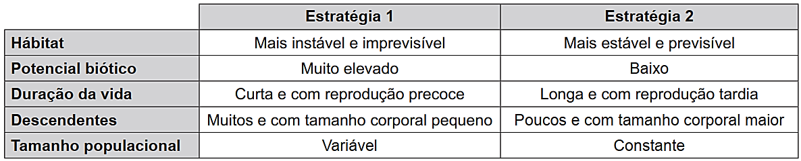
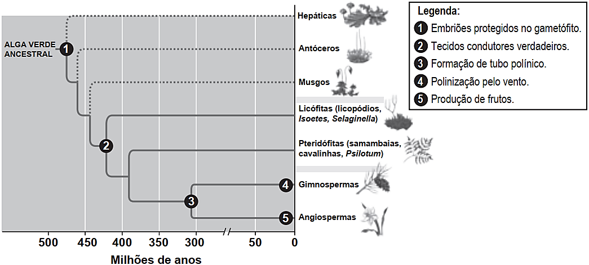
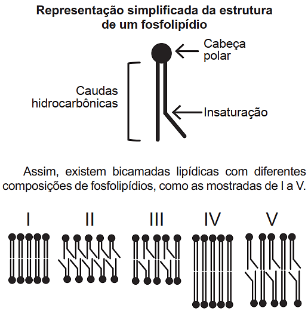
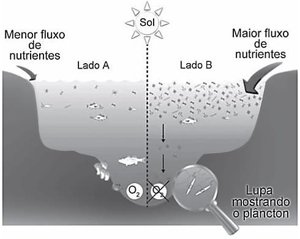
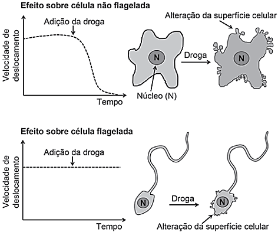
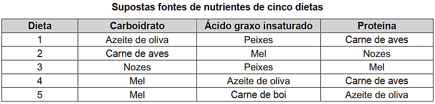
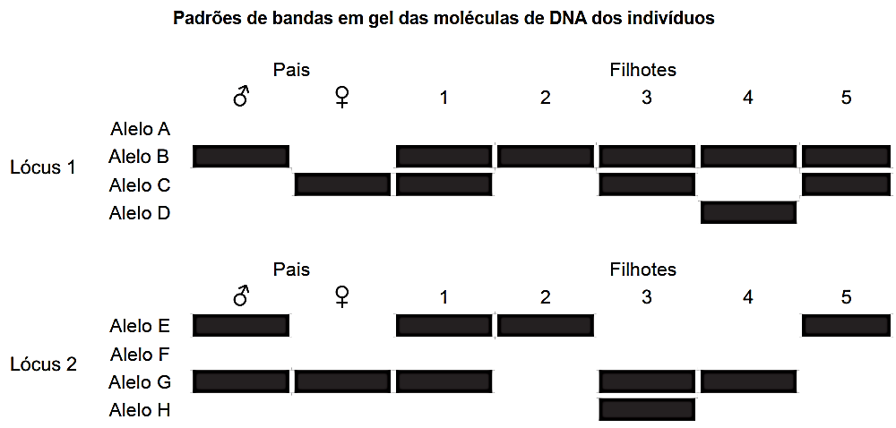
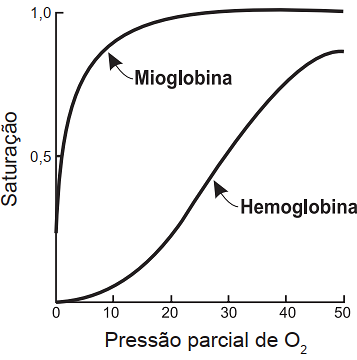
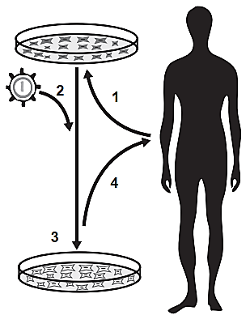
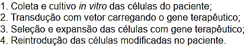

# BIOLOGIA-1_121-130 — Questões extraídas

## Questão 417 (2019.1)

No quadro estão apresentadas informações sobre duas estratégias de sobrevivência que podem ser
adotadas por algumas espécies de seres vivos.

Na recuperação de uma área desmatada deveriam ser reintroduzidas primeiramente as espécies que
adotam qual estratégia?

- **A)** Estratégia 1, pois essas espécies produzem descendentes pequenos, o que diminui a competição com outras espécies.
- **B)** Estratégia 2, pois essas espécies têm uma longa duração da vida, o que favorece a produção de muitos descendentes.
- **C)** Estratégia 1, pois essas espécies apresentam um elevado potencial biótico, o que facilita a rápida recolonização da área desmatada.
- **D)** Estratégia 2, pois essas espécies estão adaptadas a hábitats mais estáveis, o que corresponde ao ambiente de uma área desmatada.
- **E)** Estratégia 2, pois essas espécies apresentam um tamanho populacional constante, o que propicia uma recolonização mais estável da área desmatada.

## Questão 418 (2019.1)

Durante sua evolução, as plantas apresentaram grande diversidade de características, as quais permitiram sua sobrevivência em diferentes ambientes. Na imagem, cinco dessas características estão indicadas por números.

(CAMPBELL, N. et al. Biologia. São Paulo: Artmed, 2010 - adaptado)

A aquisição evolutiva que permitiu a conquista definitiva do ambiente terrestre pelas plantas está indicada pelo número:

- **A)** 1.
- **B)** 2.
- **C)** 3.
- **D)** 4.
- **E)** 5. CADERNO BIOLOGIA ENEM 2009 a 2019 118

## Questão 419 (2019.1)

A eritropoetina (EPO) é um hormônio endógeno
secretado pelos rins que influencia a maturação
dos eritrócitos. Suas formas recombinantes,
sintetizadas em laboratório, têm sido usadas por
alguns atletas em esportes de resistência na
busca por melhores resultados. No entanto, a
administração da EPO recombinante no esporte
foi proibida pelo Comitê Olímpico Internacional e
seu uso considerado doping.

(MARTELLI, A. Eritropoetina: síntese e liberação
fisiológica e o uso de sua forma recombinante no
esporte. Perspectivas Online: biológicas & saúde)

Uma influência que esse doping poderá exercer
na melhoria da capacidade física desses atletas
está relacionada ao transporte de:

- **A)** lipídios, para aumento do gasto calórico.
- **B)** ATP, para aumento da síntese hormonal.
- **C)** oxigênio, para aumento da produção de ATP.
- **D)** proteínas, para aumento da massa muscular.
- **E)** vitamina C, para aumento da integridade dos vasos sanguíneos.

## Questão 420 (2019.1)

Na piscicultura, costumam-se usar larvas de
Artemia (crustáceo) para alimentar larvas de
peixes. Ovos de Artemia são colocados em
garrafas com água salgada e, sob condições
ótimas de temperatura, luz e oxigênio, eles
eclodem, liberando suas larvas, também conhecidas como náuplios. Para recolher os náuplios,
coloca-se uma lâmpada branca fluorescente na
boca da garrafa e estes começam a subir em
direção ao gargalo. Esse comportamento das
artêmias é chamado de:

- **A)** geotropismo positivo.
- **B)** fototropismo positivo.
- **C)** hidrotropismo negativo.
- **D)** termotropismo negativo.
- **E)** quimiotropismo negativo.

## Questão 421 (2019.1)

O concreto utilizado na construção civil é um
material formado por cimento misturado a areia,
a brita e a água. A areia é normalmente extraída
de leitos de rios e a brita, oriunda da fragmentação de rochas. Impactos ambientais gerados no
uso do concreto estão associados à extração de
recursos minerais e ao descarte indiscriminado
desse material. Na tentativa de reverter esse
quadro, foi proposta a utilização de concreto
reciclado moído em substituição ao particulado
rochoso graúdo na fabricação de novo concreto,
obtendo um material com as mesmas propriedades que o anterior.
O benefício ambiental gerado nessa proposta é
a redução do(a):

- **A)** extração da brita.
- **B)** extração de areia.
- **C)** consumo de água.
- **D)** consumo de concreto.
- **E)** fabricação de cimento.

## Questão 422 (2019.1)

O “The Kidney Project” é um projeto realizado
por cientistas que pretendem desenvolver um
rim biônico que executará a maioria das funções
biológicas do órgão. O rim biônico possuirá duas partes que incorporam recentes avanços de
nanotecnologia, filtração de membrana e biologia celular. Esse projeto significará uma grande
melhoria na qualidade de vida para aquelas
pessoas que dependem da hemodiálise para
sobrevivência.

(Disponível em: https://pharm.ucsf.edu.
Acesso em: 26 abr. 2019  - adaptado)

O dispositivo criado promoverá diretamente a:

- **A)** remoção de ureia.
- **B)** excreção de lipídios.
- **C)** síntese de vasopressina.
- **D)** transformação de amônia.
- **E)** fabricação de aldosterona.

## Questão 423 (2019.1)

O 2,4-dinitrofenol (DNP) é conhecido como desacoplador da cadeia de elétrons na mitocôndria
e apresenta um efeito emagrecedor. Contudo,
por ser perigoso e pela ocorrência de casos
letais, seu uso como medicamento é proibido
em diversos países, inclusive no Brasil.

Na mitocôndria, essa substância captura, no
espaço intermembranas, prótons (H+) provenientes da atividade das proteínas da cadeia respiratória, retornando-os à matriz mitocondrial.
Assim, esses prótons não passam pelo transporte enzimático na membrana interna.

(GRUNDLINGH, J. et al. 2,4-Dinitrophenol - DNP: a
Weight Loss Agent with Significant Acute Toxicity and
Risk. Journal of Medical Toxicology, v. 7, 2011)

O efeito emagrecedor desse composto está
relacionado ao(à):

- **A)** obstrução da cadeia respiratória, resultando em maior consumo celular de ácidos graxos.
- **B)** bloqueio das reações do ciclo de Krebs, resultando em maior gasto celular de energia.
- **C)** diminuição da produção de acetil CoA, resultando em maior gasto celular de piruvato. CADERNO BIOLOGIA ENEM 2009 a 2019 119
- **D)** inibição da glicólise, resultando em maior absorção celular da glicose sanguínea.
- **E)** redução da produção de ATP, resultando em maior gasto celular de nutrientes.

## Questão 424 (2019.1)

A fluidez da membrana celular é caracterizada
pela capacidade de movimento das moléculas
componentes dessa estrutura. Os seres vivos
mantêm essa propriedade de duas formas: controlando a temperatura e/ou alterando a composição lipídica da membrana. Neste último aspecto, o tamanho e o grau de insaturação das caudas hidrocarbônicas dos fosfolipídios, conforme
representados na figura, influenciam significativamente a fluidez. Isso porque quanto maior for
a magnitude das interações entre os fosfolipídios, menor será a fluidez da membrana.

Qual das bicamadas lipídicas apresentadas
possui maior fluidez?

- **A)** I
- **B)** II
- **C)** III
- **D)** IV
- **E)** V

## Questão 425 (2019.1)

Uma cozinheira colocou sal a mais no feijão que
estava cozinhando. Para solucionar o problema,
ela acrescentou batatas cruas e sem tempero
dentro da panela. Quando terminou de cozinhálo, as batatas estavam salgadas, porque absorveram parte do caldo com excesso de sal. Finalmente, ela adicionou água para completar o
caldo do feijão.
O sal foi absorvido pelas batatas por:

- **A)** osmose, por envolver apenas o transporte do solvente.
- **B)** fagocitose, porque o sal transportado é uma substância sólida.
- **C)** exocitose, uma vez que o sal foi transportado da água para a batata.
- **D)** pinocitose, porque o sal estava diluído na água quando foi transportado.
- **E)** difusão, porque o transporte ocorreu a favor do gradiente de concentração.

## Questão 426 (2019.2)

Segundo o pensamento religioso de Padre Cícero Romão Batista (1844-1934), a ação humana do camponês sobre a natureza deveria seguir alguns princípios norteadores, os quais
ficaram conhecidos na cultura popular brasileira
como “os preceitos ecológicos do Padre Cícero”. Dentre esses preceitos, destaca-se:

“Não plante em serra acima, nem faça roçado
em ladeira muito em pé: deixe o mato protegendo a terra para que a água não a arraste e não
se perca a sua riqueza.”

(FIGUEIREDO, J. B. A. Educação ambiental dialógica: as contribuições de Paulo freire e a cultura popular nordestina. Fortaleza: UFC, 2007)

Comparando o pensamento do Padre Cícero
com o atual conhecimento científico, pode-se
encontrar elementos de convergência, já que a
prática citada contribui primariamente para evitar (o)a:

- **A)** erosão.
- **B)** salinização.
- **C)** eutrofização.
- **D)** assoreamento.
- **E)** desertificação.

## Questão 427 (2019.2)

O nitrogênio é essencial aos seres vivos e pode
ser adquirido pelas plantas, através da absorção
pelas raízes, e pelos animais, através da alimentação. Sua utilização na agricultura de forma inadequada tem aumentado sua concentração no ambiente, e o excesso, que é transportado para os cursos-d’água, tem causado a
eutrofização. Contudo, tal dano ambiental pode
ser minimizado pela adoção de práticas sustentáveis, que aprisionam esse elemento no solo,
impedindo seu escoamento para rios e lagos.

O método sustentável visando a incorporação
desse elemento na produção, prevenindo tal
dano ambiental, é o(a):
CADERNO BIOLOGIA
ENEM 2009 a 2019

120

- **A)** adição de minhocas na terra.
- **B)** irrigação da terra antes do plantio.
- **C)** reaproveitamento do esterco fresco.
- **D)** descanso do solo sem adição de culturas.
- **E)** fixação biológica nas raízes por bactérias.

## Questão 428 (2019.2)

Em regiões desérticas, a obtenção de água
potável não pode depender apenas da precipitação. Nesse sentido, portanto, sistemas para
dessalinização da água do mar têm sido uma
solução. Alguns desses sistemas consistem
basicamente de duas câmaras (uma contendo
água doce e outra contendo água salgada) separadas por uma membrana semipermeável.
Aplicando-se pressão na câmara com água
salgada, a água pura é forçada a passar através
da membrana para a câmara contendo água
doce.

O processo descrito para a purificação da água
é denominado:

- **A)** filtração.
- **B)** adsorção.
- **C)** destilação.
- **D)** troca iônica.
- **E)** osmose reversa.

## Questão 429 (2019.2)

Observe o esquema que ilustra duas situações
no ambiente marinho.

(Disponível em: www.teachoceanscience.net.
Acesso em: 7 jul. 2015 - adaptado)

Qual é o processo responsável pela diminuição
da concentração de oxigênio no lado B do esquema?

- **A)** Lixiviação.
- **B)** Eutrofização.
- **C)** Volatilização.
- **D)** Fermentação.
- **E)** Bioacumulação.

## Questão 430 (2019.2)

Pesquisadores descobriram que uma espécie
de abelha sem ferrão nativa do Brasil — a mandaguari (Scaptotrigona depilis) — cultiva um
fungo nos ninhos dentro da colmeia. Após observações, verificaram que a sobrevivência das
larvas da abelha depende da ingestão de filamentos do fungo, que produz metabólitos secundários com ação antimicrobiana, antitumoral
e imunológica, além da alimentação convencional. Por sua vez, o fungo depende da abelha
para se reproduzir e garante a sua multiplicação
ao longo das gerações.

(MIURA, J. Pequenas agricultoras: abelhas Mandaguari cultivam fungos para alimentar suas larvas.
Disponível em: www.embrapa.br.
Acesso em: 3 maio 2019 - adaptado)

O uso de fungicida ocasionaria à colmeia dessa
espécie o(a):

- **A)** controle de pragas.
- **B)** acúmulo de resíduos.
- **C)** ampliação de espaço.
- **D)** redução da população.
- **E)** incremento de alimento.

## Questão 431 (2019.2)

A ação de uma nova droga antitumoral sobre o
citoesqueleto foi investigada. O pesquisador
comparou o efeito da droga na velocidade de
deslocamento celular e na integridade de filamentos do córtex celular e de flagelos, conforme
apresentado na figura.

O pesquisador concluiu que a droga age sobre
os:

- **A)** microtúbulos apenas.
- **B)** filamentos de actina apenas.
- **C)** filamentos intermediários apenas.
- **D)** filamentos de actina e microtúbulos.
- **E)** filamentos de actina e filamentos intermediários. CADERNO BIOLOGIA ENEM 2009 a 2019 121

## Questão 432 (2019.2)

Atualmente, uma série de dietas alimentares têm sido divulgadas com os mais diferentes propósitos:
para emagrecer, para melhorar a produtividade no trabalho e até mesmo dietas que rejuvenescem o
cérebro. No entanto, poucas têm embasamento científico, e o consenso dos nutricionistas é que deve
ser priorizada uma dieta balanceada, constituída de frutas e vegetais, uma fonte de carboidrato, uma de
ácido graxo insaturado e uma de proteína. O quadro apresenta cinco dietas com supostas fontes de nutrientes.

A dieta que relaciona adequadamente as fontes de carboidrato, ácido graxo insaturado e proteína é a:

- **A)** 1.
- **B)** 2.
- **C)** 3.
- **D)** 4.
- **E)** 5.

## Questão 433 (2019.2)

Um pesquisador observou, em uma árvore, um ninho de uma espécie de falcão. Apenas um filhote apresentava uma coloração típica de penas de ambos os pais. Foram coletadas amostras de DNA dos pais e
filhotes para caracterização genética dos alelos responsáveis pela coloração das penas. O perfil de bandas obtido para cada indivíduo do ninho para os lócus 1 e 2, onde se localizam os genes dessa característica, está representado na figura.

(CARVALHO, C. S.; CARVALHO, M. A.; COLLEVATTI, R. G.
Identificando o sistema de acasalamento em aves. Genética na Escola, n. 1, 2013 - adaptado)

Dos filhotes, qual apresenta a coloração típica de penas dos pais?

- **A)** 1
- **B)** 2
- **C)** 3
- **D)** 4
- **E)** 5 CADERNO BIOLOGIA ENEM 2009 a 2019 122

## Questão 434 (2019.2)

A figura mostra a curva de saturação da hemoglobina e da mioglobina em função da pressão
parcial de oxigênio e reflete a afinidade de cada
proteína pelo oxigênio. Embora ambas sejam
hemoproteínas ligantes de oxigênio, a hemoglobina transporta oxigênio dos pulmões para os
tecidos pela corrente sanguínea, e a mioglobina
se liga ao oxigênio dentro das células musculares.

(Disponível em:
http://divingphysiology.files.wordpress.com.
Acesso em: 28 fev. 2012 - adaptado)

De que forma a oxigenação dos tecidos será
afetada em indivíduos sem o gene da mioglobina?

- **A)** A concentração de oxigênio no sangue diminuirá.
- **B)** A capacidade de produção de hemoglobina diminuirá.
- **C)** A distribuição do oxigênio por todo o organismo será homogênea.
- **D)** A transferência do oxigênio do sangue para o tecido muscular será prejudicada.
- **E)** A hemoglobina do tecido muscular apresentará maior afinidade que a presente no sangue.

## Questão 435 (2019.2)

As algas são uma opção sustentável na produção de biocombustível, pois possuem estrutura
simples e se reproduzem mais rapidamente que
os vegetais, além da grande capacidade de
absorverem dióxido de carbono. Esses organismos não são constituídos por tecidos heterogêneos, entretanto, assim como os vegetais,
possuem parede celular.

(Algas podem substituir metade do petróleo e inaugurar química verde (Agência Fapesp, 16/08/2010).
Disponível em: www.inovacaotecnologica.com.br.
Acesso em: 1 ago. 2012 - adaptado)
Para obtenção de biocombustível a partir de
algas e vegetais, é necessário utilizar no processo a enzima:

- **A)** amilase.
- **B)** maltase.
- **C)** celulase.
- **D)** fosfatase.
- **E)** quitinase.

## Questão 436 (2019.2)

A principal explicação para a grande variedade
de espécies na Amazônia é a teoria do refúgio.
Nos últimos 100000 anos, o planeta sofreu vários períodos de glaciação, em que as florestas
enfrentaram fases de seca. Dessa forma, as
matas expandiram-se e depois reduziram-se.
Nos períodos de seca prolongados, cada núcleo
de floresta ficava isolado do outro. Então, os
grupos de animais dessas áreas isoladas passaram por processos de diferenciação genética,
muitas vezes se transformando em espécies ou
subespécies diferentes das originais e das que
ficaram em outros refúgios.

(Disponível em:
http://ambientes.ambientebrasil.com.br.
Acesso em: 22 abr. 2015)

O principal processo evolutivo relacionado ao
texto é a:

- **A)** anagênese.
- **B)** coevolução.
- **C)** evolução alopátrica.
- **D)** evolução simpátrica.
- **E)** convergência adaptativa.

## Questão 437 (2019.2)

Em uma atividade prática, um professor propôs
o seguinte experimento:

Materiais: copo plástico pequeno, leite e suco de limão.

Procedimento: coloque leite até a metade
do copo plástico e, em seguida, adicione lentamente 20 gotas de limão.

Levando-se em consideração a faixa de pH do
suco de limão, a composição biomolecular do
leite e os resultados que os alunos observariam
na realização do experimento, qual processo
digestório estaria sendo simulado?

- **A)** Ação da bile sobre as gorduras no duodeno.
- **B)** Ação do suco pancreático sobre as gorduras.
- **C)** Ação da saliva sobre os carboidratos na boca.
- **D)** Ação do suco entérico sobre as proteínas no íleo.
- **E)** Ação do suco gástrico sobre as proteínas no estômago. CADERNO BIOLOGIA ENEM 2009 a 2019 123

## Questão 438 (2019.2)

O mangue é composto por três tipos de árvores
(Rhizophora mangle — mangue-bravo ou vermelho, Avicennia schaueriana — mangueseriba, e Laguncularia racemosa — manguebranco). Uma característica morfológica comum
aos três tipos de árvores encontradas no mangue está relacionada à pouca disponibilidade de
oxigênio encontrado em seu solo.

(ALVES, J. R. P. (Org.). Manguezais:
educar para proteger. Rio de Janeiro:
Femar; Semads, 2001 - adaptado)

A característica morfológica de valor adaptativo
referenciada no texto é a:

- **A)** ausência de frutos.
- **B)** ausência de estômatos.
- **C)** presença de folhas largas.
- **D)** presença de raízes-escoras.
- **E)** presença de pneumatóforos.

## Questão 439 (2019.2)

Algumas espécies de orquídeas apresentam
flores que mimetizam vespas fêmeas, de forma
que vespas machos são atraídas na tentativa de
acasalamento. Ao chegarem às flores, os machos frequentemente entram em contato com o
pólen da flor, sem prejuízo de suas atividades.
Contudo, como não conseguem se acasalar,
esses machos procuram novas fêmeas, podendo encontrar novas flores e polinizá-las.

Essa interação ecológica pode ser classificada
como:

- **A)** comensalismo.
- **B)** amensalismo.
- **C)** mutualismo.
- **D)** parasitismo.
- **E)** simbiose.

## Questão 440 (2019.2)

Em 2014, iniciou-se em São Paulo uma séria
crise hídrica que também afetou o setor energético, agravada pelo aumento do uso de arcondicionado e ventiladores. Com isso, intensifica-se a discussão sobre a matriz energética
adotada nas diversas regiões do país. Sendo
assim, há necessidade de se buscarem fontes
alternativas de energia renovável que impliquem
menores impactos ambientais.

Considerando essas informações, qual fonte
poderia ser utilizada?

- **A)** Urânio enriquecido.
- **B)** Carvão mineral.
- **C)** Gás natural.
- **D)** Óleo diesel.
- **E)** Biomassa.

## Questão 441 (2019.2)

Um herbicida de largo espectro foi desenvolvido
para utilização em lavouras. Esse herbicida atua
inibindo a atividade de uma enzima dos vegetais
envolvida na biossíntese de aminoácidos essenciais. Atualmente ele é bastante utilizado em
plantações de soja, podendo inclusive inibir a
germinação ou o crescimento das plantas cultivadas.

De que forma é desenvolvida a resistência da
soja ao herbicida?

- **A)** Expondo frequentemente uma espécie de soja a altas concentrações do herbicida, levando ao desenvolvimento de resistência.
- **B)** Cultivando a soja com elevadas concentrações de aminoácidos, induzindo a formação de moléculas relacionadas à resistência.
- **C)** Empregando raios X para estimular mutações em uma variedade de soja, produzindo a enzima-alvo resistente ao herbicida.
- **D)** Introduzindo na soja um gene específico de outra espécie, possibilitando a produção da enzima de resistência ao herbicida.
- **E)** Administrando a enzima-alvo nos fertilizantes utilizados na lavoura, promovendo sua absorção pela espécie cultivada.

## Questão 442 (2019.2)

(Disponível em: www.repositorio.uniceub.br.
Acesso em: 3 maio 2019 - adaptado)

A sequência de etapas indicadas na figura representa o processo conhecido como:

- **A)** mutação.
- **B)** clonagem.
- **C)** crossing-over.
- **D)** terapia gênica.
- **E)** transformação genética. CADERNO BIOLOGIA ENEM 2009 a 2019 124

## Questão 443 (2019.2)

Recentemente um grupo de biólogos descobriu um animal que vive em uma região extremamente árida
no território brasileiro. Fizeram a coleta do sangue e da urina desse animal e observaram que sua urina
apresenta uma concentração hipertônica em relação ao sangue.

Que adaptação desse animal lhe permite viver na região citada?

- **A)** Diminuição da transpiração.
- **B)** Eliminação de fezes hidratadas.
- **C)** Predominância de hábitos diurnos.
- **D)** Eliminação de muita água na urina.
- **E)** Excreção de amônia como produto nitrogenado.

## Questão 444 (2019.2)

Antigamente, em lugares com invernos rigorosos, as pessoas acendiam fogueiras dentro de uma sala
fechada para se aquecerem do frio. O risco no uso desse recurso ocorria quando as pessoas adormeciam antes de apagarem totalmente a fogueira, o que poderia levá-las a óbito, mesmo sem a ocorrência
de incêndio.

A causa principal desse risco era o(a):

- **A)** produção de fuligem pela fogueira.
- **B)** liberação de calor intenso pela fogueira.
- **C)** consumo de todo o oxigênio pelas pessoas.
- **D)** geração de queimaduras pela emissão de faíscas da lenha.
- **E)** geração de monóxido de carbono pela combustão incompleta da lenha.

## Questão 445 (2019.2)

As fêmeas do mosquito da dengue, Aedes aegypti, têm um olfato extremamente refinado. Além de identificar as coleções de águas para oviposição, elas são capazes de detectar de forma precisa e eficaz a
presença humana pela interpretação de moléculas de odor eliminadas durante a sudorese. Após perceber o indivíduo, voam rapidamente em direção à fonte alimentar, iniciando o repasto sanguíneo durante o
qual podem transmitir o vírus da dengue. Portanto, o olfato desempenha um papel importante para a
sobrevivência dessa espécie.

(GUIDOBALDI, F.; MAY-CONCHA, I. J.; GUERENSTEIN, P. G. Morphology and Physiology of the Olfactory System
of Blood-Feeding Insects. Journal of Physiology-Paris, n. 2-3, abr.-jun. 2014 - adaptado)

Medidas que interferem na localização do hospedeiro pelo vetor por meio dessa modalidade sensorial
incluem a:

- **A)** colocação de telas nas janelas.
- **B)** eliminação de locais de oviposição.
- **C)** instalação de borrifadores de água em locais abertos.
- **D)** conscientização para a necessidade de banhos diários.
- **E)** utilização de cremes ou pomadas com princípios ativos. CADERNO BIOLOGIA ENEM 2009 a 2019 125 GABARITO 1 D 2 D 3 A 4 E 5 E 6 D 7 D 8 B 9 B 10 E 11 D 12 C 13 B 14 E 15 C 16 C 17 D 18 A 19 B 20 C 21 D 22 A 23 B 24 D 25 D 26 B 27 D 28 C 29 C 30 D 31 D 32 C 33 B 34 B 35 C 36 C 37 A 38 E 39 B 40 C 41 C 42 A 43 D 44 C 45 D 46 E 47 E 48 C 49 E 50 E 51 D 52 D 53 E 54 A 55 A 56 E 57 D 58 C 59 D 60 C 61 E 62 C 63 C 64 B 65 D 66 D 67 D 68 C 69 D 70 B 71 E 72 D 73 A 74 B 75 A 76 C 77 B 78 B 79 E 80 C 81 C 82 E 83 D 84 C 85 D 86 B 87 C 88 D 89 A 90 D 91 C 92 C 93 A 94 A 95 A 96 A 97 E 98 A 99 A 100 A 101 D 102 E 103 C 104 E 105 A 106 D 107 E 108 A 109 C 110 A 111 E 112 D 113 E 114 A 115 E 116 B 117 D 118 D 119 B 120 B 121 D 122 C 123 C 124 C 125 E 126 B 127 A 128 D 129 A 130 C 131 A 132 B 133 D 134 E 135 D 136 E 137 D 138 A 139 B 140 B 141 D 142 D 143 A 144 A 145 E 146 B 147 E 148 E 149 D 150 D 151 D 152 B 153 A 154 E 155 D 156 E 157 C 158 C 159 C 160 B 161 E 162 C 163 A 164 D 165 B 166 C 167 D 168 D CADERNO BIOLOGIA ENEM 2009 a 2019 126 169 A 170 B 171 A 172 A 173 B 174 E 175 A 176 E 177 B 178 A 179 A 180 B 181 B 182 A 183 B 184 B 185 B 186 C 187 C 188 C 189 A 190 B 191 B 192 B 193 D 194 C 195 C 196 B 197 B 198 C 199 C 200 B 201 E 202 C 203 D 204 C 205 C 206 E 207 C 208 B 209 C 210 B 211 B 212 D 213 D 214 D 215 A 216 C 217 B 218 E 219 D 220 B 221 D 222 B 223 B 224 D 225 C 226 D 227 B 228 D 229 D 230 B 231 C 232 E 233 E 234 D 235 A 236 C 237 C 238 C 239 C 240 C 241 B 242 C 243 D 244 A 245 A 246 E 247 E 248 C 249 B 250 D 251 B 252 E 253 B 254 E 255 C 256 D 257 D 258 C 259 E 260 C 261 D 262 E 263 D 264 D 265 C 266 C 267 E 268 E 269 D 270 E 271 D 272 E 273 B 274 A 275 E 276 D 277 D 278 E 279 D 280 C 281 E 282 C 283 C 284 B 285 C 286 C 287 C 288 E 289 D 290 B 291 B 292 B 293 D 294 A 295 D 296 D 297 C 298 C 299 A 300 B 301 A 302 E 303 E 304 C 305 E 306 B 307 E 308 E 309 E 310 C 311 D 312 C 313 A 314 E 315 D 316 A 317 C 318 A 319 B 320 A 321 C 322 A 323 E 324 B 325 C 326 C 327 E 328 C 329 C 330 E 331 C 332 E 333 A 334 A 335 D 336 A 337 A 338 E 339 D 340 C 341 A 342 C 343 A 344 E 345 D 346 B 347 C 348 A

## Gabarito

- Questão 417: C
- Questão 418: C
- Questão 419: C
- Questão 420: B
- Questão 421: A
- Questão 422: A
- Questão 423: E
- Questão 424: B
- Questão 425: E
- Questão 426: A
- Questão 427: E
- Questão 428: E
- Questão 429: B
- Questão 430: D
- Questão 431: B
- Questão 432: D
- Questão 433: A
- Questão 434: D
- Questão 435: C
- Questão 436: C
- Questão 437: E
- Questão 438: E
- Questão 439: A
- Questão 440: E
- Questão 441: D
- Questão 442: D
- Questão 443: A
- Questão 444: E
- Questão 445: E
