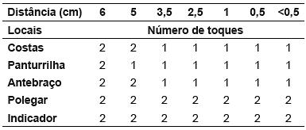
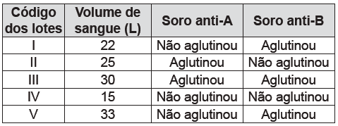

# BIOLOGIA-1_61-70 — Questões extraídas

## Questão 185 (2013.1)

A estratégia de obtenção de plantas transgênicas pela inserção de transgenes em cloroplastos, em substituição à metodologia clássica de
inserção do transgene no núcleo da célula hospedeira, resultou no aumento quantitativo da
produção de proteínas recombinantes com diversas finalidades biotecnológicas. O mesmo
tipo de estratégia poderia ser utilizada para produzir proteínas recombinantes em células de
organismos eucarióticos não fotossintetizantes,
como as leveduras, que são usadas para produção comercial de várias proteínas recombinantes e que podem ser cultivadas em grandes
fermentadores.

Considerando a estratégia metodológica descrita, qual organela celular poderia ser utilizada
para inserção de transgenes em leveduras?

- **A)** Lisossomo.
- **B)** Mitocôndria.
- **C)** Peroxissomo.
- **D)** Complexo golgiense.
- **E)** Retículo endoplasmático.

## Questão 186 (2013.1)

No Brasil, cerca de 80% da energia elétrica
advém de hidrelétricas, cuja construção implica
o represamento de rios. A formação de um reservatório para esse fim, por sua vez, pode modificar a ictiofauna local. Um exemplo é o represamento do Rio Paraná, onde se observou o
desaparecimento de peixes cascudos quase
que simultaneamente ao aumento do número de
peixes de espécies exóticas introduzidas, como
o mapará e a corvina, as três espécies com
nichos ecológicos semelhantes.

(PETESSE, M. L., PETRERE, JR. M. Ciência Hoje.
São Paulo. n.293 v. 49 jun 2012 - adaptado)

Nessa modificação da ictiofauna, o desaparecimento de cascudos é explicado pelo(a):

- **A)** redução do fluxo gênico da espécie nativa.
- **B)** diminuição da competição intraespecífica.
- **C)** aumento da competição interespecífica.
- **D)** isolamento geográfico dos peixes.
- **E)** extinção de nichos ecológicos.

## Questão 187 (2013.1)

Sabe-se que o aumento da concentração de
gases como CO2, CH4 e N2O na atmosfera é um
dos fatores responsáveis pelo agravamento do
efeito estufa. A agricultura é uma das atividades
humanas que pode contribuir tanto para a emissão quanto para o sequestre desses gases,
dependendo do manejo da matéria orgânica no
solo.
(ROSA, A. H.; COELHO, J. C. R. Cadernos
Temáticos da Química Nova na Escola.
São Paulo, n. 5 nov. 2003 - adaptado

De que maneira as práticas agrícolas podem
ajudar a minimizar o agravamento do efeito
estufa?

- **A)** Evitando a rotação de culturas.
- **B)** Liberando o CO2 presente no solo.
- **C)** Aumentando a quantidade matéria orgânica do solo.
- **D)** Queimando a matéria orgânica que se deposita no solo.
- **E)** Atenuando a concentração de resíduos vegetais do solo.

## Questão 188 (2013.1)

Cinco casais alegavam ser os pais de um bebê.
A confirmação da paternidade foi obtida pelo
exame de DNA. O resultado do teste está esquematizado na figura, em que cada casal
apresenta um padrão com duas bandas de DNA
(faixas, uma para o suposto pai e duas para a
suposta mãe), comparadas a do bebê.

Que casal pode ser considerado como pais
biológicos do bebê?

- **A)** 1.
- **B)** 2.
- **C)** 3.
- **D)** 4.
- **E)** 5. CADERNO BIOLOGIA ENEM 2009 a 2019 58

## Questão 189 (2013.1)

Uma indústria está escolhendo uma linhagem de microalgas que otimize a secreção de polímeros comestíveis, os quais são obtidos do meio de cultura de crescimento. Na figura podem ser observadas as
proporções de algumas organelas presentes no citoplasma de cada linhagem.

Qual é a melhor linhagem para se conseguir maior rendimento de polímeros secretados no meio de cultura?

- **A)** I
- **B)** II
- **C)** III
- **D)** IV
- **E)** V

## Questão 190 (2013.1)

A contaminação pelo vírus da rubéola é especialmente preocupante em grávidas, devido à
síndrome da rubéola congênita (SRC), que pode
levar ao risco de aborto e malformações congênitas.

Devido a campanhas de vacinação específicas,
nas últimas décadas houve uma grande diminuição de casos de rubéola entre as mulheres,
e, a partir de 2008, as campanhas se intensificaram e têm dado maior enfoque à vacinação de
homens jovens.

BRASIL. Brasil livre de rubéola: campanha nacional
de vacinação para eliminação da rubéola.

Considerando a preocupação com a ocorrência
da SRC, as campanhas passaram a dar enfoque à vacinação dos homens, porque eles:

- **A)** ficam mais expostos a esses vírus.
- **B)** transmitem o vírus a mulheres gestantes.
- **C)** passam a infecção diretamente para o feto.
- **D)** transferem imunidade às parceiras grávidas.
- **E)** são mais suscetíveis a esse vírus que as mulheres.

## Questão 191 (2013.1)

Estudos de fluxo de energia em ecossistemas
demonstram que a alta produtividade nos manguezais está diretamente relacionada as taxas
de produção primária líquida e a rápida reciclagem dos nutrientes. Como exemplo de seres
vivos encontrados nesse ambiente, temos:
aves, caranguejos, insetos, peixes e algas.

Dos grupos de seres vivos citados, as que contribuem diretamente para a manutenção dessa
produtividade no referido ecossistema são:

- **A)** aves.
- **B)** algas
- **C)** peixes.
- **D)** insetos.
- **E)** caranguejos.

## Questão 192 (2013.1)

Apesar de belos e impressionantes, corais exóticos encontrados na Ilha Grande podem ser
uma ameaça ao equilíbrio dos ecossistemas do
litoral do Rio de Janeiro. Originários do Oceano
Pacífico, esses organismos foram trazidos por
CADERNO BIOLOGIA
ENEM 2009 a 2019

59
plataformas de petróleo e outras embarcações,
provavelmente na década de 1980, e disputam
com as espécies nativas elementos primordiais
para a sobrevivência, como espaço e alimento.
Organismos invasores são a segunda maior
causa de perda de biodiversidade, superados
somente pela destruição direta de hábitats pela
ação do homem. As populações de espécies
invasoras crescem indefinidamente e ocupam o
espaço de organismos nativos.

(LEVY, I. Disponível em http://cienciahoje.uol.com.br.
Acesso em: 5 dez. 2011 - adaptado)

As populações de espécies invasoras crescem
bastante por terem a vantagem de:

- **A)** não apresentarem genes deletérios no seu pool gênico.
- **B)** não possuírem parasitas e predadores naturais presentes no ambiente exótico.
- **C)** apresentarem características genéticas para se adaptarem a qualquer clima ou condição ambiental.
- **D)** apresentarem capacidade de consumir toda a variedade de alimentos disponibilizados no ambiente exótico.
- **E)** apresentarem características fisiológicas que lhes conferem maior tamanho corporal que o das espécies nativas.

## Questão 193 (2013.1)

Para a identificação de um rapaz vítima de acidente, fragmentos de tecidos foram retirados e
submetidos à extração de DNA nuclear, para
comparação com o DNA disponível dos possíveis familiares (pai, avô materno, avó materna,
filho e filha). Como o teste com o DNA nuclear
não foi conclusivo, os peritos optaram por usar
também DNA mitocondrial, para dirimir dúvidas.

Para identificar o corpo, os peritos devem verificar se há homologia entre o DNA mitocondrial
do rapaz e o DNA mitocondrial do(a):

- **A)** pai.
- **B)** filho.
- **C)** filha.
- **D)** avó materna.
- **E)** avô materno.

## Questão 194 (2013.2)

A fabricação de cerveja envolve a atuação de
enzimas amilases sobre as moléculas de amido
da cevada. Sob temperatura de cerca de 65 °C,
ocorre a conversão do amido em maltose e
glicose. O caldo obtido (mosto) é fervido para a
inativação das enzimas. Após o resfriamento e a
filtração, são adicionados o lúpulo e a levedura
para que ocorra a fermentação. A cerveja sofre
maturação de 4 a 40 dias, para ser engarrafada
e pasteurizada.

(PANEK, A. D. Ciência Hoje, São Paulo,
v. 47, n. 279, mar. 2011 - adaptado)

Dentre as etapas descritas, a atividade biológica
no processo ocorre durante o(a):

- **A)** pasteurização da bebida.
- **B)** filtração do mosto.
- **C)** fermentação da maltose e da glicose.
- **D)** resfriamento do mosto.
- **E)** inativação enzimática no aquecimento.

## Questão 195 (2013.2)

A figura representa a análise gráfica de um estudo acerca da dispersão de uma doença
transmitida a um grupo de pessoas que compartilhou um mesmo ambiente de trabalho:

De acordo com o padrão apresentado no gráfico, a transmissão da doença ocorreu por:

- **A)** ingestão de água contaminada no mesmo ambiente de trabalho.
- **B)** consumo de alimentos estragados vindos da mesma fonte.
- **C)** contaminação pelo ar a partir de uma pessoa infectada.
- **D)** infecção do grupo por insetos vetores.
- **E)** manipulação de objetos contaminados.

## Questão 196 (2013.2)

Lobos da espécie Canis lycaon, do leste dos
Estados Unidos, estão intercruzando com coiotes (Canis latrans). Além disso, indivíduos presentes na borda oeste da área de distribuição
de C. lycaon estão se acasalando também com
lobos cinzentos (Canis lupus). Todos esses
cruzamentos têm gerado descendentes férteis.

(Scientific American Brasil, Rio de Janeiro,
ano II, 2011 - adaptado)
CADERNO BIOLOGIA
ENEM 2009 a 2019

60
Os animais descritos foram classificados como
espécies distintas no século XVIII. No entanto,
aplicando-se o conceito biológico de espécie,
proposto por Ernst Mayr em 1942, e ainda muito
usado hoje em dia, esse fato não se confirma,
porque:

- **A)** esses animais são morfologicamente muito semelhantes.
- **B)** o fluxo gênico entre as três populações é mantido.
- **C)** apresentam nichos ecológicos muito parecidos.
- **D)** todos têm o mesmo ancestral comum.
- **E)** pertencem ao mesmo gênero.

## Questão 197 (2013.2)

A Caatinga é o único bioma exclusivamente
brasileiro, ocupando cerca de 7% a 10% do
território nacional. Nesse ambiente seco, mesmo quando chove, não há acúmulo de água,
pois o solo é raso e pedregoso. Assim, as plantas desse bioma possuem modificações em
suas raízes, caules e folhas, que permitem melhor adaptação a esse ambiente, contra a perda
de água e de nutrientes. Geralmente, seus caules são suculentos e suas folhas possuem forma
de espinhos e cutículas altamente impermeáveis, que apresentam queda na estação seca.

Considerando as adaptações nos órgãos vegetativos, a principal característica das raízes dessas plantas, que atribui sua maior adaptação à
Caatinga, é o(a):

- **A)** armazenamento de água do solo por um sistema radicular do tipo respiratório.
- **B)** absorção de água por um sistema radicular desenvolvido e profundo.
- **C)** armazenamento de nutrientes por um sistema radicular aéreo.
- **D)** fixação do vegetal ao substrato por um sistema radicular do tipo sugador.
- **E)** fixação do vegetal ao solo por um sistema radicular do tipo tuberoso.

## Questão 198 (2013.2)

Dupla humilhação destas lombrigas, humilhação
de confessá-las a Dr. Alexandre, sério, perante
irmãos que se divertem com tua fauna intestinal
em perversas indagações: “Você vai ao circo
assim mesmo? Vai levando suas lombrigas?
Elas também pagam entrada, se não podem ver
o espetáculo? E se, ouvindo lá de dentro, as
gabarolas do palhaço, vão querer sair para fora,
hem? Como é que você se arranja?” O que é
pior: mínimo verme, quinze centímetros modestos, não mais — vermezinho idiota — enquanto
Zé, rival na escola, na queda de braço, em tudo,
se gabando mostra no vidro o novelo comprovador de seu justo gabo orgulhoso: ele expeliu,
entre ohs! e ahs! de agudo pasmo familiar, formidável tênia porcina: a solitária de três metros.

(ANDRADE, C. D. Boitempo. Rio de Janeiro, 1988)

O texto de Carlos Drummond de Andrade aborda duas parasitoses intestinais que podem afetar a saúde humana. Com relação às tênias,
mais especificamente, a Taenia solium, considera-se que elas podem parasitar o homem na
ocasião em que ele come carne de:

- **A)** carneiro mal-assada.
- **B)** boi mal-assada.
- **C)** porco mal-assada.
- **D)** peixe mal-assada.
- **E)** frango mal-assada.

## Questão 199 (2013.2)

A mosca Drosophila, conhecida como moscadas frutas, é bastante estudada no meio acadêmico pelos geneticistas. Dois caracteres estão entre os mais estudados: tamanho da asa e
cor do corpo, cada um condicionado por gene
autossômico. Em se tratando do tamanho da
asa, a característica asa vestigial é recessiva e
a característica asa longa, dominante. Em relação à cor do indivíduo, a coloração cinza é recessiva e a cor preta, dominante.

Em um experimento, foi realizado um cruzamento entre indivíduos heterozigotos para os dois
caracteres, do qual foram geradas 288 moscas.
Dessas, qual é a quantidade esperada de moscas que apresentam o mesmo fenótipo dos indivíduos parentais?

- **A)** 108
- **B)** 288
- **C)** 162
- **D)** 54
- **E)** 72

## Questão 200 (2013.2)

Para a produção de etanol combustível, as usinas retiram água do leito de rios próximos, reutilizando-a nas suas instalações. A vinhaça, resíduo líquido gerado nesse processo, é diluída
para ser adicionada ao solo, utilizando uma
técnica chamada de fertirrigação. Por meio desse procedimento, o fósforo e o potássio, essenciais à produção de cana-de-açúcar, são devolvidos ao solo, reduzindo o uso de fertilizantes
sintéticos.

Essa intervenção humana no destino da vinhaça
tem como resultado a diminuição do impacto
ambiental referente à:
CADERNO BIOLOGIA
ENEM 2009 a 2019

61

- **A)** produção de chuva ácida.
- **B)** eutrofização de lagos e represas.
- **C)** contaminação de rios por pesticidas.
- **D)** elevação da temperatura global.
- **E)** erosão do solo.

## Questão 201 (2013.2)

O sistema somatossensorial nos informa o que
ocorre tanto na superfície do corpo como em
seu interior, e processa muitas classes de diferentes estímulos, como pressão, temperatura,
toque, posição. Em uma experiência, após vendar os olhos do indivíduo, foram feitos toques
com as duas pontas de um compasso em diversas partes do corpo e em diferentes distâncias,
visando à identificação das regiões e distâncias
onde eram sentidos um ou dois toques. Os locais do corpo, a quantidade de toques que foram sentidos e a distância entre as duas pontas
do compasso estão apresentados na tabela:

As diferenças observadas entre as várias regiões do corpo refletem que a densidade dos
receptores:

- **A)** apresenta pequena diferenciação entre os diversos pontos, diferenciando-se em regiões com maior capacidade de discriminação e sensibilidade, como as costas e o antebraço.
- **B)** apresenta pequena diferenciação entre os diversos pontos, existindo regiões com menor capacidade de discriminação e sensibilidade, como o indicador e a panturrilha.
- **C)** não é a mesma em todos os pontos, existindo regiões com maior capacidade de discriminação e sensibilidade, como o panturrilha e as costas.
- **D)** se equivale, existindo pontos que manifestam uma maior sensibilidade e discriminação, como as costas e o antebraço.
- **E)** não é a mesma em todos os pontos, existindo regiões com maior capacidade de discriminação e sensibilidade, como o indicador e o polegar.

## Questão 202 (2013.2)

A transferência de genes que poderiam melhorar o desempenho esportivo de atletas saudáveis foi denominada doping genético. Uma vez
inserido no genoma do atleta, o gene se expressaria gerando um produto endógeno capaz
de melhorar o desempenho atlético.

(ARTOLI, G. G.; HIRATA, R. D. C.; LANCHA JR.
Revista Brasileira de Medicina Esportiva, 2007)

Um risco associado ao uso dessa biotecnologia
é o(a):

- **A)** aparecimento de lesões decorrentes da prática esportiva habitual.
- **B)** obtenção de baixo condicionamento físico.
- **C)** falta de controle sobre a expressão fenotípica do atleta.
- **D)** limitação das adaptações fisiológicas decorrentes do treinamento físico.
- **E)** estímulo ao uso de anabolizantes pelos atletas.

## Questão 203 (2013.2)

Garrafas PET (politereftalato de etileno) têm
sido utilizadas em mangues, onde as larvas de
ostras e de mariscos, geradas na reprodução
dessas espécies, aderem ao plástico. As garrafas são retiradas do mangue, limpas daquilo que
não interessa e colocadas nas “fazendas” de
criação, no mar.

(GALEMBECK, F. Ciência Hoje, São Paulo,
v. 47, n. 280, abr. 2011 - adaptado)

Nessa aplicação, o uso do PET é vantajoso,
pois:

- **A)** possui resistência mecânica e alta densidade.
- **B)** decompõe-se para formar petróleo a longo prazo.
- **C)** é biodegradável e poroso, auxiliando na aderência de larvas e mariscos.
- **D)** é resistente ao sol, à água salobra, a fungos e bactérias.
- **E)** diminui o consumo de garrafas plásticas.

## Questão 204 (2013.2)

As algas marinhas podem ser utilizadas para
reduzir a contaminação por metais pesados em
ambientes aquáticos. Elas podem funcionar
como uma “esponja biológica”, absorvendo esses poluentes. Dentro das células dessas algas,
esses metais são imobilizados no vacúolo por
mecanismos bioquímicos.

(Disponível em: http://revistapesquisa.fapesp.br.
Acesso em: 21 nov. 2011 - adaptado)

Nesse processo, as algas atuam como agentes
que promovem a:

- **A)** eutrofização.
- **B)** biomonitoração. CADERNO BIOLOGIA ENEM 2009 a 2019 62
- **C)** biorremediação.
- **D)** desnitrificação.
- **E)** biodigestão.

## Questão 205 (2013.2)

O manguezal é um dos mais ricos ambientes do
planeta, possui uma grande concentração de
vida, sustentada por nutrientes trazidos dos rios
e das folhas que caem das árvores. Por causa
da quantidade de sedimentos — restos de plantas e outros organismos — misturados à água
salgada, o solo dos manguezais tem aparência
de lama, mas dele resulta uma floresta exuberante capaz de sobreviver naquele solo lodoso e
salgado.
(NASCIMENTO, M. S. V.)
Para viverem em ambiente tão peculiar, as plantas dos manguezais apresentam adaptações,
tais como:

- **A)** folhas substituídas por espinhos, a fim de reduzir a perda de água para o ambiente.
- **B)** folhas grossas, que caem em períodos frios, a fim de reduzir a atividade metabólica.
- **C)** raízes respiratórias ou pneumatóforos, que afloram do solo e absorvem o oxigênio diretamente do ar.
- **D)** raízes desenvolvidas, que penetram profundamente no solo, em busca de água.
- **E)** caules modificados, que armazenam água, a fim de suprir as plantas em períodos de seca.

## Questão 206 (2013.2)

O estudo do comportamento dos neurônios ao longo de nossa vida pode aumentar a possibilidade de
cura do autismo, uma doença genética. A ilustração do experimento mostra a criação de neurônios normais a partir de células da pele de pacientes com autismo:

Analisando-se o experimento, a diferenciação de células-tronco em neurônios ocorre estimulada pela:

- **A)** atividade genética natural do neurônio autista num meio de cultura semelhante ao cérebro.
- **B)** regressão das células epiteliais a células-tronco em um meio de cultura apropriado.
- **C)** aplicação de um fator de crescimento (hormônio IGF1) e do antibiótico Gentamicina no meio de cultura.
- **D)** extração e utilização de células da pele de um indivíduo portador da doença.
- **E)** criação de um meio de cultura de células que imita o cérebro pela utilização de vitaminas e sais minerais. CADERNO BIOLOGIA ENEM 2009 a 2019 63

## Questão 207 (2013.2)

A poluição térmica, provocada principalmente
pela má utilização da água na refrigeração das
turbinas e caldeiras de usinas hidrelétricas e
termelétricas, respectivamente, afeta o aspecto
físico-químico e biológico dos cursos hídricos. A
água empregada na manutenção dessas usinas
deveria ser tratada termicamente, promovendo
a liberação do calor, para posterior devolução
ao meio ambiente. Contudo, ao ser despejada
nos lagos e nos rios, sem qualquer controle ou
fiscalização, causa sérios danos à vida aquática, pois reduz significativamente o tempo de
vida de algumas espécies, afetando seus ciclos
de reprodução.

(Disponível em: www.brasilescola.com.
Acesso em: 25 abr. 2010 - adaptado)

Um dos efeitos nocivos promovidos pela poluição térmica dos corpos hídricos pode ser identificado pelo(a):

- **A)** potenciação dos poluentes presentes, devido à diminuição da velocidade de degradação desses materiais.
- **B)** bloqueio da entrada de raios solares na água, devido ao acúmulo de sedimentos na superfície.
- **C)** prejuízo à respiração dos seres vivos, devido à redução da pressão parcial de oxigênio na água.
- **D)** desenvolvimento excessivo do fitoplâncton, devido à eutrofização do meio aquático.
- **E)** desequilíbrio dos organismos desses ecossistemas, devido ao aumento da concentração de dióxido de carbono.

## Questão 208 (2013.2)

A posição ocupada pela vaca, na interação
apresentada na tirinha, a caracteriza como:

- **A)** produtora.
- **B)** consumidora primária.
- **C)** decompositora.
- **D)** consumidora secundária.
- **E)** consumidora terciária.

## Questão 209 (2013.2)

Mitocôndrias são organelas citoplasmáticas em
que ocorrem etapas do processo de respiração
celular. Nesse processo, moléculas orgânicas
são transformadas e, juntamente com o O2, são
produzidos CO2 e H2O, liberando energia, que é
armazenada na célula na forma de ATP.

Na espécie humana, o gameta masculino (espermatozoide) apresenta, em sua peça intermediária, um conjunto de mitocôndrias, cuja função
é:

- **A)** acelerar sua maturação durante a espermatogênese.
- **B)** localizar a tuba uterina para fecundação do gameta feminino.
- **C)** fornecer energia para sua locomoção.
- **D)** facilitar a ruptura da membrana do ovócito.
- **E)** aumentar a produção de hormônios sexuais masculinos.

## Questão 210 (2013.2)

Em 1861 foi anunciada a existência de um fóssil
denominado Arqueopterix, que revolucionou o
debate acerca da evolução dos animais. Tratava-se de um dinossauro que possuía penas em
seu corpo. A partir dessa descoberta, a árvore
filogenética dos animais acabou sofrendo transformações quanto ao ancestral direto das aves.

Nessa nova árvore filogenética, de qual grupo
as aves se originaram?

- **A)** Anfíbios.
- **B)** Répteis.
- **C)** Mamíferos.
- **D)** Peixes ósseos.
- **E)** Peixes cartilaginosos.

## Questão 211 (2013.2)

Algumas estimativas apontam que, nos últimos
cem anos, a concentração de gás carbônico na
atmosfera aumentou em cerca de 40%, devido
principalmente à utilização de combustíveis
fósseis pela espécie humana. Alguns estudos
demonstram que essa utilização em larga escala promove o aumento do efeito estufa.
CADERNO BIOLOGIA
ENEM 2009 a 2019

64
Outros fatores de origem antrópica que aumentam o efeito estufa são:

- **A)** chuva ácida e destruição da camada de ozônio.
- **B)** queimada e desmatamento.
- **C)** poluição das águas e do solo.
- **D)** alagamento e inversão térmica.
- **E)** erosão e extinção das espécies.

## Questão 212 (2014.1)

Na década de 1940, na Região Centro-Oeste,
produtores rurais, cujos bois, porcos, aves e
cabras estavam morrendo por uma peste desconhecida, fizeram uma promessa, que consistiu em não comer carne e derivados até que a
peste fosse debelada. Assim, durante três meses, arroz, feijão, verduras e legumes formaram
o prato principal desses produtores.

(O Hoje, 15 out. 2011 - adaptado)

Para suprir o déficit nutricional a que os produtores rurais se submeteram durante o período da
promessa, foi importante eles terem consumido
alimentos ricos em:

- **A)** a vitaminas A e E.
- **B)** frutose e sacarose.
- **C)** aminoácidos naturais.
- **D)** aminoácidos essenciais.
- **E)** ácidos graxos saturados.

## Questão 213 (2014.1)

O potencial brasileiro para transformar lixo em
energia permanece subutilizado – apenas pequena parte dos resíduos brasileiros é utilizada
para gerar energia. Contudo, bons exemplos
são os aterros sanitários, que utilizam a principal fonte de energia ali produzida. Alguns aterros vendem créditos de carbono com base no
Mecanismo de Desenvolvimento Limpo (MDL),
do Protocolo de Kyoto.

Essa fonte de energia subutilizada, citada no
texto, é o:

- **A)** etanol, obtido a partir da decomposição da matéria orgânica por bactérias.
- **B)** gás natural, formado pela ação de fungos decompositores da matéria orgânica.
- **C)** óleo de xisto, obtido pela decomposição da matéria orgânica pelas bactérias anaeróbias.
- **D)** gás metano, obtido pela atividade de bactérias anaeróbias na decomposição da matéria orgânica.
- **E)** gás liquefeito de petróleo, obtido pela decomposição de vegetais presentes nos restos de comida.

## Questão 214 (2014.1)

A talidomida é um sedativo leve e foi muito utilizado no tratamento de náuseas, comuns no
início da gravidez. Quando foi lançada, era considerada segura para o uso de grávidas, sendo
administrada como uma mistura racêmica composta pelos seus dois enantiômeros (R e S).
Entretanto, não se sabia, na época, que o enantiômero S leva à malformação congênita, afetando principalmente o desenvolvimento normal
dos braços e pernas do bebê.

(COELHO. F. A. S. Fármacos e quiralidade. Cadernos Temáticos de Química Nova na Escola, São
Paulo. n. 3, maio 2001 - adaptado)

Essa malformação congênita ocorre porque
esses enantiômeros:

- **A)** reagem entre si.
- **B)** não podem ser separados.
- **C)** não estão presentes em partes iguais.
- **D)** interagem de maneira distinta com o organismo.
- **E)** são estruturas com diferentes grupos funcionais.

## Questão 215 (2014.1)

Embora seja um conceito fundamental para a
biologia, o termo "evolução" pode adquirir significados diferentes no senso comum. A ideia de
que a espécie humana é o ápice do processo
evolutivo é amplamente difundida, mas não é
compartilhada por muitos cientistas.

Para esses cientistas, a compreensão do processo citado baseia-se na ideia de que os seres
vivos, ao longo do tempo, passam por:

- **A)** modificação de características.
- **B)** incremento no tamanho corporal.
- **C)** complexificação de seus sistemas.
- **D)** melhoria de processos e estruturas.
- **E)** especialização para uma determinada finalidade.

## Questão 216 (2014.1)

Existem bactérias que inibem o crescimento de
um fungo causador de doenças no tomateiro,
por consumirem o ferro disponível no meio. As
bactérias também fazem fixação de nitrogênio,
disponibilizam cálcio e produzem auxinas, substâncias que estimulam diretamente o crescimento do tomateiro.

(PELZER, G. Q. et al. Mecanismos de controle da
murcha-de-esclerócio e promoção de crescimento em
tomateiro mediados por rizobactérias. Tropical Plant
Pathology. v. 36, n. 2, mar.-abr. 2011 - adaptado)
CADERNO BIOLOGIA
ENEM 2009 a 2019

65
Qual dos processos biológicos mencionados indica uma relação ecológica de competição?

- **A)** Fixação de nitrogênio para o tomateiro.
- **B)** Disponibilização de cálcio para o tomateiro.
- **C)** Diminuição da quantidade de ferro disponível para o fungo.
- **D)** Liberação de substâncias que inibem o crescimento do fungo.
- **E)** Liberação de auxinas que estimulam o crescimento do tomateiro.

## Questão 217 (2014.1)

Uma região de Cerrado possui lençol freático profundo, estação seca bem marcada, grande insolação e
recorrência de incêndios naturais. Cinco espécies de árvores nativas, com as características apresentadas no quadro, foram avaliadas quanto ao seu potencial para uso em projetos de reflorestamento nessa
região.

Qual é a árvore adequada para o reflorestamento dessa região?

- **A)** 1
- **B)** 2
- **C)** 3
- **D)** 4
- **E)** 5

## Questão 218 (2014.1)

Em um laboratório de genética experimental, observou-se que determinada bactéria continha um gene
que conferia resistência a pragas específicas de plantas. Em vista disso, os pesquisadores procederam
de acordo com a figura.

Do ponto de vista biotecnológico, como a planta representada na figura é classificada?

- **A)** Clone.
- **B)** Híbrida.
- **C)** Mutante.
- **D)** Adaptada.
- **E)** Transgênica. CADERNO BIOLOGIA ENEM 2009 a 2019 66

## Questão 219 (2014.1)

No heredograma, os símbolos preenchidos representam pessoas portadoras de um tipo raro
de doença genética. Os homens são representados pelos quadrados e as mulheres, pelos
círculos.

Qual é o padrão de herança observado para
essa doença?

- **A)** Dominante autossômico, pois a doença aparece em ambos os sexos.
- **B)** Recessivo ligado ao sexo, pois não ocorre a transmissão do pai para os filhos.
- **C)** Recessivo ligado ao Y, pois a doença é transmitida dos pais heterozigotos para os filhos.
- **D)** Dominante ligado ao sexo, pois todas as filhas de homens afetados também apresentam a doença.
- **E)** Codominante autossômico, pois a doença é herdada pelos filhos de ambos os sexos, tanto do pai quanto da mãe.

## Questão 220 (2014.1)

Um pesquisador percebe que o rótulo de um
dos vidros em que guarda um concentrado de
enzimas digestivas está ilegível. Ele não sabe
qual enzima o vidro contém, mas desconfia de
que seja uma protease gástrica, que age no
estômago digerindo proteínas. Sabendo que a
digestão no estômago é ácida e no intestino é
básica, ele monta cinco tubos de ensaio com
alimentos diferentes, adiciona o concentrado de
enzimas em soluções com pH determinado e
aguarda para ver se a enzima age em algum
deles.

O tubo de ensaio em que a enzima deve agir
para indicar que a hipótese do pesquisador está
correta é aquele que contém:

- **A)** cubo de batata em solução com pH = 9.
- **B)** pedaço de carne em solução com pH = 5.
- **C)** clara de ovo cozida em solução com pH = 9.
- **D)** porção de macarrão em solução com pH = 5.
- **E)** bolinha de manteiga em solução com pH = 9.

## Questão 221 (2014.1)

Com o objetivo de substituir as sacolas de polietileno, alguns supermercados têm utilizado um
novo tipo de plástico ecológico, que apresenta
em sua composição amido de milho e uma resina polimérica termoplástica, obtida a partir de
uma fonte petroquímica.

(ERENO. D. Plásticos de vegetais. Pesquisa
Fapesp. n. 179. jan. 2011 - adaptado)

Nesses plásticos, a fragmentação da resina
polimérica é facilitada porque os carboidratos
presentes:

- **A)** dissolvem-se na água.
- **B)** absorvem água com facilidade.
- **C)** caramelizam por aquecimento e quebram.
- **D)** são digeridos por organismos decompositores.
- **E)** decompõem-se espontaneamente em contato com água e gás carbônico.

## Questão 222 (2014.1)

Em um hospital havia cinco lotes de bolsas de
sangue, rotulados com os códigos I, II, III, IV e
V. Cada lote continha apenas um tipo sanguíneo não identificado.

Uma funcionária do hospital resolveu fazer a
identificação utilizando dois tipos de soro, anti-A
e anti-B. Os resultados obtidos estão descritos
no quadro.

Quantos litros de sangue eram do grupo sanguíneo do tipo A?

- **A)** 15
- **B)** 25
- **C)** 30
- **D)** 33
- **E)** 55

## Questão 223 (2014.1)

Os parasitoides (misto de parasitas e predadores) são insetos diminutos que têm hábitos muito peculiares: suas larvas podem se desenvolver dentro do corpo de outros organismos, como
mostra a figura. A forma adulta se alimenta de
pólen e açúcares.

Em geral, cada parasitoide ataca hospedeiros
de determinada espécie e, por isso, esses organismos vêm sendo amplamente usados para o
controle biológico de pragas agrícolas.

## Gabarito

- Questão 185:
- Questão 186:
- Questão 187:
- Questão 188:
- Questão 189:
- Questão 190:
- Questão 191:
- Questão 192:
- Questão 193:
- Questão 194:
- Questão 195:
- Questão 196:
- Questão 197:
- Questão 198:
- Questão 199:
- Questão 200:
- Questão 201:
- Questão 202:
- Questão 203:
- Questão 204:
- Questão 205:
- Questão 206:
- Questão 207:
- Questão 208:
- Questão 209:
- Questão 210:
- Questão 211:
- Questão 212:
- Questão 213:
- Questão 214:
- Questão 215:
- Questão 216:
- Questão 217:
- Questão 218:
- Questão 219:
- Questão 220:
- Questão 221:
- Questão 222:
- Questão 223:
