# BIOLOGIA-1_71-80 — Questões extraídas

## Questão 224 (2014.1)

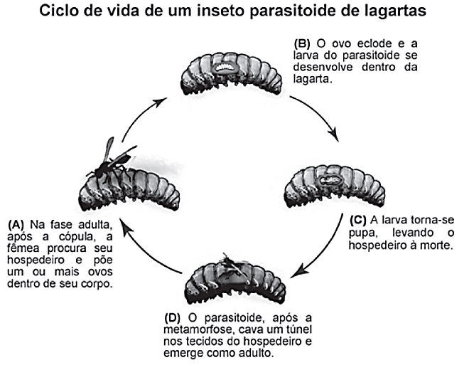

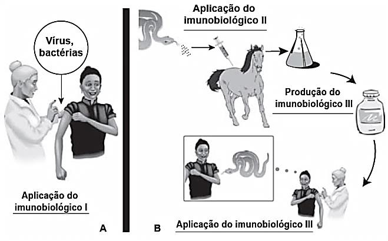

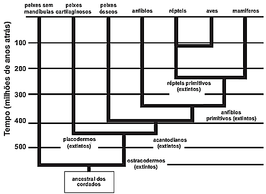

Imunobiológicos:
diferentes formas de produção, diferentes aplicações

Embora sejam produzidos e utilizados em situações distintas, os imunobiológicos I e II atuam de forma
semelhante nos humanos e equinos, pois:

- **A)** conferem imunidade passiva.
- **B)** transferem células de defesa.
- **C)** suprimem a resposta imunológica.
- **D)** estimulam a produção de anticorpos.
- **E)** desencadeiam a produção de antígenos. CADERNO BIOLOGIA ENEM 2009 a 2019 68

## Questão 225 (2014.2)

A classificação dos seres vivos permite a compreensão das relações evolutivas entre eles. O esquema
representa a história evolutiva de um grupo.

Os animais representados nesse esquema pertencem ao filo dos cordados, porque:

- **A)** possuem ancestrais que já foram extintos.
- **B)** surgiram há mais de 500 milhões de anos.
- **C)** evoluíram a partir de um ancestral comum.
- **D)** deram origem aos grupos de mamíferos atuais.
- **E)** vivem no ambiente aquático em alguma fase da vida.

## Questão 226 (2014.1)

Segundo a teoria evolutiva mais aceita hoje, as
mitocôndrias, organelas celulares responsáveis
pela produção de ATP em células eucariotas,
assim como os cloroplastos, teriam sido originados de procariontes ancestrais que foram incorporados por células mais complexas.

Uma característica da mitocôndria que sustenta
essa teoria é a:

- **A)** a capacidade de produzir moléculas de ATP.
- **B)** presença de parede celular semelhante à de procariontes.
- **C)** presença de membranas envolvendo e separando a matriz mitocondrial do citoplasma.
- **D)** capacidade de autoduplicação dada por DNA circular próprio semelhante ao bacteriano.
- **E)** presença de um sistema enzimático eficiente às reações químicas do metabolismo aeróbio.

## Questão 227 (2014.2)

Se por um lado a Revolução Industrial instituiu
um novo patamar de tecnologia e, com isso,
uma melhoria na qualidade de vida da população, por outro lado os resíduos decorrentes
desse processo podem se acumular no ar, no
solo e na água, causando desequilíbrios no
ambiente.

O acúmulo dos resíduos provenientes dos processos industriais que utilizam combustíveis
fósseis traz como consequência o(a):

- **A)** eutrofização dos corpos-d'água, aumentando a produtividade dos sistemas aquáticos.
- **B)** precipitação de chuvas ácidas, danificando florestas, ecossistemas aquáticos e construções.
- **C)** mudança na salinidade dos mares, provocando a mortalidade de peixes e demais seres aquáticos. CADERNO BIOLOGIA ENEM 2009 a 2019 69
- **D)** acúmulo de detritos, causando entupimento de bueiros e alagamento das ruas.
- **E)** presença de mosquitos, levando à disseminação de doenças bacterianas e virais.

## Questão 228 (2014.1)

Na década de 1990, células do cordão umbilical
de recém-nascidos humanos começaram a ser
guardadas por crio preservação, uma vez que
apresentam alto potencial terapêutico em consequência de suas características peculiares.

O poder terapêutico dessas células baseia-se
em sua capacidade de:

- **A)** multiplicação lenta.
- **B)** comunicação entre células.
- **C)** adesão a diferentes tecidos.
- **D)** diferenciação em células especializadas.
- **E)** reconhecimento de células semelhantes.

## Questão 229 (2014.2)

No ano de 2009, registrou-se um surto global de
gripe causada por um variante do vírus Influenza A, designada H1N1. A Organização Mundial
de Saúde (OMS) solicitou que os países intensificassem seus programas de prevenção para
que não houvesse uma propagação da doença.
Uma das ações mais importantes recomendadas pela OMS era a higienização adequada das
mãos, especialmente após tossir e espirrar.

A ação recomendada pela OMS tinha como
objetivo:

- **A)** reduzir a reprodução viral.
- **B)** impedir a penetração do vírus na pele.
- **C)** reduzir o processo de autoinfecção viral.
- **D)** reduzir a transmissão do vírus no ambiente.
- **E)** impedir a seleção natural de vírus resistentes.

## Questão 230 (2014.2)

Os gêmeos sempre exerceram um fascínio para
a maioria das pessoas, principalmente os monozigóticos ou idênticos. Parte desse interesse
está relacionada ao fato de que esses indivíduos representam a manifestação natural que
mais se aproxima da clonagem na espécie humana.

O mecanismo que está associado com a formação dos indivíduos citados é a:

- **A)** divisão do feto em gestação em dois indivíduos separados.
- **B)** divisão do embrião em dois grupos celulares independentes.
- **C)** fecundação de um óvulo por dois espermatozoides diferentes.
- **D)** ocorrência de duas fecundações simultâneas no útero materno.
- **E)** fertilização sucessiva de dois óvulos por apenas um espermatozoide.

## Questão 231 (2014.2)

Na técnica de plantio conhecida por hidroponia,
os vegetais são cultivados em uma solução de
nutrientes no lugar do solo, rica em nitrato e
ureia. Nesse caso, ao fornecer esses nutrientes
na forma aproveitável pela planta, a técnica
dispensa o trabalho das bactérias fixadoras do
solo, que, na natureza, participam do ciclo
do(a):

- **A)** água.
- **B)** carbono.
- **C)** nitrogênio.
- **D)** oxigênio.
- **E)** fósforo.

## Questão 232 (2014.2)

Ao se caracterizarem os aspectos ambientais do
setor sucroalcooleiro, é preciso analisar dois
setores: o setor agrícola, que se refere às atividades desenvolvidas na área que a cultura da
cana-de-açúcar ocupa, e o setor industrial, que
está relacionado à fabricação de açúcar e álcool.

Para essa atividade produtiva, como impacto
ambiental causado pelo setor industrial, tem-se
o(a):

- **A)** compactação do solo.
- **B)** assoreamento dos rios.
- **C)** desmatamento de áreas.
- **D)** queima da cana-de-açúcar.
- **E)** geração de resíduos poluidores.

## Questão 233 (2014.2)

Os corais funcionam como termômetros, capazes de indicar, mudando de coloração, pequenas alterações na temperatura da água dos
oceanos. Mas, um alerta, eles estão ficando
brancos. O seu clareamento progressivo acontece pela perda de minúsculas algas, chamadas
zooxantelas, que vivem dentro de seus tecidos,
numa relação de mutualismo.

(Disponível em: http://super.abril.com.br.
Acesso em: 6 dez. 2012 - adaptado)

O desequilíbrio dessa relação faz com que os
pólipos que formam os corais tenham dificuldade em:
CADERNO BIOLOGIA
ENEM 2009 a 2019

70

- **A)** produzir o próprio alimento.
- **B)** obter compostos nitrogenados.
- **C)** realizar a reprodução sexuada.
- **D)** absorver o oxigênio dissolvido na água.
- **E)** adquirir nutrientes derivados da fotossíntese.

## Questão 234 (2014.2)

Estranha neve:

espuma, espuma apenas  que
o vento espalha,

bolha em baile no ar,

vinda do Tietê alvoroçado ao
abrir de comportas,

espuma de dodecilbenzeno irredutível,

emergindo das águas profanadas do rio-bandeirante,

hoje rio-despejo de mil imundícies do progresso.

(Andrade, C. D. Poesia e prosa. Rio de Janeiro:
Nova Aguiar, 1992 - fragmento)

Nesse poema, o autor faz referência à:

- **A)** disseminação de doenças nas áreas atingidas por inundações.
- **B)** contaminação do lençol freático pela eliminação de lixo nos rios.
- **C)** ocorrência de enchente causada pela impermeabilização dos solos.
- **D)** presença de detergentes sintéticos como agentes poluentes de águas.
- **E)** destruição de fauna e flora pela contaminação de bacias hidrográficas.

## Questão 235 (2014.2)

Antes de técnicas modernas de determinação
de paternidade por exame de DNA, o sistema
de determinação sanguínea ABO foi amplamente utilizado como ferramenta para excluir possíveis pais. Embora restrito à análise fenotípica,
era possível concluir a exclusão de genótipos
também. Considere que uma mulher teve um
filho cuja paternidade estava sendo contestada.
A análise do sangue revelou que ela era do tipo
sanguíneo AB e o filho, do tipo sanguíneo B.

O genótipo do homem, pelo sistema ABO, que
exclui a possibilidade de paternidade desse filho
é:

- **A)** IAIA.
- **B)** IAi.
- **C)** IBIB.
- **D)** IBi.
- **E)** ii.

## Questão 236 (2014.2)

O movimento pelo saneamento do Brasil, desencadeado durante a Primeira República, colocou em evidência as precárias condições de
saúde das populações rurais. A origem e trajetória desse movimento estiveram diretamente
relacionadas à história da doença de Chagas.

(KROPF,S. P.; LIMA, N. T. Disponível em
www.fiocruz.br. Acesso em 01/08/2012 - adaptado)

A intervenção ambiental considerada fundamental para a prevenção dessa doença é a:

- **A)** limpeza de terrenos baldios, com a retirada de matéria orgânica em decomposição.
- **B)** construção de unidade de saúde, com atendimento mais eficiente aos indivíduos infectados.
- **C)** melhoria das condições de habitação, com redução de insetos no ambiente domiciliar e peridomiciliar.
- **D)** construção de estradas e rodovias, com garantias de melhor acesso da população rural ao sistema de saúde.
- **E)** limpeza do ambiente domiciliar e peridomiciliar, com retirada de entulhos e recipientes que possam acumular água.

## Questão 237 (2014.2)

O Brasil tem investido em inovações tecnológicas para a produção e comercialização de maçãs. Um exemplo é a aplicação do composto
volátil 1-metilciclopropeno, que compete pelos
sítios de ligação do hormônio vegetal etileno
nas células desse fruto.

(Disponível em http://revistaeletronicas.pucrs.br.
Acesso em 16/08/2012 - adaptado)

Com base nos conhecimentos sobre o efeito
desse hormônio, o 1-metilciclopropeno age retardando o(a):

- **A)** formação do fruto.
- **B)** crescimento do fruto.
- **C)** amadurecimento do fruto.
- **D)** germinação das sementes.
- **E)** formação de sementes no fruto.

## Questão 238 (2014.2)

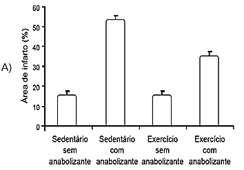

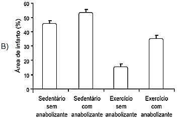

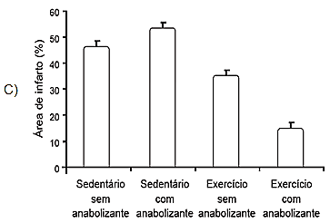

Surtsey é uma ilha vulcânica situada perto da
costa sul da Islândia. A erupção vulcânica que
lhe deu origem ocorreu na década de 1960, o
que faz dela, seguramente, a ilha mais nova do
Oceano Atlântico. As primeiras espécies que aí
se fixaram foram musgos e liquens. À medida
que as aves foram fixando-se na ilha, as condições do solo foram melhorando e espécies vegetais mais complexas puderam iniciar a coloni-
CADERNO BIOLOGIA
ENEM 2009 a 2019

71
zação do território. Em 1988 foi observada a
presença do primeiro arbusto.

(Disponível em www.nacopadasarvores.com.br.
Acesso em 25/05/2012 fragmento)

O conjunto das alterações ocorridas no ambiente descrito é exemplo de:

- **A)** nicho ecológico.
- **B)** eficiência ecológica.
- **C)** sucessão ecológica.
- **D)** irradiação adaptativa.
- **E)** resistência ambiental.

## Questão 239 (2014.2)

O arroz-dourado é uma planta transgênica capaz de produzir quantidades significativas de
betacaroteno, que é ausente na variedade branca. A presença dessa substância torna os grãos
amarelados, o que justifica seu nome.

A ingestão dessa variedade geneticamente modificada está relacionada à redução da incidência de:

- **A)** fragilidade óssea.
- **B)** fraqueza muscular.
- **C)** problemas de visão.
- **D)** alterações na tireoide.
- **E)** sangramento gengival.

## Questão 240 (2014.2)

Determinado bioma brasileiro apresenta vegetação conhecida por perder as folhas e ficar apenas com galhos esbranquiçados, ao passar por
até nove meses de seca. As plantas podem
acumular água no caule e na raiz, além de
apresentarem folhas pequenas, que em algumas espécies assumem a forma de espinhos.

Qual região fitogeográfica brasileira apresenta
plantas com essas características?

- **A)** Cerrado.
- **B)** Pantanal.
- **C)** Caatinga.
- **D)** Mata Atlântica.
- **E)** Floresta Amazônica.

## Questão 241 (2014.2)

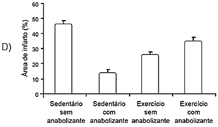

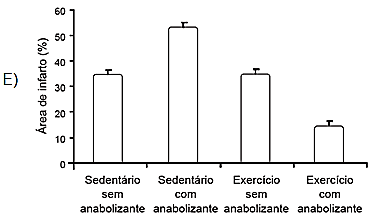

Os efeitos do exercício físico na redução de
doenças cardiovasculares são bem conhecidos,
aumentando, por exemplo, a tolerância a infartos em comparação com indivíduos sedentários.
Visando ganho de força, de massa muscular e
perda de gordura, verifica-se o uso de anabolizantes por alguns esportistas.
Em uma pesquisa com ratos, confirmou-se a
melhora da condição cardíaca em resposta ao
exercício, mas verificou-se que os efeitos benéficos do exercício físico são prejudicados pelo
uso de anabolizantes, como o decanoato de
nandrolona, aumentando a área cardíaca afetada pelo infarto.

((CHAVES, E.A. et al. Cardioproteção induzida pelo
exercício é prejudicada por anabolizantes. Brazilian
Journal of Biomotricity, v.1, n.3, 2007 - adaptado))

Qual gráfico representa os resultados desse
estudo?
CADERNO BIOLOGIA
ENEM 2009 a 2019

72

## Questão 242 (2014.2)

A eutrofização é um dos fenômenos responsáveis pela mortalidade de parte das espécies
aquáticas e, em regiões próximas a centros
urbanos, pela perda da qualidade de vida da
população. Um exemplo é a Lagoa da Pampulha, um dos mais conhecidos pontos turísticos
da capital de Minas Gerais, onde as atividades
de pesca e nado não são mais permitidas.

Para evitar a ocorrência desse fenômeno em
lagos deve-se:

- **A)** manter inalterado seu volume de água.
- **B)** aumentar a população de algas planctônicas.
- **C)** diminuir o teor de nutrientes despejados nas águas.
- **D)** impedir a fotossíntese das algas abaixo da superfície.
- **E)** aumentar a população de espécies do topo da cadeia alimentar.

## Questão 243 (2014.3)

Em media, a cada 28 dias ocorrem mudanças
no corpo da mulher devido ao seu ciclo reprodutivo. Em cada ciclo, observam-se modificações
morfológicas nas glândulas mamárias, ovários e
Otero, em função da liberação de inúmeros
hormônios. No inicio do ciclo observa-se que o
hormônio liberador de gonadotrofinas (GnRH)
estimula também a liberação de um outro hormônio (X), que proporciona o crescimento e
diferenciação de um ovócito primário, a proliferação das células foliculares, a formação da
zona pelúcida e o desenvolvimento de uma
capsula de tecido conjuntivo (denominada teca
folicular).

O hormônio X ao qual o texto se refere o(a):

- **A)** estrogênio.
- **B)** progesterona.
- **C)** luteinizante (LH).
- **D)** folículo estimulante (FSH).
- **E)** gonadotrófico coriônico humano (HCG).

## Questão 244 (2014.3)

O ciclo da água envolve processos de evaporação, condensação e precipitação da água no
ambiente. Na etapa de evaporação, pode-se
dizer que a água resultante encontra-se pura,
entretanto, quando em contato com poluentes
atmosféricos, como os óxidos sulfuroso e nitroso, é contaminada. Dessa forma, quando a
água precipita, traz consigo substâncias que
interferem diretamente no ambiente.

A qual problema ambiental o texto faz referencia?

- **A)** Chuva acida.
- **B)** Poluição do ar.
- **C)** Aquecimento global.
- **D)** Destruição da camada de ozônio.
- **E)** Eutrofização dos corpos hídricos.

## Questão 245 (2014.3)

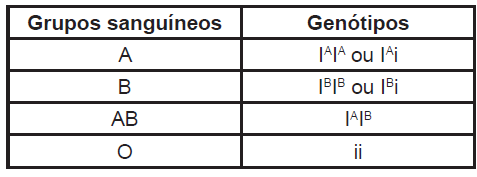

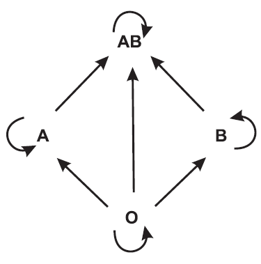

A radioterapia a um método capaz de destruir
células tumorais, empregando feixe de radiações ionizantes. Uma dose pré-calculada de
radiação e aplicada, buscando destruir as células tumorais, com o menor dano possível as
células normais circunvizinhas. A resposta dos
tecidos as radiações depende de diversos fatores, entre eles a oxigenação. Em termos práticos isto quer dizer que, para um mesmo efeito,
em condições de hipóxia (baixa oxigenação) a
necessária uma dose de irradiação 2,5 a 3,5
vezes superior a que seria indicada em condições de oxigenação normais, o que seria letal.

(Disponível em: www.inca.gov.br. Acesso: 6 ago.12)

Considerando essas informações, pode-se deduzir que a aplicação desse procedimento está
contraindicada na situação de:

- **A)** anemia.
- **B)** basofilia.
- **C)** eosinofilia.
- **D)** linfocitose.
- **E)** leucopenia. CADERNO BIOLOGIA ENEM 2009 a 2019 73

## Questão 246 (2014.3)

A reprodução a uma característica atribuída a
todos os seres vivos, unicelulares ou pluricelulares, de qualquer espécie.

Em condições naturais, a importância dessa
característica reside no fato de permitir o(a):

- **A)** transferência de características básicas entre indivíduos de espécies diferentes.
- **B)** duplicação da quantidade de DNA nas células da espécie ao longo das gerações.
- **C)** cruzamento entre indivíduos de espécies diferentes, gerando descendentes férteis.
- **D)** aumento da quantidade de células dos seres vivos, para que se tornem pluricelulares.
- **E)** perpetuação da espécie e conservação de suas características ao longo das gerações.

## Questão 247 (2014.3)

O quadro a seguir refere-se aos grupos sanguíneos humanos e seus respectivos genótipos, e
o esquema seguinte representa as possibilidades de doação entre esses diferentes grupos.

Um casal tem três filhos, sendo um do grupo A,
outro do grupo B e o terceiro do grupo O. Considerando-se somente o sistema ABO para fins
de transfusão sanguínea, a probabilidade de o
casal dar à Iuz uma menina que no futuro possa
doar sangue para todos seus irmãos e de:

- **A)** 75,0%.
- **B)** 50,0%.
- **C)** 37,5%.
- **D)** 25,0%.
- **E)** 12,5%.

## Questão 248 (2014.3)

A celulose, presente nos vegetais, é um alimento importante para muitas espécies de animais
herbívoros, como os ruminantes. Eles próprios
não têm capacidade de digerir a celulose e,
para que ela seja aproveitada, necessária uma
associação com microrganismos, que ficam na
parte aglandular do estomago dos ruminantes.
Esses microrganismos são capazes de produzir
a celulase, uma enzima que digere a celulose,
possibilitando o aproveitamento da matéria orgânica vegetal, tanto pelos ruminantes como
pelos microrganismos.

A relação descrita e um exemplo de:

- **A)** predatismo.
- **B)** competição
- **C)** mutualismo.
- **D)** inquilinismo.
- **E)** comensalismo.

## Questão 249 (2014.3)

Manguezais são biomas litorâneos que ocorrem
ao longo da costa brasileira com vegetação
característica que se desenvolve em solo lodoso, alagado e salgado. Uma planta presente
nesse bioma a Aviccenia tomentosa, conhecida
popularmente como siriúba. Dentre as características adaptativas dessa planta, destacam-se
suas raízes, que afloram perpendicularmente ao
solo, conhecidas como pneumatóforos.

Essa adaptação este relacionada a uma maior:

- **A)** eliminação de água.
- **B)** captação de O2 do ar.
- **C)** captação de CO2 do ar.
- **D)** absorção de nutrientes.
- **E)** fixação ao solo do manguezal.

## Questão 250 (2014.3)

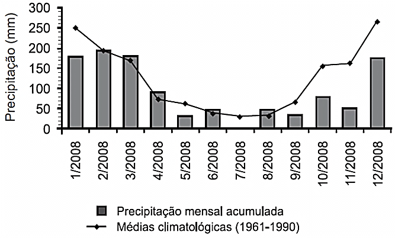

O mimetismo a uma característica adaptativa
que pode influenciar positivamente nas chances
de sobrevivência. Nessa condição, uma espécie
apresenta uma característica de outra espécie
que a não comestível e/ou não palatável.

Como exemplo de seres que se utilizam dessa
estratégia de sobrevivência, há:

- **A)** inseto cuja forma e coloração assemelhamse a folhas de arvores em estado de decomposição.
- **B)** a raposa-do-ártico, que apresenta pelagens diferentes para a estação do inverno e estação do verso.
- **C)** o cavalo-marinho, que apresenta projeções no corpo que lembram as algas entre as quais eles vivem. CADERNO BIOLOGIA ENEM 2009 a 2019 74
- **D)** a falsa-coral, que apresenta a coloração similar a da coral-verdadeira apesar de ser pouco peçonhenta.
- **E)** o camaleão, que muda a sua coloração assumindo as cores predominantes do local onde se encontra.

## Questão 251 (2014.3)

Meios de cultura são utilizados como fontes de
nutrientes para o crescimento de microrganismos em laboratórios. Pesquisadores brasileiros
avaliaram a viabilidade da produção de acido
lático pela bactéria Leuconostoc mesenteroides
B512F, utilizando na composição do meio de
cultura um substrato a base de material obtido
do aproveitamento de excedentes da agroindústria tropical local de caju. Os resultados obtidos
mostraram que o meio de cultura enriquecido
com xarope de caju propiciou um crescimento
adequado desta bactéria.

(GUILHERME. A.A.; PINTO, G.A.S.; RODRIGUES, S.
AveUndo da produção de acido lático por Leuconostoc mesenteroides B512F em xarope de caju. Ciência
Tecnologia de Alimentos, 29(4), 2009 - adaptado)

O carboidrato presente no xarope de caju que
auxiliou no crescimento desta bactéria foi a:

- **A)** celulose.
- **B)** glicose.
- **C)** maltose.
- **D)** lactose.
- **E)** ribose.

## Questão 252 (2014.3)

O gráfico apresenta a precipitação mensal acumulada no município de São Carlos, SP, ao
longo do ano de 2008, contrastando com as
medias mensais para o período de 1961 a 1990.

Considerando-se que a produção de agentes
poluentes tem se mantido constante desde 1961
e que o escoamento pluvial seja a principal fonte de poluição dos rios da região, seria de se
esperar que o volume de poluentes nos rios
durante a primavera (setembro a dezembro) de
2008 fosse:

- **A)** progressivamente menor a cada mês.
- **B)** semelhante a media histórica no verão.
- **C)** acima da média de verão para o mesmo ano.
- **D)** abaixo da média de inverno para o mesmo ano.
- **E)** menor que a média histórica no mesmo período.

## Questão 253 (2014.3)

Adubação verde, uma das maneiras de cultivar
e tratar bem o solo, e uma técnica agrícola que
consiste no cultivo de espécies de plantas com
elevado potencial de produção de massa vegetal, semeadas em rotação, sucessão e ate em
consorcio com culturas de interesse econômico.
No cultivo em rotação, o adubo verde pode ser
incorporado ao solo após a rogada para posterior plantio da cultura de interesse econômico, ou
mantido em cobertura sobre a superfície do
terreno, fazendo-se o plantio direto da cultura na
palhada.

(SILVA, A.C.F. Adubação verde e o manejo de cobertura do solo. Jornal Vanguarda, 15 abr. 2010
Acesso em: www.jvanguarda.com.br - adaptado)

A técnica de adubação verde é vantajosa por:

- **A)** permitir correção química refinada do solo.
- **B)** liberar gradualmente sais minerais diversos.
- **C)** viabilizar uma adubação rápida em regiões frias.
- **D)** permitir o arraste da massa vegetal, evitando excesso.
- **E)** limitar a respiração do solo, diminuindo nematoides indesejados.

## Questão 254 (2014.3)

A reportagem "Primo pobre das doenças" publicada na revista Ciência Hoje em 2005, relatava
a ação de uma organização não governamental
norte americana em busca do desenvolvimento
de uma vacina contra o Plasmodium. O Plasmodium e um parasita que, ao penetrar no corpo humano, pode causar uma série de sintomas, sendo clássico o estado febril grave que
pode levar o individuo ao Óbito.

(Disponível em: http://cienciahoje.uol.com.br.
Acesso em: 01 mar. 2012)

Essa vacina tem como objetivo controlar a ocorrência da:

- **A)** doença de Chagas.
- **B)** toxoplasmose.
- **C)** leishmaniose.
- **D)** elefantíase.
- **E)** malária. CADERNO BIOLOGIA ENEM 2009 a 2019 75

## Questão 255 (2014.3)

Após um aumento de 80% nos casos de doença
de Chagas na cidade de Belém (PA), a Vigilância Sanitária do município interditou cinco pontos de venda de agaí. Os locais interditados
desobedeciam às regras de higiene na manipulação do fruto e, por isso, apresentavam risco
de contaminação. Um dos problemas encontrados foi a estrutura de madeira de um desses
locais, propicia para a proliferação do barbeiro,
inseto transmissor da doença de Chagas, que a
causada pelo Tripanosoma cruzi, protozoário
encontrado nas fezes destes insetos.

(Folha de São Paulo. Disponível em:
http://www1.folha.uol.com.br.
Acesso em: 25 out. 2011 - adaptado)

Que medida poderia ser tomada durante o preparo do alimento para evitar a contaminação
dos consumidores da polpa do açaí?

- **A)** Adição de açúcar.
- **B)** Secagem dos frutos.
- **C)** Pasteurização do produto.
- **D)** Diluição da polpa em água.
- **E)** Adição de corantes naturais.

## Questão 256 (2014.3)

Uma das possíveis alternativas para a substituição da gasolina como combustível de automóveis é a utilização do gás hidrogênio, que, ao
reagir com o gás oxigênio, em condições adequadas, libera energia necessária para o funcionamento do motor, conforme a equação química a seguir:

2 H2 (g) + O2 (g) → 2 H2O (g) + energia

Esta opção para a substituição da gasolina contribuiria para que a condição do meio ambiente
seja melhorada, visto que:

- **A)** calor gerado pela reação intensificara o aquecimento global.
- **B)** aumentara a quantidade de gases causadores do aquecimento global.
- **C)** a emissão de gases causadores do aquecimento global permanecera inalterada.
- **D)** ocorrerá a diminuição da emissão de um dos gases causadores do aquecimento global.
- **E)** os gases liberados na reação podem neutralizar aqueles responsáveis pelo aquecimento global.

## Questão 257 (2014.3)

A relação simbiótica entre plantas e certos microrganismos têm sido explorada pela agricultura para aumentar a produtividade. Um exemplo
conhecido são as micorrizos, fungos associados
a raízes de plantas que as ajudam a absorver
nutrientes do solo. Recentemente, pesquisadores conseguiram inocular, em tomateiros, fungos simbiontes de plantas que crescem naturalmente em áreas próximas a fontes de águas
quentes e que resistem a temperaturas em tono
de 65 °C.

(Scientific American Brazil, n. 97, jun. 2010 - adp)

A vantagem da inoculação desses fungos nos
tomateiros deve-se a possibilidade de aumentar
a produtividade, pois:

- **A)** o cultivo de tomate poderá ser feito em regiões de águas termais ricas em nutrientes.
- **B)** as novas plantas de tomate serão mais resistentes a fungos patogênicos.
- **C)** as novas plantas de tomate poderão ser cultivadas em regiões de temperaturas extremas.
- **D)** a área de cultivo de tomate poderá ser ampliada para regiões com temperaturas mais quentes.
- **E)** os frutos produzidos por essas plantas não serão suscetíveis a decomposição por fungos.

## Questão 258 (2014.3)

Os impactos da construção de represas são
relativamente bem documentados para muitas
bacias hidrográficas. Estes impactos estão relacionados ao tamanho, volume, tempo de retenção de água do reservatório, localização geográfica e posição no trajeto do rio.

As alterações na região produzem efeitos e
impactos, tais como:

- **A)** elevação da taxa de reprodução dos peixes da região pelo aumento da área inundada.
- **B)** diminuição da quantidade de CO2 na atmosfera pela formação do reservatório.
- **C)** maior incidência de doenças endérmicas transmitidas por mosquitos da região.
- **D)** alteração dos níveis de precipitação pela ampliação do lençol freático.
- **E)** aumento na quantidade de água no ciclo hidrográfico da bacia atingida.

## Questão 259 (2014.3)

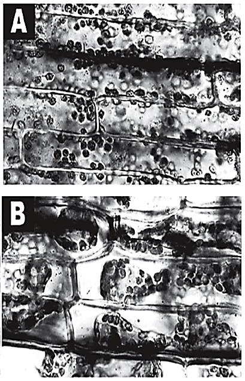

O petróleo que vaza de um navio cargueiro em
alto-mar pode ser removido por meio de duas
técnicas de dispersão mecânica, em que jatos
de água ou de areia são usados para dissociar
a mancha em pequenos pedaços e facilitar sua
degradação.
(Disponível em: http://g1.globo.com.
Acesso em: 24 nov. 2011 - adaptado)

Apesar de eficientes, essas técnicas apresentam importante potencial de contaminação do
solo marítimo quando:
CADERNO BIOLOGIA
ENEM 2009 a 2019

76

- **A)** petróleo que chega a praia fica impregnado na areia que a arrastada para o fundo.
- **B)** os jatos de água ou de areia empurram o petróleo da superfície para o fundo do mar.
- **C)** o petróleo fica diluído na água salgada e, por ser mais denso que a água do mar, ira afundar.
- **D)** os jatos de água ou de areia provocam um movimento de circulação da água, que leva o petróleo para o fundo.
- **E)** o petróleo fica diluído na água e atinge o fundo pela convecção da água e pelo afundamento dos grãos de areia do jato.

## Questão 260 (2014.3)

As figuras A e B mostram um tecido vegetal
observado sob microscópio, evidenciando o
fenômeno da plasmólise de uma célula vegetal,
quando em contato com um meio externo de
diferente concentração.

Considerando que as figuras A e B mostram
duas situações de um mesmo experimento,
pode-se afirmar que as células da figura:

- **A)** A estão em contato com um meio externo mais concentrado, sofrendo aumento de volume.
- **B)** A e B foram colocadas em meio isotônico, não sofrendo mudança de volume.
- **C)** B foram colocadas em meio externo hipertônico, apresentando diminuição de volume.
- **D)** B foram colocadas em contato com meio externo menos concentrado, apresentando aumento de volume dos vacúolos.
- **E)** A foram mergulhadas em meio externo menos concentrado, apresentando seus cloroplastos espalhados no citoplasma.

## Questão 261 (2014.3)

Um novo tipo de replicador surgiu recentemente
neste planeta. Ainda esta em sua infância num
caldo primordial, mas já esta evoluindo a uma
velocidade que deixa o gene para trás. O novo
caldo é a cultura humana. Precisamos de um
nome para o novo replicador, que passe a ideia
de uma unidade de transmissão cultural, ou
unidade de imitação.

Exemplos de memes são melodias, ideias, "slogans", roupas da moda, modos de fazer potes
ou de construir arcos. Os memes propagam-se
de cérebro a cérebro por meio de imitação. Se
um cientista ouve ou 18 uma ideia boa, ele a
transmite a seus colegas e alunos. Se a ideia
"pegar", pode-se dizer que ela se propaga por si
própria.

(DAWKINS, R. O gene egoísta. São Paulo:
Companhia das Letras, 1976 - adaptado)

Nesses termos, o paralelo entre a evolução
biológica e a evolução cultural somente será
valido se:

- **A)** o acaso operar com maior intensidade sobre os genes.
- **B)** o processo de seleção de memes for mais intenso que o dos genes.
- **C)** as taxas de mutação de genes e memes tiverem a mesma magnitude.
- **D)** em ambas, as informações estiverem sujeitas a copia com modificações.
- **E)** ambos os processos forem independentes da configuração de um ancestral.

## Questão 262 (2014.3)

Cientistas acreditam que a concentração de
dióxido de carbono na atmosfera tem aumentado devido, principalmente, a sua liberação durante a queima de combustíveis f6sseis. O dióxido de carbono é um dos componentes da atmosfera que retém a radiação infravermelha na
superfície da Terra, e o aumento na sua concentração contribui para o aquecimento global.
Uma das medidas propostas para combater
este problema o consumo de biocombustíveis
no lugar de combustíveis fósseis.

A citada medida se justifica porque o consumo
de biocombustíveis:

- **A)** e energeticamente menos eficiente que o consumo de combustíveis fósseis.
- **B)** libera menos dióxido de carbono na atmosfera que o consumo de combustíveis f6sseis.
- **C)** não resulta na emissão de poluentes, como acontece com o consumo de combustíveis fósseis.

## Gabarito

- Questão 224:
- Questão 225:
- Questão 226:
- Questão 227:
- Questão 228:
- Questão 229:
- Questão 230:
- Questão 231:
- Questão 232:
- Questão 233:
- Questão 234:
- Questão 235:
- Questão 236:
- Questão 237:
- Questão 238:
- Questão 239:
- Questão 240:
- Questão 241:
- Questão 242:
- Questão 243:
- Questão 244:
- Questão 245:
- Questão 246:
- Questão 247:
- Questão 248:
- Questão 249:
- Questão 250:
- Questão 251:
- Questão 252:
- Questão 253:
- Questão 254: B
- Questão 255:
- Questão 256:
- Questão 257:
- Questão 258:
- Questão 259:
- Questão 260:
- Questão 261:
- Questão 262:
