# BIOLOGIA-1_81-90 — Questões extraídas

## Questão 263 (2014.3)

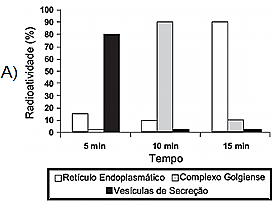

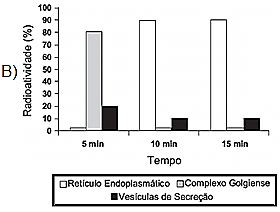

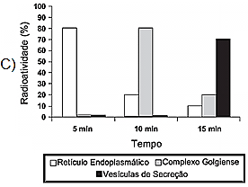

A indústria têxtil responsável por um consumo
elevado de água e de outros produtos, gerando
grande quantidade de efluentes com concentração alta e composição complexa, principalmente
nos processos de tingimento e acabamento.

Visando minimizar os efeitos ambientais nocivos
ocasionados pela grande quantidade de efluente contaminado, a catálise — quebra de moléculas — recebeu atenção especial, visto que:

- **A)** permite a estocagem correta do efluente, evitando a contaminação de rios e lagos.
- **B)** os catalisadores são substancias que têm como objetivo principal a neutralização do pH do meio.
- **C)** pode recuperar todos os produtos químicos presentes na água, permitindo a reutilização desses compostos.
- **D)** associada a processos oxidativos, pode provocar a completa mineralização dos contaminantes, formando gás carbônico e água.
- **E)** permite o retorno do efluente contaminado para o processo, uma vez que provoca a floculação dos produtos, facilitando a separação.

## Questão 264 (2015.1)

Hipóxia ou mal das alturas consiste na diminuição de oxigênio (O2) no sangue arterial do organismo. Por essa razão, muitos atletas apresentam mal-estar (dores de cabeça, tontura, falta
de ar etc.) ao praticarem atividade física em
altitudes elevadas. Nessas condições, ocorrerá
uma diminuição na concentração de hemoglobina oxigenada (HbO2) em equilíbrio no sangue,
conforme a relação:

Hb (aq) + O2 (aq) ↔  HbO2 (aq)

A alteração da concentração de hemoglobina
oxigenada no sangue ocorre por causa do(a):

- **A)** elevação da pressão arterial.
- **B)** aumento da temperatura corporal.
- **C)** redução da temperatura do ambiente.
- **D)** queda da pressão parcial de oxigênio.
- **E)** diminuição da quantidade de hemácias.

## Questão 265 (2015.1)

A indústria têxtil utiliza grande quantidade de
corantes no processo de tingimento dos tecidos.
O escurecimento das águas dos rios causado
pelo despejo desses corantes pode desencadear uma série de problemas no ecossistema
aquático.

Considerando esse escurecimento das águas, o
impacto negativo inicial que ocorre é o(a):

- **A)** Eutrofização
- **B)** proliferação de algas.
- **C)** inibição da fotossíntese.
- **D)** fotodegradação da matéria orgânica.
- **E)** aumento da quantidade de gases dissolvidos.

## Questão 266 (2015.1)

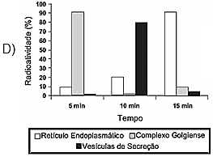

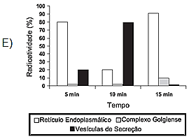

Muitos estudos de síntese e endereçamento de
proteínas utilizam aminoácidos marcados radioativamente para acompanhar as proteínas, desde fases iniciais de sua produção até seu destino final. Esses ensaios foram muito empregados para estudo e caracterização de células
secretoras.

Após esses ensaios de radioatividade, qual
gráfico representa a evolução temporal da produção de proteínas e sua localização em uma
célula secretora?
CADERNO BIOLOGIA
ENEM 2009 a 2019

78

## Questão 267 (2015.1)

Um importante princípio da biologia, relacionado
à transmissão de caracteres e à embriogênese
humana, foi quebrado com a descoberta do
microquimerismo fetal. Microquimerismo é o
nome dado ao fenômeno biológico referente a
uma pequena população de células ou DNA
presente em um indivíduo, mas derivada de um
organismo geneticamente distinto. Investigandose a presença do cromossomo Y, foi revelado
que diversos tecidos de mulheres continham
células masculinas. A análise do histórico médico revelou uma correlação extremamente curiosa: apenas as mulheres que antes tiveram filhos
homens apresentaram microquimerismo masculino. Essa correlação levou à interpretação de
que existe uma troca natural entre células do
feto e maternas durante a gravidez.

(MUOTRI, A. Você não é só você: carregamos células maternas na maioria de nossos órgãos.
Disponível em: http://g1.globo.com.
Acesso em: 4 dez. 2012 - adaptado)

O princípio contestado com essa descoberta,
relacionado ao desenvolvimento do corpo humano, é o de que:

- **A)** o fenótipo das nossas células pode mudar por influência do meio ambiente.
- **B)** a dominância genética determina a expressão de alguns genes.
- **C)** as mutações genéticas introduzem variabilidade no genoma.
- **D)** as mitocôndrias e o seu DNA provêm do gameta materno.
- **E)** as nossas células corporais provêm de um único zigoto.

## Questão 268 (2015.1)

Algumas raças de cães domésticos não conseguem copular entre si devido à grande diferença
em seus tamanhos corporais. Ainda assim, tal
dificuldade reprodutiva não ocasiona a formação
de novas espécies (especiação).

Essa especiação não ocorre devido ao(à):

- **A)** oscilação genética das raças.
- **B)** convergência adaptativa das raças.
- **C)** isolamento geográfico entre as raças.
- **D)** seleção natural que ocorre entre as raças.
- **E)** manutenção do fluxo gênico entre as raças.

## Questão 269 (2015.1)

O nitrogênio é essencial para a vida e o maior
reservatório global desse elemento, na forma de
N2, é a atmosfera. Os principais responsáveis
por sua incorporação na matéria orgânica são
microrganismos fixadores de N2, que ocorrem
de forma livre ou simbiontes com plantas.

(ADUAN, R. E. et al. Os grandes ciclos biogeoquímicos do planeta. Planaltina: Embrapa, 2004)

Animais garantem suas necessidades metabólicas desse elemento pela:

- **A)** absorção do gás nitrogênio pela respiração.
- **B)** ingestão de moléculas de carboidratos vegetais.
- **C)** incorporação de nitritos dissolvidos na água consumida.
- **D)** transferência da matéria orgânica pelas cadeias tróficas.
- **E)** protocooperação com microorganismos fixadores nitrogênio.

## Questão 270 (2015.1)

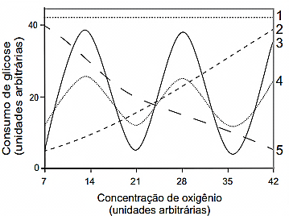

A cariotipagem é um método que analisa células
de um indivíduo para determinar seu padrão
cromossômico. Essa técnica consiste na montagem fotográfica, em sequência, dos pares de
cromossomos e permite identificar um indivíduo
normal (46, XX ou 46, XY) ou com alguma alteração cromossômica. A investigação do cariótipo de uma criança do sexo masculino com alterações morfológicas e comprometimento cognitivo verificou que ela apresentava fórmula cariotípica 47, XY, +18.

A alteração cromossômica da criança pode ser
classificada como:

- **A)** estrutural, do tipo deleção.
- **B)** numérica, do tipo euploidia.
- **C)** numérica, do tipo poliploidia.
- **D)** estrutural, do tipo duplicação.
- **E)** numérica, do tipo aneuploidia. CADERNO BIOLOGIA ENEM 2009 a 2019 79

## Questão 271 (2015.1)

Durante uma expedição, um grupo de estudantes perdeu-se de seu guia. Ao longo do dia em
que esse grupo estava perdido, sem água e
debaixo de sol, os estudantes passaram a sentir
cada vez mais sede. Consequentemente, o
sistema excretor desses indivíduos teve um
acréscimo em um dos seus processos funcionais. Nessa situação o sistema excretor dos
estudantes:

- **A)** aumentou a filtração glomerular.
- **B)** produziu maior volume de urina.
- **C)** produziu urina com menos ureia.
- **D)** produziu urina com maior concentração de sais.
- **E)** reduziu a reabsorção de glicose e aminoácidos.

## Questão 272 (2015.1)

Normalmente, as células do organismo humano
realizam a respiração aeróbica, na qual o consumo de uma molécula de glicose gera 38 moléculas de ATP. Contudo, em condições anaeróbicas, o consumo de uma molécula de glicose
pelas células é capaz de gerar apenas duas
moléculas de ATP.

Qual curva representa o perfil de consumo de
glicose, para manutenção da homeostase de
uma célula que inicialmente está em uma condição anaeróbica e é submetida a um aumento
gradual da concentração de oxigênio?

- **A)** 1
- **B)** 2
- **C)** 3
- **D)** 4
- **E)** 5

## Questão 273 (2015.1)

Tanto a febre amarela quanto a dengue são
doenças causadas por vírus do grupo dos arbovírus, pertencentes ao gênero Flavivirus, existindo quatro sorotipos para o vírus causador da
dengue. A transmissão de ambas acontece por
meio da picada de mosquitos, como o Aedes
aegypti. Entretanto, embora compartilhem essas
características, hoje somente existe vacina, no
Brasil, para a febre amarela e nenhuma vacina
efetiva para a dengue.

(MINISTÉRIO DA SAÚDE.
Fundação Nacional de Saúde. Dengue.
Disponível em: http://portal.saude.gov.br.
Acesso em: 7 ago. 2012 - adaptado)

Esse fato pode ser atribuído à:

- **A)** maior taxa de mutação do vírus da febre amarela do que do vírus da dengue.
- **B)** alta variabilidade antigênica do vírus da dengue em relação ao vírus da febre amarela.
- **C)** menor adaptação do vírus da dengue à população humana do que do vírus da febre amarela.
- **D)** presença de dois tipos de ácidos nucleicos no vírus da dengue e somente um tipo no vírus da febre amarela.
- **E)** baixa capacidade de indução da resposta imunológica pelo vírus da dengue em relação ao da febre amarela.

## Questão 274 (2015.1)

A palavra "biotecnologia" surgiu no século XX,
quando o cientista Herbert Boyer introduziu a
informação responsável pela fabricação da insulina humana em uma bactéria, para que ela
passasse a produzir a substância.

(Disponível em: www.brasil.gov.br.
Acesso em: 28 jul. 2012 - adaptado)

As bactérias modificadas por Herbert Boyer
passaram a produzir insulina humana porque
receberam:

- **A)** a sequência de DNA codificante de insulina humana.
- **B)** a proteína sintetizada por células humanas.
- **C)** um RNA recombinante de insulina humana.
- **D)** o RNA mensageiro de insulina humana.
- **E)** um cromossomo da espécie humana.

## Questão 275 (2015.1)

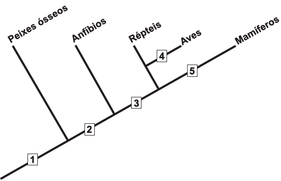

A definição de queimadura é bem ampla, porém, basicamente, é a lesão causada pela ação
direta ou indireta produzida pela transferência
de calor para o corpo. A sua manifestação varia
desde bolhas (flictenas) até formas mais graves,
capazes de desencadear respostas sistêmicas
proporcionais à gravidade da lesão e sua respectiva extensão. Muitas vezes, os primeiros
socorros prestados à vítima, ao invés de ajudar,
acabam agravando ainda mais a situação do
paciente.

(Disponível em: www.bombeiros-bm.rs.gov.br.
Acesso em: 28 fev. 2012 - adaptado)
CADERNO BIOLOGIA
ENEM 2009 a 2019

80
Ao se deparar com um indivíduo que sofreu
queimadura com formação de flictena, o procedimento de primeiros socorros que deve ser
realizado antes de encaminhar o paciente ao
hospital é:

- **A)** colocar gelo sobre a flictena para amenizar o ardor.
- **B)** utilizar manteiga para evitar o rompimento da flictena.
- **C)** passar creme dental para diminuir a ardência da flictena.
- **D)** perfurar a flictena para que a água acumulada seja liberada.
- **E)** cobrir a flictena com gazes molhadas para evitar a desidratação.

## Questão 276 (2015.1)

Os anfíbios representam o primeiro grupo de
vertebrados que, evolutivamente, conquistou o
ambiente terrestre. Apesar disso, a sobrevivência do grupo ainda permanece restrita a ambientes úmidos ou aquáticos, devido à manutenção
de algumas características fisiológicas relacionadas à água.

Uma das características a que o texto se refere
é a:

- **A)** reprodução por viviparidade.
- **B)** respiração pulmonar nos adultos.
- **C)** regulação térmica por endotermia.
- **D)** cobertura corporal delgada e altamente permeável.
- **E)** locomoção por membros anteriores e posteriores desenvolvidos.

## Questão 277 (2015.1)

O formato das células de organismos pluricelulares é extremamente variado. Existem células
discoides, como é o caso das hemácias, as que
lembram uma estrela, como os neurônios, e
ainda algumas alongadas, como as musculares.

Em um mesmo organismo, a diferenciação dessas células ocorre por;

- **A)** produzirem mutações específicas.
- **B)** possuírem DNA mitocondrial diferentes.
- **C)** apresentarem conjunto de genes distintos.
- **D)** expressarem porções distintas do genoma.
- **E)** terem um número distinto de cromossomos.

## Questão 278 (2015.1)

Euphorbia milii é uma planta ornamental amplamente disseminada no Brasil e conhecida
como coroa-de-cristo. O estudo químico do látex
dessa espécie forneceu o mais potente produto
natural moluscicida, a miliamina L.
O uso desse látex em água infestada por hospedeiros intermediários tem potencial para atuar
no controle da:

- **A)** dengue.
- **B)** malária.
- **C)** elefantíase.
- **D)** ascaridíase.
- **E)** esquistossomose.

## Questão 279 (2015.2)

Durante a aula, um professor apresentou uma
pesquisa nacional que mostrava que o consumo
de sódio pelos adolescentes brasileiros é superior ao determinado pela Organização Mundial
da Saúde. O professor, então, destacou que
esse hábito deve ser evitado.

A doença associada a esse hábito é a:

- **A)** obesidade.
- **B)** osteoporose.
- **C)** diabetes tipo II.
- **D)** hipertensão arterial.
- **E)** hipercolesterolemia.

## Questão 280 (2015.2)

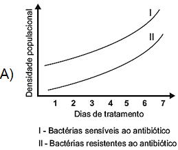

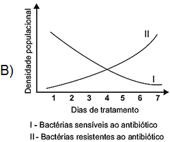

O cladograma representa, de forma simplificada, o processo evolutivo de diferentes grupos de
vertebrados. Nesses organismos, o desenvolvimento de ovos protegidos por casca rígida (pergaminácea ou calcárea) possibilitou a conquista
do ambiente terrestre.

O surgimento da característica mencionada está
representado, no cladograma, pelo número.

- **A)** 1.
- **B)** 2.
- **C)** 3.
- **D)** 4.
- **E)** 5. CADERNO BIOLOGIA ENEM 2009 a 2019 81

## Questão 281 (2015.2)

Dentre outras características, uma determinada
vegetação apresenta folhas durante três a quatro meses ao ano, com limbo reduzido, mecanismo rápido de abertura e fechamento dos
estômatos e caule suculento. Essas são algumas características adaptativas das plantas ao
bioma onde se encontram.

Que fator ambiental é o responsável pela ocorrência dessas características adaptativas?

- **A)** Escassez de nutrientes no solo.
- **B)** Estratificação da vegetação.
- **C)** Elevada insolação.
- **D)** Baixo pH do solo.
- **E)** Escassez de água.

## Questão 282 (2015.2)

A remoção de petróleo derramado em ecossistemas marinhos é complexa e muitas vezes
envolve a adição de mais sustâncias ao ambiente. Para facilitar o processo de recuperação
dessas áreas, pesquisadores têm estudado a
bioquímica de bactérias encontradas em locais
sujeitos a esse tipo de impacto. Eles verificaram
que algumas dessas espécies utilizam as moléculas de hidrocarbonetos como fonte energética, atuando como biorremediadores, removendo
o óleo do ambiente.

(KREPSKY, N.; SILVA SOBRINHO, F.; CRAPEZ, M.
A. C. Ciência Hoje, n. 223, jan.-fev. 2006 - adaptado)

Para serem eficientes no processo de biorremediação citado, as espécies escolhidas devem
possuir:

- **A)** células flageladas, que capturem as partículas de óleo presentes na água.
- **B)** altas taxas de mutação, para se adaptarem ao ambiente impactado pelo óleo.
- **C)** enzimas, que catalisem reações de quebra das moléculas constituintes do óleo.
- **D)** parede celular espessa, que impossibilite que as bactérias se contaminem com o óleo.
- **E)** capacidade de fotossíntese, que possibilite a liberação de oxigênio para a renovação do ambiente poluído.

## Questão 283 (2015.2)

Uma enzima foi retirada de um dos órgãos do
sistema digestório de um cachorro e, após ser
purificada, foi diluída em solução fisiológica e
distribuída em três tubos de ensaio com os seguintes conteúdos:

Tubo 1: carne
Tubo 2: macarrão
Tubo 3: banha
Em todos os tubos foi adicionado ácido clorídrico (HCl), e o pH da solução baixou para um
valor próximo a 2. Além disso, os tubos foram
mantidos por duas horas a uma temperatura de
37°C. A digestão do alimento ocorreu somente
no tubo 1.

De qual órgão do cachorro a enzima foi retirada?

- **A)** Fígado.
- **B)** Pâncreas.
- **C)** Estômago.
- **D)** Vesícula biliar.
- **E)** Intestino delgado.

## Questão 284 (2015.2)

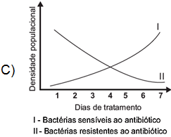

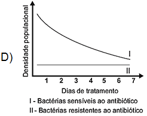

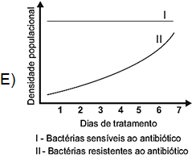

As superbactérias respondem por um número
crescente de infecções e mortes em todo o
mundo. O termo superbactérias é atribuído às
bactérias que apresentam resistência a praticamente todos os antibióticos. Dessa forma, no
organismo de um paciente, a população de uma
espécie bacteriana patogênica pode ser constituída principalmente por bactérias sensíveis a
antibióticos usuais e por um número reduzido de
superbactérias que, por mutação ou intercâmbio
de material genético, tornaram-se resistentes
aos antibióticos existentes.

(FERREIRA, F. A.; CRUZ, R. S.; FIGUEIREDO, A. M.
S. Superbactérias: o problema mundial da resistência
a antibióticos. Ciência Hoje, n. 287, nov. 2011)

Qual figura representa o comportamento populacional das bactérias ao longo de uma semana
de tratamento com um antibiótico comum?
CADERNO BIOLOGIA
ENEM 2009 a 2019

82

## Questão 285 (2015.2)

A fenilcetonúria é uma doença hereditária autossômica recessiva, associada à mutação do
gene PAH, que limita a metabolização do aminoácido fenilalanina. Por isso, é obrigatório, por
lei, que as embalagens de alimentos, como
refrigerantes dietéticos, informem a presença de
fenilalanina em sua composição. Uma mulher
portadora de mutação para o gene PAH tem
três filhos normais, com um homem normal, cujo
pai sofria de fenilcetonúria, devido à mesma
mutação no gene PAH encontrada em um dos
alelos da mulher.

Qual a probabilidade de a quarta criança gerada
por esses pais apresentar fenilcetonúria?

- **A)** 0%
- **B)** 12,5%
- **C)** 25%
- **D)** 50%
- **E)** 75%

## Questão 286 (2015.2)

Um gel vaginal poderá ser um recurso para as
mulheres na prevenção contra a aids. Esse
produto tem como princípio ativo um composto
que inibe a transcriptase reversa viral.
Essa ação inibidora é importante, pois a referida
enzima:

- **A)** corta a dupla hélice do DNA, produzindo um molde para o RNA viral.
- **B)** produz moléculas de DNA viral que vão infectar células sadias.
- **C)** polimeriza molécula de DNA, tendo como molde o RNA viral.
- **D)** promove a entrada do vírus da aids nos linfócitos T.
- **E)** sintetiza os nucleotídeos que compõem o DNA viral.

## Questão 287 (2015.2)

Os parasitoides são insetos diminutos, que têm
hábitos bastante peculiares: suas larvas se desenvolvem dentro do corpo de outros animais.
Em geral, cada parasitoide ataca hospedeiros
de determinada espécie e, por isso, esses organismos vêm sendo amplamente usados para o
controle biológico de pragas agrícolas.

(Santo, M. M. E. et al. Parasitoides: insetos benéficos
e curéis. Ciência Hoje, n. 291, abr. 2012 - adaptado)

O uso desses insetos na agricultura traz benefícios ambientais, pois diminui o(a):

- **A)** tempo de produção agrícola.
- **B)** diversidade de insetos-praga.
- **C)** aplicação de inseticidas tóxicos.
- **D)** emprego de fertilizantes agrícolas.
- **E)** necessidade de combate a ervas daninhas.

## Questão 288 (2015.2)

A figura representa uma embalagem cartonada
e sua constituição em multicamadas. De acordo
com as orientações do fabricante, essas embalagens não devem ser utilizadas em fornos micro-ondas.

A restrição citada deve-se ao fato de a:

- **A)** A embalagem aberta se expandir pela pressão do vapor formado em seu interior
- **B)** camada de polietileno se danificar, colocando o alumínio em contato com o alimento. CADERNO BIOLOGIA ENEM 2009 a 2019 83
- **C)** fina camada de alumínio blindar a radiação, não permitindo que o alimento se aqueça.
- **D)** absorção de radiação pelo papel, que se aquece e pode levar à queima da camada de polietileno.
- **E)** geração de centelhas na camada de alumínio, que pode levar à queima da camada de papel e de polietileno.

## Questão 289 (2015.2)

De acordo com estatísticas do Ministério da
Saúde, cerca de 5% das pessoas com dengue
hemorrágica morrem. A dengue hemorrágica
tem como base fisiopatológica uma resposta
imune anômala, causando aumento da permeabilidade de vasos sanguíneos, queda da pressão arterial e manifestações hemorrágicas, podendo ocorrer manchas vermelhas na pele e
sangramento pelo nariz, boca e gengivas. O
hemograma do paciente pode apresentar como
resultado leucopenia (diminuição do número de
glóbulos brancos), linfocitose (aumento do número de linfócitos), aumento do hematócrito e
trombocitopenia (contagem de plaquetas abaixo
de 100 000/mm3).

(Disponível em: http://www.ciencianews.com.br.
Acesso em: 28 fev. 2012 - adaptado)

Relacionando os sintomas apresentados pelo
paciente com dengue hemorrágica e os possíveis achados do hemograma, constata-se que:

- **A)** as manifestações febris ocorrem em função da diminuição dos glóbulos brancos, uma vez que estes controlam a temperatura do corpo.
- **B)** a queda na pressão arterial é ocasionada pelo aumento do número de linfócitos, que têm como função principal a produção de anticorpos.
- **C)** o sangramento pelo nariz, pela boca e gengiva é ocasionado pela quantidade reduzida de plaquetas, que são responsáveis pelo transporte de oxigênio.
- **D)** as manifestações hemorrágicas estão associadas à trombocitopenia, uma vez que as plaquetas estão envolvidas na cascata de coagulação sanguínea.
- **E)** os sangramentos observados ocorrem em função da linfocitose, uma vez que os linfócitos são responsáveis pela manutenção da integridade dos vasos sanguíneos.

## Questão 290 (2015.2)

O caramujo gigante africano, Achatina fulica, é
uma espécie exótica que tem despertado o interesse das autoridades brasileiras, uma vez que
tem causado danos ambientais e prejuízos
econômicos à agricultura. A introdução da espécie no Brasil ocorreu clandestinamente, com
o objetivo de ser utilizada na alimentação humana. Porém, o molusco teve pouca aceitação
no comércio de alimentos, o que resultou em
abandono e liberação intencional das criações
por vários produtores.

Por ser uma espécie herbívora generalista (alimenta-se de mais de 500 espécies diferentes de
vegetais), com grande capacidade reprodutiva,
tornou-se uma praga agrícola de difícil erradicação. Associada a isto, a ausência de predadores
naturais fez com que ocorresse um crescimento
descontrolado da população.

O desequilíbrio da cadeia alimentar observado
foi causado pelo aumento da densidade populacional de:

- **A)** consumidores terciários, em função da elevada disponibilidade de consumidores secundários.
- **B)** consumidores primários, em função da ausência de consumidores secundários.
- **C)** consumidores secundários, em função da ausência de consumidores primários.
- **D)** consumidores terciários, em função da elevada disponibilidade de produtores.
- **E)** consumidores primários, em função do aumento de produtores.

## Questão 291 (2015.2)

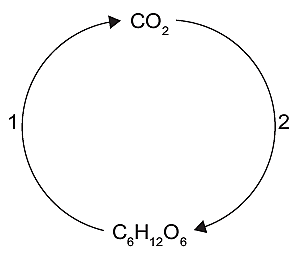

A toxina botulínica (produzida pelo bacilo Clostridium botulinum) pode ser encontrada em alimentos malconservados, causando até a morte
de consumidores. No entanto, essa toxina modificada em laboratório está sendo usada cada
vez mais para melhorar a qualidade de vida das
pessoas com problemas físicos e/ou estéticos,
atenuando problemas como o blefaroespasmo,
que provoca contrações involuntárias das pálpebras.

(BACHUR, T. P. R. et al. Toxina botulínica: de veneno
a tratamento. Revista Eletrônica Pesquisa Médica,
n. 1, jan.-mar. 2009 - adaptado)

O alívio dos sintomas do blefaroespasmo é consequência da ação da toxina modificada sobre o
tecido:

- **A)** glandular, uma vez que ela impede a produção de secreção de substâncias na pele.
- **B)** muscular, uma vez que ela provoca a paralisia das fibras que formam esse tecido.
- **C)** epitelial, uma vez que ela leva ao aumento da camada de queratina que protege a pele.
- **D)** conjuntivo, uma vez que ela aumenta a quantidade de substância intercelular no tecido.
- **E)** adiposo, uma vez que ela reduz a espessura da camada de células de gordura do tecido. CADERNO BIOLOGIA ENEM 2009 a 2019 84

## Questão 292 (2015.2)

A reprodução vegetativa de plantas por meio de
estacas é um processo natural. O homem, observando esse processo, desenvolveu uma
técnica para propagar plantas em escala comercial.

A base genética dessa técnica é semelhante
àquela presente no(a):

- **A)** transgenia.
- **B)** clonagem.
- **C)** hibridização.
- **D)** controle biológico.
- **E)** melhoramento genético.

## Questão 293 (2015.2)

Na natureza a matéria é constantemente transformada por meio dos ciclos biogeoquímicos.
Além do ciclo da água, existem os ciclos do
carbono, do enxofre, do fósforo, do nitrogênio e
do oxigênio.

O elemento que está presente em todos os ciclos nomeados é o:

- **A)** fósforo.
- **B)** enxofre.
- **C)** carbono.
- **D)** oxigênio.
- **E)** nitrogênio.

## Questão 294 (2015.2)

Bioindicador ou indicador biológico é uma espécie ou grupo de espécies que reflete o estado
biótico ou abiótico de um meio ambiente, o impacto produzido sobre um hábitat, comunidade
ou ecossistema, entre outras funções.

A posição trófica do organismo bioindicador é
uma das características mais relevantes quanto
ao seu grau de importância para essa função:
quanto mais baixo o nível trófico do organismo,
maior será a sua utilidade, pois pressupõe que
toda a cadeia trófica é contaminada a partir
dele.

(ANDRÉA, M. M. Bioindicadores ecotoxicológicos de
agrotóxicos. Disponível em: www.biologico.sp.gov.br.
Acesso em: 11 mar. 2013 - adaptado)

O grupo de organismos mais adequado para
essa condição, do ponto de vista da sua posição
na cadeia trófica é constituída por:

- **A)** algas.
- **B)** peixes.
- **C)** baleias.
- **D)** camarões.
- **E)** anêmonas.

## Questão 295 (2015.2)

No esquema representado, o processo identificado pelo número 2 é realizado por:

- **A)** seres herbívoros.
- **B)** fungos fermentadores.
- **C)** bactérias heterótrofas.
- **D)** organismos produtores.
- **E)** microrganismos decompositores.

## Questão 296 (2016.1)

A vegetação apresenta adaptações ao ambiente, como plantas arbóreas e arbustivas com
raízes que se expandem horizontalmente, permitindo forte ancoragem no substrato lamacento; raízes que se expandem verticalmente, por
causa da baixa oxigenação do substrato; folhas
que têm glândulas para eliminar o excesso de
sais; folhas que podem apresentar cutícula espessa para reduzir a perda de água por evaporação.

As características descritas referem-se a plantas adaptadas ao bioma:

- **A)** Cerrado.
- **B)** Pampas.
- **C)** Pantanal.
- **D)** Manguezal.
- **E)** Mata de Cocais.

## Questão 297 (2016.1)

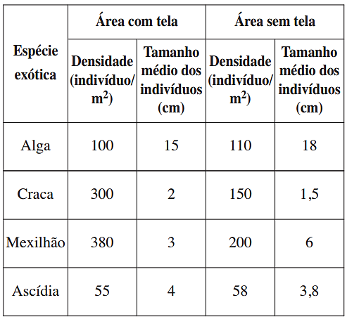

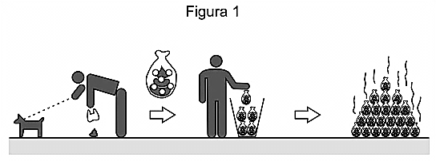

Os ecossistemas degradados por intensa atividade agrícola apresentam, geralmente, diminuição de sua diversidade e perda de sua estabilidade. Nesse contexto, o uso integrado de árvores aos sistemas agrícolas (sistemas agroflorestais) pode cumprir um papel inovador ao buscar
a aceleração do processo sucessional e, ao
mesmo tempo, uma produção escalonada e
diversificada.

(Disponível em: saf.cnpgc.embrapa.br.
Acesso em: 21 jan. 2012 - adaptado)
CADERNO BIOLOGIA
ENEM 2009 a 2019

85
Essa é uma estratégia de conciliação entre recuperação ambiental e produção agrícola, pois:

- **A)** substitui gradativamente as espécies cultiváveis por espécies arbóreas.
- **B)** intensifica a fertilização do solo com o uso de técnicas apropriadas e biocidas.
- **C)** promove maior diversidade de vida no solo com o aumento da matéria orgânica.
- **D)** favorece a dispersão das sementes cultivadas pela fauna residente nas áreas florestais.
- **E)** cria condições para o estabelecimento de espécies pioneiras com a diminuição da insolação sobre o solo.

## Questão 298 (2016.1)

Um pesquisador investigou o papel da predação
por peixes na densidade e tamanho das presas,
como possível controle de populações de espécies exóticas em costões rochosos. No experimento colocou uma tela sobre uma área da
comunidade, impedindo o acesso dos peixes ao
alimento, e comparou o resultado com uma área
adjacente na qual os peixes tinham acesso livre.
O quadro apresenta os resultados encontrados
após 15 dias de experimento.

O pesquisador concluiu corretamente que os
peixes controlam a densidade dos(as):

- **A)** algas, estimulando seu crescimento.
- **B)** cracas, predando especialmente animais pequenos.
- **C)** mexilhões, predando especialmente animais pequenos.
- **D)** quatro espécies testadas, predando indivíduos pequenos.
- **E)** ascídias, apesar de não representarem os menores organismos.

## Questão 299 (2016.1)

Ao percorrer o trajeto de uma cadeia alimentar,
o carbono, elemento essencial e majoritário da
matéria orgânica que compõe os indivíduos, ora
se encontra em sua forma inorgânica, ora se
encontra em sua forma orgânica. Em uma cadeia alimentar composta por fitoplâncton, zooplâncton, moluscos, crustáceos e peixes ocorre
a transição desse elemento da forma inorgânica
para a orgânica.

Em qual grupo de organismos ocorre essa transição?

- **A)** Fitoplâncton.
- **B)** Zooplâncton.
- **C)** Moluscos.
- **D)** Crustáceos.
- **E)** Peixes.

## Questão 300 (2016.1)

As proteínas de uma célula eucariótica possuem
peptídeos sinais, que são sequências de aminoácidos responsáveis pelo seu endereçamento
para as diferentes organelas, de acordo com
suas funções. Um pesquisador desenvolveu
uma nanopartícula capaz de carregar proteínas
para dentro de tipos celulares específicos. Agora ele quer saber se uma nanopartícula carregada com uma proteína bloqueadora do ciclo de
Krebs in vitro é capaz de exercer sua atividade
em uma célula cancerosa, podendo cortar o
aporte energético e destruir essas células.

Ao escolher essa proteína bloqueadora para
carregar as nanopartículas, o pesquisador deve
levar em conta um peptídeo sinal de endereçamento para qual organela?

- **A)** Núcleo.
- **B)** Mitocôndria.
- **C)** Peroxissomo.
- **D)** Complexo golgiense.
- **E)** Retículo endoplasmático.

## Questão 301 (2016.1)

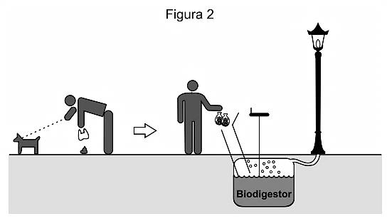

A coleta das fezes dos animais domésticos em
sacolas plásticas e o seu descarte em lixeiras
convencionais podem criar condições de degradação que geram produtos prejudiciais ao meio
ambiente (Figura 1).
CADERNO BIOLOGIA
ENEM 2009 a 2019

86
A Figura 2 ilustra o Projeto Park Spark, desenvolvido em Cambridge, MA (EUA), em que as
fezes dos animais domésticos são recolhidas
em sacolas biodegradáveis e jogadas em um
biodigestor instalado em parques públicos; e os
produtos são utilizados em equipamentos no
próprio parque.

Uma inovação desse projeto é possibilitar o(a):

- **A)** queima de gás metano.
- **B)** armazenamento de gás carbônico.
- **C)** decomposição aeróbica das fezes.
- **D)** usa mais eficiente de combustíveis fósseis.
- **E)** fixação de carbono em moléculas orgânicas.

## Questão 302 (2016.1)

Portadores de diabetes insipidus reclamam da
confusão feita pelos profissionais da saúde
quanto aos dois tipos de diabetes: mellitus e
insipidus. Enquanto o primeiro tipo está associado aos níveis ou à ação da insulina, o segundo
não está ligado à deficiência desse hormônio. O
diabetes insipidus é caracterizado por um distúrbio na produção ou no funcionamento do
hormônio antidiurético (na sigla em inglês,
ADH), secretado pela neuro-hipófise para controlar a reabsorção de água pelos túbulos renais.

Tendo em vista o papel funcional do ADH, qual
é um sintoma clássico de um paciente acometido por diabetes insipidus?

- **A)** Alta taxa de glicose no sangue.
- **B)** Aumento da pressão arterial.
- **C)** Ganho de massa corporal.
- **D)** Anemia crônica.
- **E)** Desidratação.

## Questão 303 (2016.1)

Apesar da grande diversidade biológica, a hipótese de que a vida na Terra tenha tido uma única origem comum é aceita pela comunidade
científica. Uma evidência que apoia essa hipótese é a observação de processos biológicos
comuns a todos os seres vivos atualmente existentes.
Um exemplo de tal processo é o(a):

- **A)** desenvolvimento embrionário.
- **B)** reprodução sexuada.
- **C)** respiração aeróbica.
- **D)** excreção urinária.
- **E)** síntese proteica.

## Questão 304 (2016.1)

O Brasil possui um grande número de espécies
distintas entre animais, vegetais e microrganismos envoltos em uma imensa complexidade e
distribuídas em uma grande variedade de ecossistemas.
(SANDES. A. R. R.; BLASI. G.
Biodiversidade e diversidade química e genética.
Disponível em: http://novastecnologias.com.br.
Acesso em: 22 set. 2015 - adaptado)

O incremento da variabilidade ocorre em razão
da permuta genética, a qual propicia a troca de
segmentos entre cromátides não irmãs na meiose. Essa troca de segmentos é determinante
na:

- **A)** produção de indivíduos mais férteis.
- **B)** transmissão de novas características adquiridas.
- **C)** recombinação genética na formação dos gametas.
- **D)** ocorrência de mutações somáticas nos descendentes.
- **E)** variação do número de cromossomos característico da espécie.

## Questão 305 (2016.1)

A formação de coágulos sanguíneos em veias e
artérias é um dos fatores responsáveis pela
ocorrência de doenças cardiovasculares, como
varizes, infarto e acidentes vasculares cerebrais. A prevenção e o tratamento dessas doenças podem ser feitos com drogas anticoagulantes. A indústria farmacêutica estimula a pesquisa de toxinas animais com essa propriedade.

Considerando as adaptações relacionadas aos
hábitos alimentares, os animais adequados ao
propósito dessas pesquisas são os(as):

- **A)** moluscos fitófagos.
- **B)** moscas saprófagas.
- **C)** pássaros carnívoros.
- **D)** morcegos frugívoros.
- **E)** mosquitos hematófagos.

## Questão 306 (2016.1)

Vários métodos são empregados para prevenção de infecções por microrganismos. Dois desses métodos utilizam microrganismos vivos e
são eles: as vacinas atenuadas, constituídas por

## Gabarito

- Questão 263:
- Questão 264:
- Questão 265:
- Questão 266:
- Questão 267:
- Questão 268:
- Questão 269:
- Questão 270:
- Questão 271:
- Questão 272:
- Questão 273:
- Questão 274:
- Questão 275:
- Questão 276:
- Questão 277:
- Questão 278:
- Questão 279:
- Questão 280:
- Questão 281:
- Questão 282:
- Questão 283:
- Questão 284:
- Questão 285:
- Questão 286:
- Questão 287:
- Questão 288:
- Questão 289:
- Questão 290:
- Questão 291:
- Questão 292:
- Questão 293:
- Questão 294:
- Questão 295:
- Questão 296:
- Questão 297:
- Questão 298:
- Questão 299:
- Questão 300:
- Questão 301:
- Questão 302:
- Questão 303:
- Questão 304:
- Questão 305:
- Questão 306:
