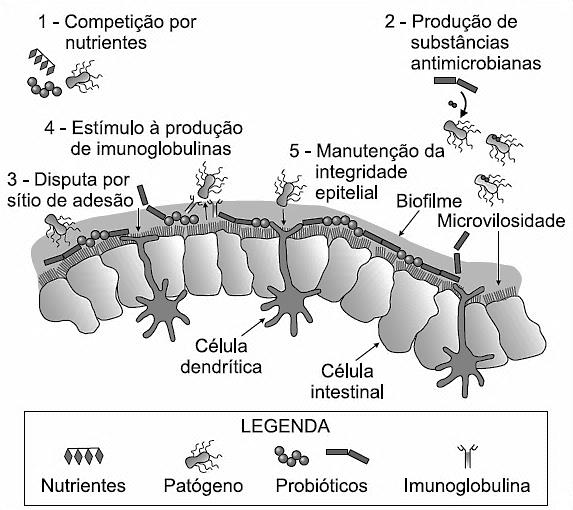
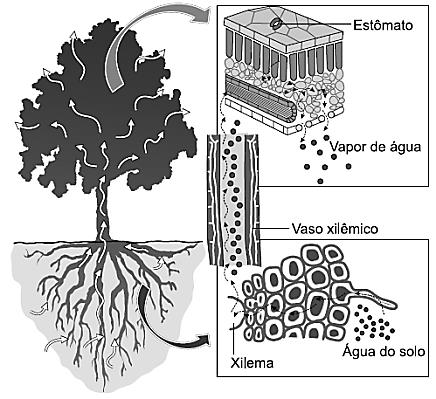
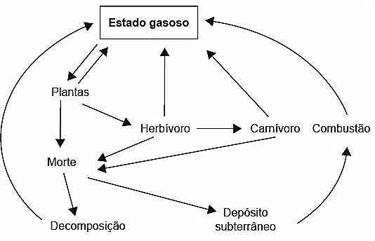
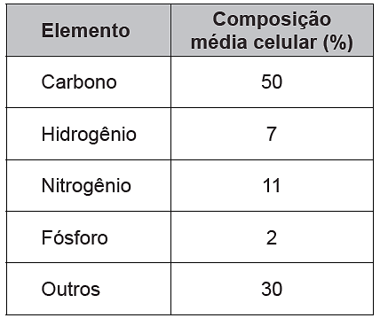
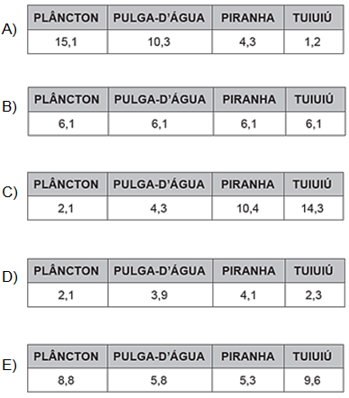
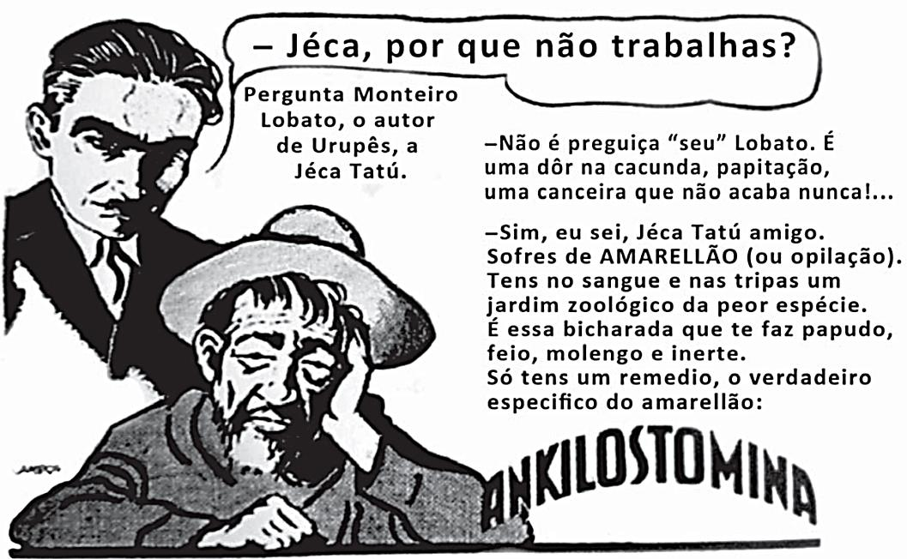
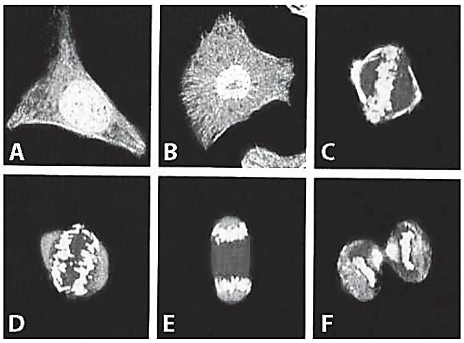
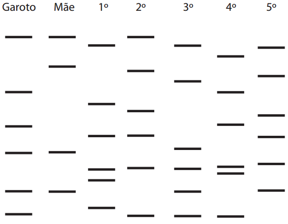
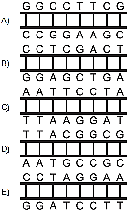

# BIOLOGIA-1_91-100 — Questões extraídas

## Questão 307 (2016.1)

O Painel lntergovernamental de Mudanças Climáticas (na sigla em inglês, IPCC) prevê que
nas próximas décadas o planeta passará por
mudanças climáticas e propõe estratégias de
mitigação e adaptação a elas. As estratégias de
mitigação são direcionadas à causa dessas
mudanças, procurando reduzir a concentração
de gases de efeito estufa na atmosfera. As estratégias de adaptação, por sua vez, são direcionadas aos efeitos dessas mudanças, procurando preparar os sistemas humanos às mudanças climáticas já em andamento, de modo a
reduzir seus efeitos negativos.

(IPCC, 2014. Climate Change: synthesis report.
Disponível em: http://ar5-syr.ipcc.ch.
Acesso em: 22 out. 2015 - adaptado)

Considerando as informações do texto, qual
ação representa uma estratégia de adaptação?

- **A)** Construção de usinas eólicas.
- **B)** Tratamento de resíduos sólidos.
- **C)** Aumento da eficiência dos veículos.
- **D)** Adoção de agricultura sustentável de baixo carbono.
- **E)** Criação de diques de contenção em regiões costeiras.

## Questão 308 (2016.1)

Recentemente um estudo feito em campos de
trigo mostrou que níveis elevados de dióxido de
carbono na atmosfera prejudicam a absorção de
nitrato pelas plantas. Consequentemente, a
qualidade nutricional desses alimentos pode
diminuir à medida que os níveis de dióxido de
carbono na atmosfera atingirem as estimativas
para as próximas décadas.

(BLOOM, A.J. et al. Nitrate assimilation is inhibited by
elevated CO2 in field-grown wheat. Nature Climate
Change, n. 4, abr. 2014 - adaptado)

Nesse contexto, a qualidade nutricional do grão
de trigo será modificada primariamente pela
redução de:

- **A)** amido.
- **B)** frutose.
- **C)** lipídeos.
- **D)** celulose.
- **E)** proteínas.

## Questão 309 (2016.1)

A figura ilustra o movimento da seiva xilêmica
em uma planta.

Mesmo que essa planta viesse a sofrer ação
contínua do vento e sua copa crescesse voltada
para baixo, essa seiva continuaria naturalmente
seu percurso.

O que garante o transporte dessa seiva é a:

- **A)** gutação.
- **B)** gravidade.
- **C)** respiração.
- **D)** fotossíntese.
- **E)** transpiração. CADERNO BIOLOGIA ENEM 2009 a 2019 88

## Questão 310 (2016.2)

A modernização da agricultura, também conhecida como Revolução Verde, ficou marcada pela
expansão da agricultura nacional. No entanto,
trouxe consequências como o empobrecimento
do solo, o aumento da erosão e dos custos de
produção, entre outras. Atualmente, a preocupação com a agricultura sustentável tem suscitado práticas como a adubação verde, que consiste na incorporação ao solo de fitomassa de
espécies vegetais distintas, sendo as mais difundidas as leguminosas.

(ANUNCIAÇÃO. G. C. F. Disponível em:
www.muzifsuidemlnesadubr.
Acesso em: 20 dez 2012 - adaptado)

A utilização de leguminosas nessa prática de
cultivo visa reduzir a:

- **A)** utilização de agrotóxicos.
- **B)** atividade biológica do solo.
- **C)** necessidade do uso de fertilizantes.
- **D)** decomposição da matéria orgânica.
- **E)** capacidade de armazenamento de água no solo.

## Questão 311 (2016.2)

Os seres vivos mantêm constantes trocas de
matéria com o ambiente mediante processos
conhecidos como ciclos biogeoquímicos. O esquema representa um dos ciclos que ocorrem
nos ecossistemas.

O esquema apresentado corresponde ao ciclo
biogeoquímico do(a):

- **A)** água.
- **B)** fósforo.
- **C)** enxofre.
- **D)** carbono.
- **E)** nitrogênio.

## Questão 312 (2016.2)

Em uma aula de biologia sobre formação vegetal brasileira, a professora destacou que em
uma região, a flora convive com condições ambientais curiosas. As características dessas
plantas não estão relacionadas com a falta de
água, mas com as condições do solo, que é
pobre em sais minerais, ácido e rico em alumínio. Além disso, essas plantas possuem adaptações ao fogo.

As características adaptativas das plantas que
correspondem à região destacada pela professora são:

- **A)** Raízes escoras e respiratórias.
- **B)** Raízes tabulares e folhas largas.
- **C)** Casca grossa e galhos retorcidos.
- **D)** Raízes aéreas e perpendiculares ao solo.
- **E)** Folhas reduzidas ou modificadas em espinhos.

## Questão 313 (2016.2)

A sombra do cedro vem se encostar no cocho.
Primo Ribeiro levantou os ombros: começa a
tremer. Com muito atraso. Mas ele tem no baço
duas colmeias de bichinhos maldosos, que não
se misturam, soltando enxames no sangue em
dias alternados. E assim nunca precisa de passar um dia sem tremer.

(ROSA. J. G. Sagarana. Rio de Janeiro:
Nova Fronteira. 1984)

O texto de João Guimarães Rosa descreve as
manifestações das crises paroxísticas da malária em seu personagem. Essas se caracterizam
por febre alta, calafrios, sudorese intensa e tremores, com intervalos de 48 h ou 72 h, dependendo da espécie de Plasmodium.

Essas crises periódicas ocorrem em razão da:

- **A)** lise das hemácias, liberando merozoítos e substâncias denominadas hemozoinas.
- **B)** invasão das hemácias por merozoítos com maturação até a forma esquizonte.
- **C)** reprodução assexuada dos esporozoítos no fígado do indivíduo infectado.
- **D)** liberação de merozoítos dos hepatócitos para a corrente sanguínea.
- **E)** formação de gametócitos dentro das hemácias.

## Questão 314 (2016.2)

Suponha que uma doença desconhecida esteja
dizimando um rebanho bovino de uma cidade e
alguns veterinários tenham conseguido isolar o
agente causador da doença, verificando que se
trata de um ser unicelular e procarionte.
CADERNO BIOLOGIA
ENEM 2009 a 2019

89
Para combater a doença, os veterinários devem
administrar, nos bovinos contaminados,

- **A)** vacinas.
- **B)** antivirais.
- **C)** fungicidas.
- **D)** vermífugos.
- **E)** antibióticos.

## Questão 315 (2016.2)

As sacolas plásticas são utilizadas em grande
quantidade no Brasil por serem práticas, leves e
de baixo custo. Porém, o tempo necessário para
que sofram degradação nas condições do meio
é de, no mínimo, 100 anos. Com o intuito de
reduzir o impacto ambiental desses produtos, as
sacolas biodegradáveis foram introduzidas no
mercado. Essas sacolas são confeccionadas de
um material polimérico que confere a elas uma
característica que as torna biodegradáveis.

A qual característica das sacolas biodegradáveis o texto faz referência?

- **A)** Elevada massa molecular do polímero.
- **B)** Espessura fina do material que as constitui.
- **C)** Baixa resistência aos líquidos nas condições de uso.
- **D)** Baixa resistência ao ataque por microrganismos em condições adequadas.
- **E)** Ausência de anéis aromáticos na estrutura do polímero usado na confecção das sacolas.

## Questão 316 (2016.2)

O petróleo é um tipo de combustível fóssil, de
origem animal e vegetal, constituído principalmente por hidrocarbonetos. Em desastres de
derramamento de petróleo, vários métodos são
usados para a limpeza das áreas afetadas. Um
deles é a biodegradação por populações naturais de microrganismos que utilizam o petróleo
como fonte de nutrientes. O quadro mostra a
composição química média das células desses
microrganismos.

Para uma efetiva biodegradação, a região afetada deve ser suplementada com:

- **A)** nitrogênio e fósforo.
- **B)** hidrogênio e fósforo.
- **C)** carbono e nitrogênio.
- **D)** carbono e hidrogênio.
- **E)** nitrogênio e hidrogênio.

## Questão 317 (2016.2)

Em um hospital, acidentalmente, uma funcionária ficou exposta a alta quantidade de radiação
liberada por um aparelho de raios X em funcionamento. Posteriormente ela engravidou e seu
filho nasceu com grave anemia. Foi verificado
que a criança apresentava a doença devido à
exposição anterior da mãe à radiação.

O que justifica, nesse caso, o aparecimento da
anemia na criança?

- **A)** A célula-ovo sofreu uma alteração genética.
- **B)** As células somáticas da mãe sofreram uma mutação.
- **C)** A célula gamética materna que foi fecundada sofreu uma mutação.
- **D)** As hemácias da mãe que foram transmitidas à criança não eram normais.
- **E)** As células hematopoiéticas sofreram alteração do número de cromossomos.

## Questão 318 (2016.2)

Chamamos de lixo a grande diversidade de
resíduos sólidos de diferentes procedências,
como os gerados em residências. O aumento na
produção de resíduos sólidos leva à necessidade de se pensar em maneiras adequadas de
tratamento. No Brasil, 76% do lixo é disposto
em lixões e somente 24% tem como destino um
tratamento adequado, considerando os aterros
sanitários, as usinas de compostagem ou a
incineração.

(FADINI, P S.; FADINI, A A. A, Lixo: desafiosecompromissos. Química Nova na Escola, maio 2001)

Comparando os tratamentos descritos, as usinas de compostagem apresentam como vantagem serem o destino:

- **A)** que gera um produto passível de utilização na agricultura.
- **B)** onde ocorre a eliminação da matéria orgânica presente no lixo.
- **C)** mais barato, pois não implica custos de tratamento nem controle.
- **D)** que possibilita o acesso de catadores, pela disposição do lixo a céu aberto.
- **E)** em que se podem utilizar áreas contaminadas com resíduos de atividades de mineração. CADERNO BIOLOGIA ENEM 2009 a 2019 90

## Questão 319 (2016.2)

O ambiente marinho pode ser contaminado com
rejeitos radioativos provenientes de testes com
armas nucleares. Os materiais radioativos podem se acumular nos organismos. Por exemplo,
o estrôncio-90 é quimicamente semelhante ao
cálcio e pode substituir esse elemento nos processos biológicos.

(FIGUEIRA, R. C. L.; CUNHA. I. I. L. A contaminação
dos oceanos por radionuclídeos antrupogênios. Química Nova na Escola, n. 1. 1996 - adaptado)

Um pesquisador analisou as seguintes amostras
coletadas em uma região marinha próxima a um
local que manipula o estrôncio radioativo: coluna vertebral de tartarugas, concha de moluscos,
endoesqueleto de ouriços-do-mar, sedimento de
recife de corais e tentáculos de polvo.

Em qual das amostras analisadas a radioatividade foi menor?

- **A)** Concha de moluscos.
- **B)** Tentáculos de polvo.
- **C)** O sedimento de recife de corais.
- **D)** Coluna vertebral de tartarugas.
- **E)** Endoesqueleto de ouriços-do-mar.

## Questão 320 (2016.2)

Um jovem suspeita que não é filho biológico de
seus pais, pois descobriu que o seu tipo sanguíneo é O Rh negativo, o de sua mãe é B Rh
positivo e de seu pai é A Rh positivo.

A condição genotípica que possibilita que ele
seja realmente filho biológico de seus pais é
que:

- **A)** o pai e a mãe sejam heterozigotos para o sistema sanguíneo ABO e para o fator Rh.
- **B)** pai e a mãe sejam heterozigotos para o sistema sanguíneo ABO e homozigotos para o fator Rh.
- **C)** o pai seja homozigoto para as duas características e a mãe heterozigota para as duas características.
- **D)** o pai seja homozigoto para as duas características e a mãe heterozigota para o sistema ABO e homozigota para o fator Rh.
- **E)** o pai seja homozigoto para o sistema ABO e heterozigoto para o fator Rh e a mãe homozigota para as duas características.

## Questão 321 (2016.2)

Em 1950, Erwin Chargaff e colaboradores estudavam a composição quimica do DNA e observaram que a quantidade de adenina (A) é igual
à de timina (T), e a quantidade de guanina (G) é
igual à de citosina (C) na grande maioria das
duplas fitas de DNA. Em outras palavras, esses
cientistas descobriram que o total de purinas
(A + G) e o total de pirimidinas (C + T) eram
iguais. Um professor trabalhou esses conceitos
em sala de aula e apresentou como exemplo
uma fita simples de DNA com 20 adeninas, 25
timinas, 30 guaninas e 25 citosinas.

Qual a quantidade de cada um dos nucleotídeos, quando considerada a dupla fita de DNA
formada pela fita simples exemplificada pelo
professor?

- **A)** Adenina: 20; Timina: 25; Guanina: 25; Citosina: 30.
- **B)** Adenina: 25; Timina: 20; Guanina: 45; Citosina: 45.
- **C)** Adenina: 45; Timina: 45; Guanina: 55; Citosina: 55.
- **D)** Adenina: 50; Timina: 50: Guanina: 50; Citosina: 50.
- **E)** Adenina: 55; Timina: 55; Guanina: 45: Citosina: 45.

## Questão 322 (2016.2)

A descoberta dos organismos extremófilos foi
uma surpresa para os pesquisadores. Alguns
desses organismos, chamados de acidófilos,
são capazes de sobreviver em ambientes extremamente ácidos. Uma característica desses
organismos é a capacidade de produzir membranas celulares compostas de lipídeos feitos
de éteres em vez dos ésteres de glicerol, comuns nos outros seres vivos (mesófilos), o que
preserva a membrana celular desses organismos mesmo em condições extremas de acidez.

A degradação das membranas celulares de
organismos não extremófilos em meio ácido é
classificada como:

- **A)** hidrólise.
- **B)** termólise.
- **C)** eterificação.
- **D)** condensação.
- **E)** saponificação.

## Questão 323 (2016.2)

Uma nova estratégia para o controle da dengue
foi apresentada durante o Congresso internacional de Medicina Tropical, no Rio de Janeiro,
em 2012. O projeto traz uma abordagem nova e
natural para o combate à doença e já está em
fase de testes. O objetivo do programa é cessar
a transmissão do vírus da dengue pelo Aedes
aegypti, a partir da introdução da bactéria Wolbachia – que é naturalmente encontrada em
insetos — nas populações locais de mosquitos.
CADERNO BIOLOGIA
ENEM 2009 a 2019

91
Quando essa bactéria é introduzida no A. aegypti, atua como uma “vacina”. estimulando o
sistema imunológico e bloqueando a multiplicação do vírus dentro do inseto.

(Disponível em: http://portalsaude.saude.gov.br.
Acesso em: 20 dez 2012 - adaptado)

Qual o conceito fundamental relacionado a essa
estratégia?

- **A)** Clonagem.
- **B)** Mutualismo.
- **C)** Parasitismo.
- **D)** Transgênese.
- **E)** Controle biológico.

## Questão 324 (2016.2)

Darwin, em viagem às ilhas Galápagos, observou que os tentilhões apresentavam bicos com
formatos diferentes em cada ilha, de acordo
com o tipo de alimentação disponível. Lamarck,
ao explicar que o pescoço da girafa teria esticado para colher folhas e frutos no alto das árvores, elaborou ideias importantes sobre a evolução dos seres vivos.

O texto aponta que uma ideia comum às teorias
da evolução, propostas por Darwin e por Lamarck, refere-se à interação entre os organismos e seus ambientes, que é denominada de:

- **A)** mutação.
- **B)** adaptação.
- **C)** seleção natural.
- **D)** recombinação gênica.
- **E)** variabilidade genética.

## Questão 325 (2016.2)

Suponha que um pesticida lipossolúvel que se
acumula no organismo após ser ingerido tenha
sido utilizado durante anos na região do Pantanal, ambiente que tem uma de suas cadeias
alimentares representadas no esquema:

PLÂNCTON → PULGA-D’ÁGUA → LAMBARI →

PIRANHA → TUIUIÚ

Um pesquisador avaliou a concentração do
pesticida nos tecidos de lambaris da região e
obteve um resultado de 6,1 partes por milhão
(ppm).

Qual será o resultado compatível com a concentração do pesticida (em ppm) nos tecidos dos
outros componentes da cadeia alimentar?

## Questão 326 (2016.2)

Companheira viajante

Suavemente revelada? Bem no interior de nossas células, uma clandestina e estranha alma
existe. Silenciosamente, ela trama e aparece
cumprindo seus afazeres domésticos cotidianos,
descobrindo seu nicho especial em nossa fogosa cozinha metabólica, mantendo entropia em
apuros, em ciclos variáveis noturnos e diurnos.
Contudo, raramente ela nos acende, apesar de
sua fornalha consumi-la. Sua origem? Microbiana, supomos. Julga-se adapta da às células
eucariontes, considerando-se como escrava –
uma serva a serviço de nossa verdadeira evolução.
(McMURRAY, W. C. The traveler. Trends In
Blochcmical Sciences, 1994 - adaptado)

A organela celular descrita de forma poética no
texto e o(a):

- **A)** centríolo.
- **B)** lisossomo.
- **C)** mitocôndria.
- **D)** complexo golgiense.
- **E)** retículo endoplasmático liso.

## Questão 327 (2016.3)

Um pesquisador preparou um fragmento do
caule de uma flor de margarida para que pudesse ser observado em microscopia óptica.

Também preparou um fragmento de pele de
rato com a mesma finalidade. Infelizmente, após
algum descuido, as amostras forma misturadas.
CADERNO BIOLOGIA
ENEM 2009 a 2019

92
Que estruturas celulares permitiriam a separação das amostras, se reconhecidas?

- **A)** Ribossomos e mitocôndrias, ausentes nas células animais.
- **B)** Centríolos e lisossomos, organelas muito numerosas nas plantas.
- **C)** Envoltório nuclear e nucléolo, característicos das células eucarióticas.
- **D)** Lisossomos e peroxissomos, organelas exclusivas de células vegetais.
- **E)** Parede celular e cloroplastos, estruturas características de células vegetais.

## Questão 328 (2016.3)

Em uma floresta existiam duas populações herbívoras que habitavam o mesmo ambiente. A
população das espécies X mostrava um grande
número de indivíduos, enquanto a população  Z
era pequena. Ambas tinham hábitos ecológicos
semelhantes. Com a intervenção humana, ocorreu fragmentação da floresta em duas porções,
o que separou as populações X e Z. Após algum tempo, observou-se que a população X
manteve sua taxa populacional, enquanto a
população Z aumentou a sua até que ambas
passaram a ter, aproximadamente, a mesma
quantidade de indivíduos.

A relação ecológica entre as espécies X e Z,
quando no mesmo ambiente, é de:

- **A)** Predação.
- **B)** Parasitismo.
- **C)** Competição.
- **D)** Comensalismo.
- **E)** Protocooperação.

## Questão 329 (2016.3)

O cladograma representa relações filogenéticas
entre os vertebrados.

A correspondência correta entre as indicações
numéricas no cladograma e a característica
evolutiva é:

- **A)** I - endotermia
- **B)** II - coluna vertebral.
- **C)** III - ovo amniótico.
- **D)** IV - respiração pulmonar.
- **E)** V - membros locomotores.

## Questão 330 (2016.3)

Nem sempre é seguro colocar vírus inteiros
numa vacina. Alguns são tão perigosos que os
cientistas preferem usar só um de seus genes -
aquele que fabrica o antígeno, proteína que é
reconhecida pelas células de defesa. Uma dessas vacinas de alta tecnologia é a anti-hepatite
B. Um gene do vírus é emendado ao DNA de
um fungo inofensivo, que passa, então a produzir uma substância que é injetada no corpo humano.

(Vírus: guerra silenciosa. Superinteressante,
n. 143, ago. 1999 - adaptado)

A função dessa substância, produzida pelo fungo, no organismo humano é:

- **A)** neutralizar proteínas virais.
- **B)** interromper a ação das toxinas.
- **C)** ligar-se ao patógeno já instalado.
- **D)** reconhecer substâncias estranhas.
- **E)** desencadear a produção de anticorpos.

## Questão 331 (2016.3)

A Caatinga é um ecossistema que se encontra
nos lados equatoriais dos desertos quentes,
com índices pluviométricos muito baixos. Chove
pouco no inverno e as chuvas, quando ocorrem,
acontecem no verão. Apresenta plantas semelhantes às das regiões de deserto quente, do
tipo xerófitas, como as cactáceas, com adaptações às condições de escassez de água.

(SADAVA, D. et al. Vida: a ciência da biologia. Porto
Alegre: Artmed, 2009 - adaptado)

Uma característica que permite a sobrevivência
dessas plantas, na condição da escassez citada, é a presença de:

- **A)** caule subterrâneo.
- **B)** sistema radicular fasciculado.
- **C)** folhas modificadas em espinhos.
- **D)** parênquima amilífero desenvolvido.
- **E)** limbo foliar desprovido de estômatos.

## Questão 332 (2016.3)

Após a germinação, normalmente, os tomates
produzem uma proteína que os faz amolecer
depois de colhidos. Os cientistas introduziram,
em um tomateiro, um gene antissentido (imagem espelho do gene natural) àquele que codifica a enzima "amolecedora".
CADERNO BIOLOGIA
ENEM 2009 a 2019

93
O novo gene antissentido bloqueou a síntese da
proteína amolecedora.

(SIZER, F.; WHITNEY, E. Nutrição: conceitos e
controvérsias. Barueri: Manole, 2002 - adaptado)

Um benefício ao se obter o tomate transgênico
foi o fato de o processo biotecnológico ter:

- **A)** aumentado a coleção de proteínas que o protegem do apodrecimento, pela produção da proteína antissentido.
- **B)** diminuído a necessidade do controle das pragas, pela maior resistência conferida pela nova proteína.
- **C)** facilitado a germinação das sementes, pela falta da proteína que o leva a amolecer.
- **D)** substituído a proteína amolecedora por uma invertida, que endurece o tomate.
- **E)** prolongado o tempo de vida do tomate, pela falta da proteína que o amolece.

## Questão 333 (2016.3)

O rótulo descreve características de uma doença que pode ser prevenida com o(a):

- **A)** uso de calçados.          D) eliminação de água parada.
- **B)** aplicação de inseticida.           E) substituição de casas de barro por de alvenaria.
- **C)** utilização de mosqueteiros.

## Questão 334 (2016.3)

(Disponível em: http://angelobranco.blogspot.com.br. Acesso em: 4 maio 2013)

Na tirinha, o processo mencionado pelo molusco está relacionado a um mecanismo de:

- **A)** defesa.       B) excreção.
- **C)** circulação.              D) locomoção.
- **E)** reprodução. CADERNO BIOLOGIA ENEM 2009 a 2019 94

## Questão 335 (2016.3)

Nos ambientes tropicais, os modelos convencionais de produção agrícola têm gerado degradação dos recursos naturais e um manejo cada
vez mais caro e trabalhoso. Pela legislação
brasileira, os sistemas agroflorestais (SAFs) são
sistemas de uso e ocupação do solo em que
plantas lenhosas perenes são manejadas em
associação com plantas herbáceas, arbustivas,
arbóreas, culturas agrícolas e forrageiras em
uma mesma unidade de manejo, de acordo com
arranjo espacial e temporal, com alta diversidade de espécies e interações entre esses componentes.

(Disponível em: www.ambienteduran.eng.br.
Acesso em: 4 ago. 2012 - adaptado)

Os SAFs são atualmente muito adotados como
estratégia de manejo ambiental no Brasil porque:

- **A)** garantem a produção de plantas exóticas.
- **B)** possibilitam a manutenção de monocultura típica.
- **C)** aumentam a produção com culturas transgênicas.
- **D)** permitem a utilização do solo com culturas diversas.
- **E)** favorecem a adaptação de plantas lenhosas madeireiras.

## Questão 336 (2016.3)

A figura apresenta diferentes fases do ciclo de
uma célula somática, cultivada e fotografada em
microscópio confocal de varredura a laser. As
partes mais claras evidenciam o DNA.

(JUNQUEIRA, L. C.; CARNEIRO, J. CARNEIRO, J.
Histologia básica. Rio de Janeiro: Guanabara
Koogan, 2004 - adaptado)

Na fase representada em D, observa-se que os
cromossomos encontram-se em:

- **A)** migração.
- **B)** duplicação.
- **C)** condensação.
- **D)** recombinação.
- **E)** reestruturação.

## Questão 337 (2016.3)

Os indivíduos de uma população de uma pequena cidade, fundada por uma família de europeus, são, frequentemente, frutos de casamentos consanguíneos. Grande parte dos grupos
familiares dessa localidade apresenta membros
acometidos por uma doença rara, identificada
por fraqueza muscular progressiva, com início
aos 30 anos de idade. Em famílias com presença dessa doença, quando os pais são saudáveis, somente os filhos do sexo masculino podem ser afetados. Mas em famílias cujo pai é
acometido pela doença e a mãe é portadora do
gene, 50% da descendência, independentemente do sexo, é afetada.

Considerando as características populacionais,
o sexo e a proporção dos indivíduos afetados,
qual é o tipo de herança da doença descrita no
texto?

- **A)** Recessiva, ligada ao cromossomo X.
- **B)** Dominante, ligada ao cromossomo X.
- **C)** Recessiva, ligada ao cromossomo Y.
- **D)** Recessiva autossômica.
- **E)** Dominante autossômica.

## Questão 338 (2016.3)

Para o consumidor, é praticamente impossível
identificar a diferença entre a sacola biodegradável e a comum, feita de polietileno - derivado
do petróleo. Alguns governos municipais já exigem que os supermercados ofereçam sacolas
biodegradáveis em substituição às sacolas comuns.

(Disponível em: http//epocanegocios.globo.com.
Acesso em: 1 ago. 2012)

A atitude tomada pelos governos municipais
deve-se ao(à):

- **A)** maior resistência que os materiais biodegradáveis apresentam em relação aos comuns.
- **B)** escassez das matérias-primas derivadas do petróleo para produção das sacolas comuns.
- **C)** custo consideravelmente menor das sacolas biodegradáveis em relação ao das sacolas comuns.
- **D)** maior capacidade de produção das sacolas biodegradáveis, já que as fontes podem ser renováveis.
- **E)** rápida decomposição das sacolas biodegradáveis pela ação de bactérias, em comparação às sacolas comuns. CADERNO BIOLOGIA ENEM 2009 a 2019 95

## Questão 339 (2016.3)

Para verifica a eficácia do teste de DNA na determinação de paternidade, cinco voluntários, dentre eles o
pai biológico de um garoto, cederam amostras biológicas para a realização desse teste. A figura mostra
o resultado obtido após a identificação dos fragmentos de DNA de cada um deles.

(OLIVEIRA, F. B.; SILVEIRA, R. M. V. O teste de DNA na sala de aula:
é possível ensinar biologia a partir de temas atuais. Revista Genética na Escola, abr. 2010)

Após a análise das bandas de DNA, pode-se concluir que o pai biológico do garoto é o:

- **A)** 1º voluntário.
- **B)** 2º voluntário.
- **C)** 3º voluntário.
- **D)** 4º voluntário.
- **E)** 5º voluntário.

## Questão 340 (2016.3)

O descarte do óleo de cozinha na rede de esgotos gera diversos problemas ambientais. Pode-se destacar a contaminação dos cursos d'água, que tem como uma das consequências a formação de uma película de óleo na superfície, causando danos à fauna aquática, por dificultar as trocas gasosas, além de
diminuir a penetração dos raios solares no curso hídrico.

(Disponível em: http://revistagalileu.globo.com. Acesso em: 3 ago. 2012 - adaptado)

Qual das propriedades dos óleos vegetais está relacionada aos problemas ambientais citados?

- **A)** Alta miscibilidade em água.
- **B)** Alta reatividade com água.
- **C)** Baixa densidade em relação à água.
- **D)** Baixa viscosidade em relação à água.
- **E)** Alto ponto de ebulição em relação à água.

## Questão 341 (2016.3)

Um produtor rural registrou queda de produtividade numa das áreas de plantio de arroz de sua propriedade. Análises químicas revelaram concentrações elevadas do íon amônio (NH4
+) e baixas dos íons
nitrito (NO2
-) e nitrato (NO3
-)) no solo. Esses compostos nitrogenados são necessários para o crescimento dos vegetais e participam do ciclo biogeoquímico no nitrogênio.

Em qual etapa desse ciclo biogeoquímico são formados os compostos que estão em baixa concentração
nesse solo?

- **A)** Nitrificação.
- **B)** Assimilação.                C) Amonização.
- **D)** Desnitrificação.
- **E)** Fixação de nitrogênio. CADERNO BIOLOGIA ENEM 2009 a 2019 96

## Questão 342 (2017.1)

A reação em cadeia da polimerase (PCR, na
sigla em inglês) é uma técnica de biologia molecular que permite replicação in vitro do DNA de
forma rápida. Essa técnica surgiu na década de
1980 e permitiu avanços científicos em todas as
áreas de investigação genômica. A dupla hélice
é estabilizada por ligações hidrogênio, duas
entre as bases adenina (A) e timina (T) e três
entre guanina (G) e citosina (C). Inicialmente,
para que o DNA possa ser replicado, a dupla
hélice precisa ser totalmente desnaturada (desenrolada) pelo aumento da temperatura, quando são desfeitas as ligações hidrogênio entre as
diferentes bases nitrogenadas.

Qual dos segmentos de DNA será o primeiro a
desnaturar totalmente durante o aumento da
temperatura na reаção de PCR?

## Questão 343 (2017.1)

A retina é um tecido sensível à luz, localizado
na parte posterior do olho, onde ocorre o processo de formação de imagem. Nesse tecido,
encontram-se vários tipos celulares específicos.
Um desses tipos celulares são cones, os quais
convertem os diferentes comprimentos de onda
da luz visível em sinais elétricos, que são
transmitidos pelo nervo óptico até o cérebro.

(Disponível: www.portaldaretina.com.br.
Acesso em: 13 jun. 2012 – adaptado)

Em relação à visão, a degeneração desse tipo
celular irá:

- **A)** comprometer a capacidade de visão em cores.
- **B)** impedir a projeção dos raios luminosos na retina.
- **C)** provocar a formação de imagens invertidas na retina.
- **D)** dificuldade de visualização de objetos próximos.
- **E)** acarretar a perda da capacidade de alterar o diâmetro da pupila.

## Questão 344 (2017.1)

A terapia celular tem sido amplamente divulgada como revolucionária, por permitir a regeneração de tecidos a partir de células novas. Entretanto, a técnica de se introduzirem novas células em um tecido, para o tratamento de enfermidades em indivíduos, já era aplicada rotineiramente em hospitais.

A que técnica refere-se o texto?

- **A)** Vacina.
- **B)** Biópsia.
- **C)** Hemodiálise.
- **D)** Ouimioterapia.
- **E)** Transfusão de sangue.

## Questão 345 (2017.1)

A distrofia muscular Duchenne (DMD) é uma
doença causada por uma mutação em um gene
localizado no cromossomo X. Pesquisadores
estudaram uma família na qual gêmeas monozigóticas eram portadoras de um alelo mutante
recessivo para esse gene (heterozigóticas). O
interessante é que uma das gêmeas apresentava o fenótipo relacionado ao alelo mutante, isto
é, DMD, enquanto a sua irmã apresentava fenótipo normal.

(RICHARDS, CS, et al. The American Journal of
Human Genetics, n. 4, 1990 adaptado)

A diferença na manifestação da DMD entre as
gêmeas pode ser explicada pela:

- **A)** dominância incompleta do alelo mutante em relação ao alelo normal.
- **B)** falha na separação dos cromossomos X no momento da separação dos dois embriões.
- **C)** recombinação cromossômica em uma divisão celular embrionária anterior à separação dos dois embriões.
- **D)** inativação aleatória de um dos cromossomos X em fase posterior à divisão que resulta nos dois embriões.
- **E)** origem paterna do cromossomo portador do alelo mutante em uma das gêmeas e origem materna na outra.

## Gabarito

- Questão 307:
- Questão 308:
- Questão 309:
- Questão 310:
- Questão 311:
- Questão 312:
- Questão 313:
- Questão 314:
- Questão 315:
- Questão 316:
- Questão 317:
- Questão 318:
- Questão 319:
- Questão 320:
- Questão 321:
- Questão 322:
- Questão 323:
- Questão 324:
- Questão 325:
- Questão 326:
- Questão 327:
- Questão 328:
- Questão 329:
- Questão 330:
- Questão 331:
- Questão 332:
- Questão 333:
- Questão 334:
- Questão 335:
- Questão 336:
- Questão 337:
- Questão 338:
- Questão 339:
- Questão 340:
- Questão 341:
- Questão 342:
- Questão 343:
- Questão 344:
- Questão 345:
